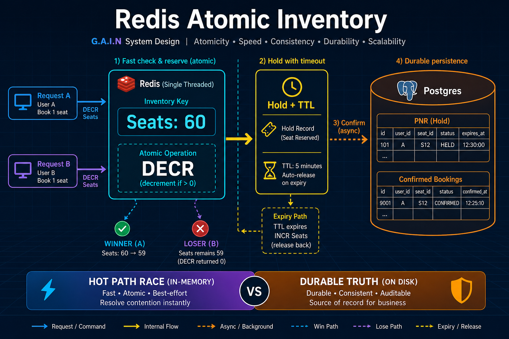
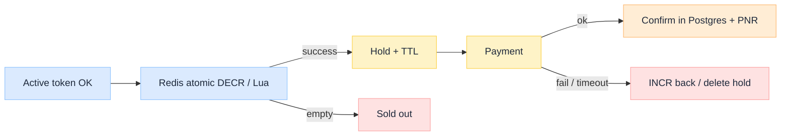

import Details from '@theme/Details';

<br/>


# Redis Atomic Inventory: DECR for Scarce Seats

*Two booking requests can arrive in the same nanosecond for the last Tatkal berth. If each does "read remaining, then write remaining-1" in application memory, both can win. Scarce inventory needs an atomic lease, not a faster SELECT.*

Under an open-second spike, Postgres is the wrong place to run the race. Connection pools, row locks, and WAL amplify contention on one hot train/date/class row. The usual pattern moves **hot availability** into Redis: a counter (or small Lua script) that only decrements when stock remains, creates a **hold with TTL**, and later **confirms** into a durable store when payment succeeds.

This is an **architecture breakdown** of atomic inventory on the hot path. Upstream: Virtual Waiting Room and Active Token Concurrency (both coming soon). Those decide who may attempt; this plane decides whether an attempt gets a seat.

:::tip[THE CLAIM]
**Availability may be a cached projection. Confirmation is an atomic lease against a quota bucket.** Redis `DECR` (or conditional Lua) owns the race. Postgres (or equivalent) owns money, PNR, and audit. Mixing those jobs is how you oversell seats or lose seats to expired holds that never return.
:::

<!-- truncate -->

## Why not check seats in Postgres under the spike

| Approach | What goes wrong at open second |
| --- | --- |
| **SELECT then UPDATE** | Two transactions read `remaining=1`; both update; oversell |
| **Row lock on train row** | Correct but serializes the hot object; latency explodes |
| **Serializable retries** | Abort storms under contention; user sees random failures |
| **Read replica for stock** | Stale "3 left" becomes a lie under write load |

Postgres remains essential **after** the race: booking row, payment reference, passengers, refunds. It should not be the mutex for "last 60 Tatkal 3A seats" when tens of thousands of admitted users hammer hold.


<br/>

## Path at a glance

| # Stage | What it does | Failure if skipped |
| --- | --- | --- |
| **1. Key the bucket** | `train + date + class + quota` counter | Wrong grain: lock whole train or invent seats |
| **2. Atomic reserve** | Decrement only if `remaining > 0` | Oversell |
| **3. Write hold** | Hold id, user, seats, `expiresAt` | No object to confirm or release |
| **4. Pay** | External PSP; idempotent callbacks | Charge without ticket or ticket without charge |
| **5. Confirm** | Durable booking + revoke hold | Redis says sold, ledger disagrees |
| **6. Release** | TTL sweeper or fail path increments back | Silent inventory leak |

---

## DECR / Lua: decrement only if remaining > 0

Naive `DECR` can go negative if you are not careful. Prefer a **compare-and-decrement** in one round trip.

<Details summary="Lua: reserve one unit if stock remains">

```lua
-- KEYS[1] = inventory counter
-- returns remaining after reserve, or -1 if sold out
local n = tonumber(redis.call('GET', KEYS[1]) or '0')
if n <= 0 then
  return -1
end
return redis.call('DECR', KEYS[1])
```

</Details>

Then create a hold record (Redis hash or durable outbox) keyed by `holdId`, with TTL matching the pay window.

**Counter vs seat rows:** for the open-second race, a **quota counter** is enough ("60 Tatkal 3A left"). Assign concrete berths at hold or confirm time if the product needs preferences. Seat-level locks at race time are richer UX and hotter contention.

---

## Hold TTL and release

A hold that never expires is a **stuck seat**. A hold that expires too fast burns real UPI users.

| Path | Action on inventory |
| --- | --- |
| **TTL expiry** | Worker or Redis key event: delete hold, `INCR` counter |
| **Pay fail** | Same release path, idempotent |
| **Confirm** | Do not `INCR`; mark hold `CONFIRMED`; write Postgres booking |

Idempotency keys on confirm (payment id or client attempt id) stop double PNRs when mobile retries.

<Details summary="State machine worth persisting">

```text
HELD -> PAYMENT_PENDING -> CONFIRMED
  |           |
EXPIRED    FAILED -> RELEASED
```

Every transition should be safe to retry.

</Details>

---

## Hot keys and shard by train and date

One Redis key for "all Tatkal inventory" is a single-threaded hotspot. Shard the counter space:

```text
inv:{trainNumber}:{yyyyMMdd}:{class}:{quota}
```

Route hold traffic so train A and train B do not share one contended key. Waiting-room and token planes can be global; **inventory contention should be per scarce object**.

Pre-warm counters before open (load quota into Redis from the catalog) so the first second is not a cold migrate from Postgres.

---

## Redis hot path, Postgres truth

| Store | Owns | Optimized for |
| --- | --- | --- |
| **Redis** | Remaining quota, holds, short TTL | Atomic race, low latency |
| **Postgres** | Confirmed bookings, payments, audit | Durability, joins, disputes |

Search UIs may still show cached "seats left" that lag by seconds. That is acceptable for browsing. It is **not** acceptable as the authority for confirm. After payment success, the durable row is the product truth; Redis holds are cleared or marked confirmed.

Reconcile jobs catch the ugly cases: paid but confirm crashed, hold expired while webhook late, counter drift. Tatkal-class correctness is partly a **reconciliation** problem, not only a clever `DECR`.

---

:::tip[TAKEAWAY]
**Run the seat race in Redis with conditional decrement and TTL holds; commit money and PNR in Postgres.** Shard counters by train and date, release on expiry, and idempotently confirm. Upstream tokens only buy you the right to attempt. This plane is where two requests at the same nanosecond become one winner and one sold-out.
:::
