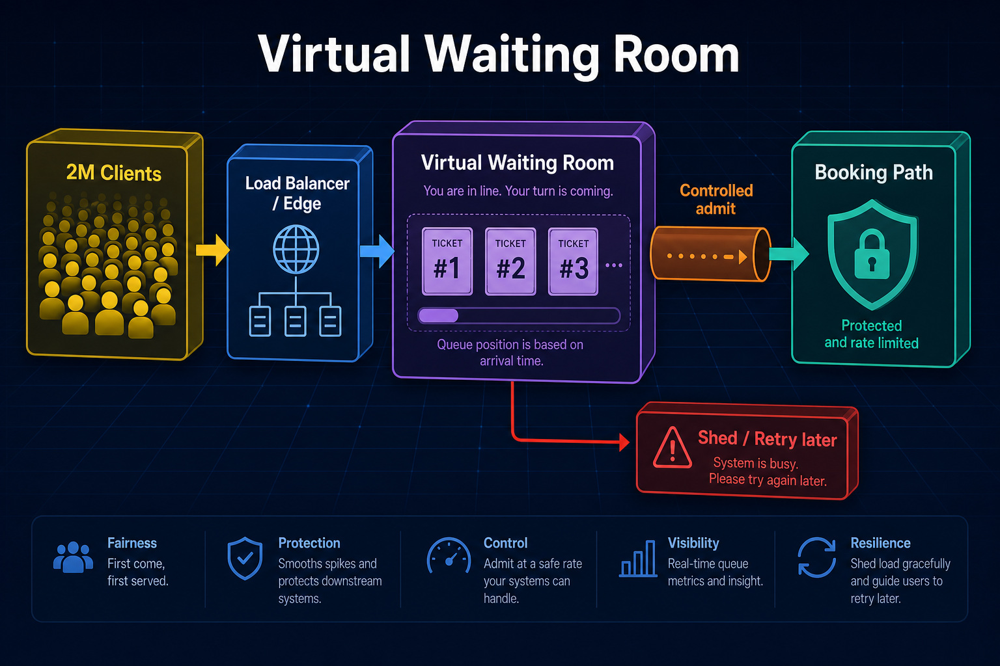
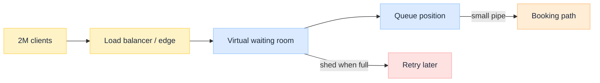
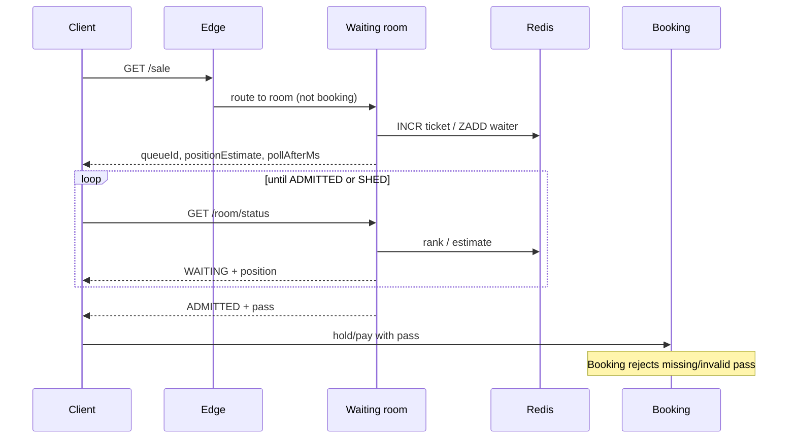
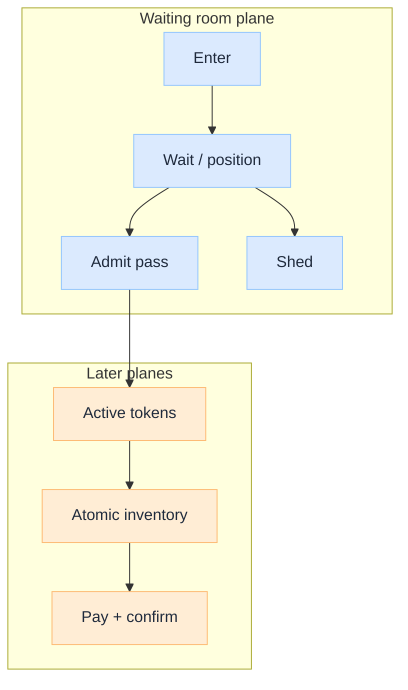

import Details from '@theme/Details';

<br/>


# Virtual Waiting Room: Absorbing the Open-Second Stampede

*When Tatkal opens or a BookMyShow drop goes live, the product problem is not "make booking faster." It is "stop two million browsers from becoming two million concurrent writers against the same service."*

A load balancer spreads traffic. It does not invent capacity. If every client that lands on the VIP can call `POST /hold`, you still melt auth, booking, inventory, and payments in the same second. The virtual waiting room sits **in front of the book path** so the crowd gets a queue number while only a controlled trickle is allowed to attempt a seat.

This is an **architecture breakdown** of waiting-room admission for open-second spikes. Exact vendor topologies differ (CDN waiting rooms, custom Redis rooms, cloud "queue-it" style products). The design lesson stays stable: **admit on your schedule, not theirs.** Sibling pieces in this series: Active Token Concurrency (coming soon) and Redis Atomic Inventory (coming soon).

:::tip[THE CLAIM]
**A virtual waiting room is admission control, not inventory.** It turns an unbounded stampede into an ordered wait. It does not allocate seats, take payment, or prove fairness against bots. Those are later planes. If booking is reachable without passing the room, the room is decoration.
:::

<!-- truncate -->

## The problem: stampede vs service

Open-second demand looks like this:

| Signal | What happens |
| --- | --- |
| **Clock edge** | Quota or sale opens at a known second |
| **Herd** | Millions refresh and retry together |
| **Hot object** | One train, one event, one SKU class |
| **Failure mode** | Timeouts, double submits, payment for nothing, or total outage |

Scaling the booking fleet horizontally does not fix a **hot key** or a **scarce counter**. It only multiplies how hard you hit the same scarce resource. The first design move is to **refuse** most of the herd at the edge and admit the rest on your schedule.

### Why "just rate limit" is not enough

Per-IP or per-user rate limits blunt abuse. They do not give users a **shared story** ("you are #18,402") and they do not convert a synchronized open into a smooth drain. Without a room:

- Honest users hammer refresh and look like bots.
- Every retry still targets booking URLs.
- You have no place to put progressive challenges (CAPTCHA only for the head of the line).
- Product cannot show ETA or "sale busy" with a clear next step.

Rate limits belong **at the edge of the room and on book APIs**. They are not a substitute for the room.


<br/>

## Worked example: 2M arrivals, tiny useful work

Concrete numbers make the room's job obvious.

| Quantity | Example value | Note |
| --- | --- | --- |
| Arrivals in first 60s | ~2,000,000 | Browsers + scripts |
| Scarce units (seats / tickets) | ~500-5,000 | Tatkal quota or section drop |
| Safe concurrent bookers | ~2,000-3,000 | Downstream token pool |
| Status poll interval | 2-5s (jittered) | Room reads only |
| Room hard cap | e.g. 500,000 waiters | Beyond this: shed |

Useful confirms will never approach 2M. The room's success metric is not "queue everyone forever." It is:

1. **Protect** booking and inventory from unbounded concurrency.
2. **Order** (or lottery) who gets promoted next.
3. **Communicate** progress without implying a reserved seat.
4. **Shed** when even waiting is unaffordable.

If 2M people enter an uncapped room, you moved the outage from Postgres to Redis and the polling fleet. Caps and shed are part of the design, not ops afterthoughts.

---

## Path at a glance

| # Stage | What it does | Failure if skipped |
| --- | --- | --- |
| **1. Edge terminate** | TLS, WAF, coarse rate limit, geo/IP filters | Origin sees raw bot + browser flood |
| **2. Enter room** | Assign queue id / arrival rank; sticky session or signed cookie | Users rejoin as new arrivals every refresh |
| **3. Poll position** | Cheap "you are #N" reads; no booking calls yet | Every wait poll becomes a book attempt |
| **4. Admit or shed** | Promote head of line, or reject when room is over capacity | Infinite queue promises seats you will never sell |
| **5. Hand off** | Issue short-lived pass into the next plane (active tokens) | Booking still callable without a pass |


<br/>

---

## Edge to room to queue number

The BookMyShow-shaped pattern is familiar on purpose: **nobody touches checkout until the room says so.**

1. Client hits the sale URL.
2. Edge routes **sale and book hostnames** carefully: marketing may be on CDN; `/room/*` hits the room service; `/hold` and `/pay` are blocked unless a valid pass is present.
3. Room assigns a **queue number** (arrival order, lottery bucket, or fair shard).
4. Client polls a lightweight status endpoint on an interval the server dictates (`pollAfterMs`), with jitter so polls do not align on the second.
5. When promoted, client receives a **pass** (cookie or token) scoped to the next stage.

<Details summary="Pseudo-contract: enter room and poll position">

```text
POST /room/enter
  Headers: Cookie: sid=...   (signed session; ideally authed user)
  Body:    { saleId }
  -> { queueId, positionEstimate, pollAfterMs, state: WAITING | SHED }

GET  /room/status?queueId=...&saleId=...
  -> { state: WAITING | ADMITTED | SHED | EXPIRED,
       positionEstimate?,
       etaSeconds?,
       pass?,          // only when ADMITTED
       pollAfterMs }
```

Status must be cheap: cacheable per queueId for a short TTL, no inventory DECR, no payment, no heavy auth fan-out on every poll.

</Details>

### Sticky identity

If every refresh creates a new `queueId`, power users and bots jump the line by accident (or on purpose). Bind the wait to:

| Binding | Pros | Cons |
| --- | --- | --- |
| **Signed browser session** | Works before login; sticky across refresh | Multi-device and private mode create multiples |
| **Authenticated account** | Stronger anti-farm; one line per user | Login stampede before the sale |
| **Device attestation** (optional) | Harder script farms | Platform cost; false positives |

Practical pattern for high-stakes sales: **pre-auth window** (login and bind session before the clock edge), then room enter is cheap and already tied to `userId`.

### Client UX that does not lie

| Do | Do not |
| --- | --- |
| "You are roughly #N in line" | "Your seats are held" |
| Show progress / ETA bands | Promise exact second of admit |
| Disable book buttons until `ADMITTED` | Deep-link straight to checkout |
| Honor `pollAfterMs` | Poll status at 50ms "to go faster" |

Position is an **estimate** once you shard. Say so in copy. Users tolerate "about 12 minutes" better than a frozen exact counter that jumps weirdly when shards rebalance.

---

## Ordering policy: FIFO, lottery, or hybrid

The room must answer: **who gets the next admit slot?**

| Policy | How it works | Feels fair? | Under bots |
| --- | --- | --- | --- |
| **FIFO** | Lowest arrival ticket first | Yes for humans | Early bots win |
| **Lottery** | Random sample from waiters / buckets | Mixed | Early join helps less |
| **Fair shard** | Per-user or per-cohort caps, then FIFO inside | Better for multi-account | Needs identity |
| **Hybrid** | FIFO with score penalties for abuse signals | Tunable | Needs scoring |

For a system-design writeup, pick an explicit default: **authenticated FIFO with abuse demotion**, and note lottery as the spike-simple alternative when identity is weak.

Promotion is usually driven by **downstream capacity**, not by "someone waited long enough":

```text
when active_token_pool has free slots:
  pick next waiter(s) per policy
  mint ADMITTED pass / hand off to token plane
  remove from waiting set
```

The waiting room **does not** open the floodgates because the wall clock says the sale started. The sale start only enables `enter`. Admit rate stays tied to what booking and inventory can absorb.

---

## Redis-backed position

A waiting room needs a **shared ordering structure** visible to every room replica. Redis is a common choice: fast increments, TTLs, and simple rank queries.

Typical shape:

| Structure | Role |
| --- | --- |
| **Counter** | Monotonic arrival ticket (`INCR room:{saleId}:seq`) |
| **Sorted set** | `queueId` scored by ticket (or lottery score) |
| **Hash / string** | Session metadata, userId, expiry, state |
| **Admit cursor / lag gauge** | How far promotion has advanced (for ETA) |

**Teaching simplification:** "everyone lands in a Redis queue."  
**Production nuance:** one giant `LIST` or one zset for two million waiters is a memory and ops footgun. Prefer:

- **Sharded rooms** by `hash(userId) % N` or by sale section (many smaller ordered sets)
- **TTL on wait membership** so abandoned tabs leave and free memory
- **Estimated position** when exact `ZRANK` across shards is expensive
- **Separate keys per saleId** so Event A cannot contend with Event B

The product promise is "you are waiting in line," not "we recompute perfect worldwide FIFO on every heartbeat."

<Details summary="Lua: assign arrival ticket">

```lua
-- KEYS[1] = seq key, KEYS[2] = zset key, KEYS[3] = meta hash
-- ARGV[1] = queueId, ARGV[2] = userId, ARGV[3] = ttlSec
local ticket = redis.call('INCR', KEYS[1])
redis.call('ZADD', KEYS[2], ticket, ARGV[1])
redis.call('HSET', KEYS[3],
  'ticket', ticket,
  'userId', ARGV[2],
  'state', 'WAITING')
redis.call('EXPIRE', KEYS[2], ARGV[3])
redis.call('EXPIRE', KEYS[3], ARGV[3])
return ticket
```

</Details>

<Details summary="Position estimate with a promoted cursor">

```text
ticket        = meta[queueId].ticket
promotedUpTo  = GET room:{saleId}:promoted_cursor
positionEst   = max(ticket - promotedUpTo, 1)

// Optional: ETA
admitRate     = EMA of admits per second
etaSeconds    = positionEst / max(admitRate, epsilon)
```

Exact `ZRANK` is fine for small rooms. At multi-million scale, cursor math plus shard-local rank is usually enough for UX.

</Details>

<Details summary="Promote next waiter when a slot frees">

```lua
-- KEYS[1] = zset, KEYS[2] = promoted_cursor
-- ARGV[1] = queueId just promoted (or use ZPOPMIN)
local entry = redis.call('ZPOPMIN', KEYS[1], 1)
if not entry[1] then
  return nil
end
local queueId = entry[1]
local ticket = tonumber(entry[2])
redis.call('SET', KEYS[2], ticket)  -- advance cursor
return queueId
```

After pop: mark meta `ADMITTED`, mint signed pass, push client via next poll (or websocket if you already operate one).

</Details>

### Polling fleet cost

Rough math: 500k waiters × 1 poll / 3s ≈ **167k RPS** of status reads. That is why status must be:

- Redis-local or edge-cached briefly
- No joins to booking DB
- No CAPTCHA on every poll (challenge on enter or on promote instead)

If polls dominate cost, increase `pollAfterMs` as position grows (far away → poll every 10s; near head → every 2s).

---

## Shed when the room is full

An unbounded waiting room is a **denial-of-service sponge** that still burns Redis, polling fleet, and goodwill. Cap the room.

| Policy | Behavior |
| --- | --- |
| **Hard cap** | Beyond N waiters: `SHED` / "sale busy, try again" |
| **Soft cap** | Degrade UX (slower polls, coarser position) before hard reject |
| **Time box** | Room only exists for the sale window; keys expire with the event |
| **Priority shed** | Shed anonymous / high-risk first; keep authed waiters longer |

Shedding is kinder than a silent hang. It also keeps the room's data plane inside a budget you can size before the event.

**Capacity sketch before go-live:**

1. Max waiters × bytes per meta ≈ Redis memory ceiling.
2. Max waiters / poll interval ≈ status RPS ceiling.
3. Admit rate × average checkout seconds ≈ needed active-token pool (downstream).
4. Hard cap and shed copy reviewed by product (not invent during the outage).

---

## Failure modes and reconnects

| Failure | What the user sees | Design response |
| --- | --- | --- |
| **Tab refresh** | Should keep same place | Sticky `sid` + same `queueId` |
| **Lost cookie** | New line / shed | Re-bind via login; do not silently mint a better ticket |
| **Room replica restart** | Brief errors | Shared Redis state; idempotent enter |
| **Redis blip** | Status fails | Retry with backoff; do not fall open to booking |
| **Pass stolen** | Attacker books | Short-lived signed pass bound to userId + saleId |
| **Client polls booking early** | 401/403 | Gateway deny without pass; metrics alert |

**Fall closed on booking.** If the room or pass issuer is down, fail checkout rather than open the floodgates. A closed sale with an apology beats an oversold inventory and a melted cluster.

---

## What the waiting room does not solve

Keep the planes separate so the design stays honest:

| Plane | Job |
| --- | --- |
| **Waiting room** | Who may wait / who may proceed next |
| **Active tokens** | How many users may hit hold/pay concurrently (coming soon) |
| **Atomic inventory** | Whether a seat lease succeeds (coming soon) |
| **Abuse** | Bots, farms, multi-accounting |

A waiting room without the next planes still lets admitted users stampede hold. A room without abuse controls still fills with scripts that grabbed queue ids early.

Also: **queue position is not a seat.** Messaging should never imply that #42,131 is reserved inventory. It is a place in line for a chance to attempt booking.


<br/>

---

## Where I land

**Put the herd in a room before it can book.** For Tatkal-class and ticket-drop-class spikes I would ship:

1. **Edge → room before any hold URL** (fall closed if the room is down).
2. **Pre-auth when possible**, sticky signed session, one active wait per user per sale.
3. **Sharded Redis zsets** plus a promoted cursor for ETA, not one mega-list.
4. **Hard cap + shed** sized from memory and poll RPS before the event.
5. **Admit rate tied to the downstream token pool**, not to wall-clock open alone.
6. Honest UX: position estimate, jittered polls, no "seat reserved" language.

FIFO with abuse demotion is the default ordering I would defend in a design review. Pure lottery is the fallback when identity is weak and bot pressure is extreme. The waiting room buys a controllable admission curve; seats, money, and bot fairness start after the pass is issued.
