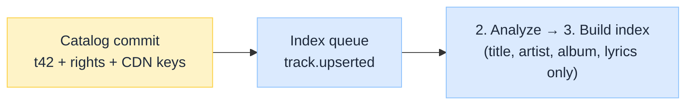
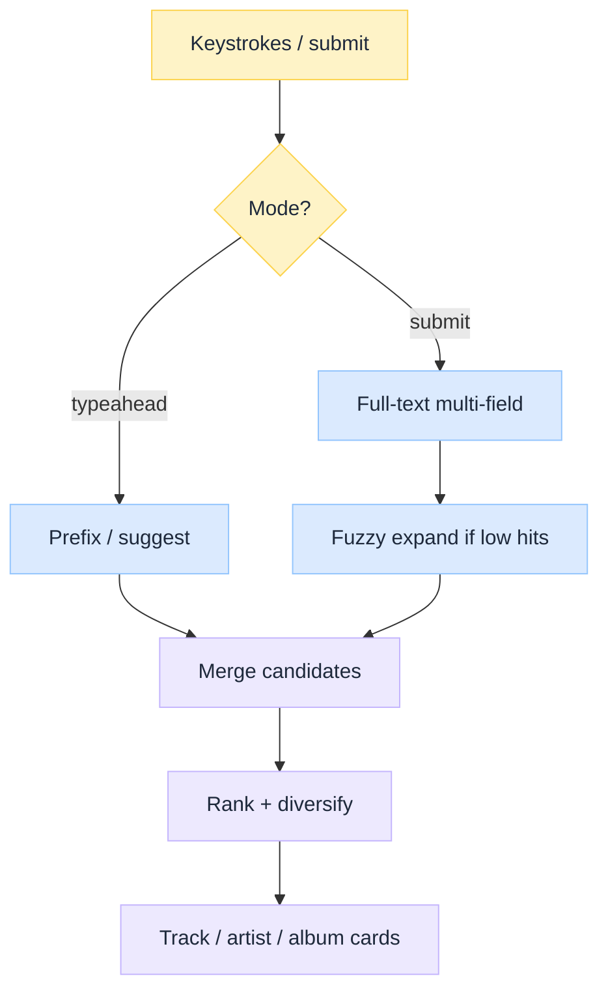
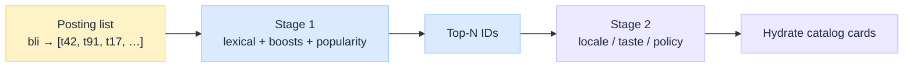
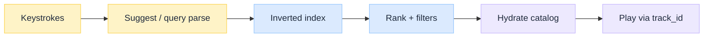
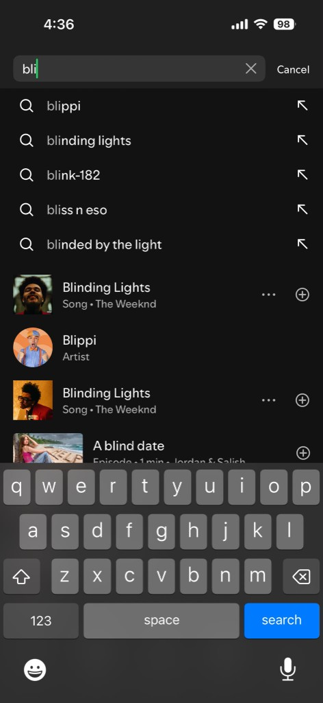
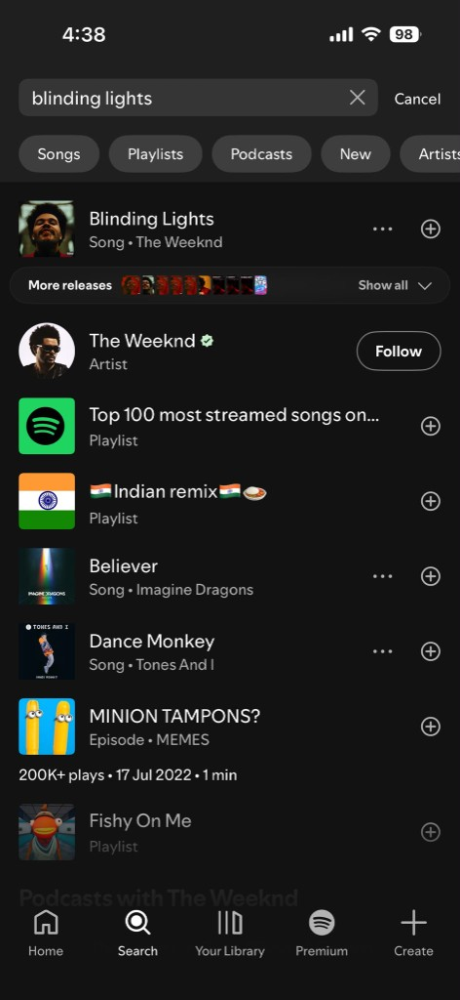
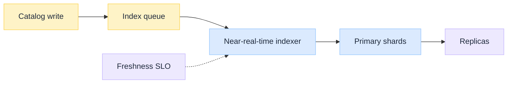

import Details from '@theme/Details';
import Tabs from '@theme/Tabs';
import TabItem from '@theme/TabItem';

<br/>


# Inverted Index Search Explained: Spotify Music Discovery

*When you type in Spotify's search box, you are not scanning a tracks table. You are probing an inverted index: terms from title, artist, album, and lyrics mapped to posting lists of track IDs, then ranked and hydrated from the catalog so Play still hits the right audio object.*

"Elasticsearch on track metadata" is the easy sketch. It skips the hard parts Spotify-class search must get right: **catalog vs index as two planes**, **tokenization that makes autocomplete and fuzzy match cheap**, **multi-field ranking**, and a **freshness SLA** so new releases appear before the marketing window closes.

This is an **architecture breakdown** of inverted index search, using **Spotify music discovery** as the running example. Exact internal names evolve; the design lessons stay useful. Parent pipeline context: [Spotify Music Streaming Pipeline](/insights/spotify-music-streaming-pipeline).

:::tip[THE CLAIM]
**Spotify-class discovery is inverted index search, not SQL LIKE.** Catalog is the source of truth for play and rights. The search index is a projection optimized for prefix, fuzzy, and ranked retrieval over title, artist, album, and lyrics. Mixing those jobs is how search latency and catalog load both explode.
:::

<!-- truncate -->

## Search path at a glance

Same six stages as the hero ribbon: catalog write → analyze → build inverted index → fuzzy/prefix query → rank → play.


<br/>

| # Stage | What it does | Failure if skipped |
| --- | --- | --- |
| **1. Catalog write** | Commit track identity, rights, playable keys | Search returns IDs nothing can play |
| **2. Analyze** | Tokenize and normalize title, artist, album, lyrics | Typos and prefixes miss; ranking is noise |
| **3. Build inverted index** | Map terms → posting lists of track IDs | Every query becomes a catalog scan |
| **4. Fuzzy / prefix query** | Suggest or full-text lookup against postings | Empty recall or wrong query mode |
| **5. Rank** | Score candidates; stage-2 locale / taste / policy | Relevant hits buried under obscure matches |
| **6. Play** | Hydrate cards from catalog; resolve audio via control plane | Empty tiles or play never leaves search |

---

## 1. Catalog write

On a Spotify-shaped stack, upload and play trust the **catalog**; the search box trusts the **inverted index**.

| Plane | Owns | Optimized for |
| --- | --- | --- |
| **Catalog** | Identity, rights, relationships, playable object keys | Consistency, joins, compliance |
| **Search index** | Terms, postings, field norms, suggest structures | Latency, recall for messy human queries |

The catalog write is the event. The indexer is a consumer. Search never mutates rights or audio object keys; it only projects fields needed for discovery.

**Where catalog finishes:** once the track row is committed (identity, rights, playable keys, display fields). Catalog does not tokenize, build postings, or answer the search box.

**Where analyze / index starts:** a catalog change event lands on an **index queue**. The indexer pulls search fields only, then stages 2 and 3 do the rest.


<br/>

Queue payload is thin on purpose: a **notification that catalog write finished**, not the index and not the full catalog row. It tells the indexer which track to refresh and which fields to project. Rights and playable keys stay in the catalog so search never becomes source of truth for play.

| Field | Meaning |
| --- | --- |
| `event: track.upserted` | Something changed; reindex this track (not a full catalog dump) |
| `track_id: t42` | Which recipe/page to refresh in search |
| `fields_for_search` | Which columns the indexer may read for discovery |

Flow: catalog commit → this message → indexer loads title/artist/album/lyrics for `t42` → stages 2 and 3 (analyze → postings).

<Details summary="JSON: index queue message (thin)">

```json
{
  "event": "track.upserted",
  "track_id": "t42",
  "fields_for_search": ["title", "artist", "album", "lyrics_snippet"]
}
```

</Details>

Store choices look like classic [SQL vs NoSQL](/insights/sql-vs-nosql-under-the-hood) tradeoffs on the catalog side. The search plane is usually a purpose-built inverted-index engine (Elasticsearch / OpenSearch / Lucene-class, or an in-house equivalent), not a general document DB with a text column.

**Cookbook view:** the catalog is the cookbook (full recipes: title, artist, rights, how to play). The inverted index is the back-of-book index: `blinding → recipes t42, t91`. Guests look up a word in the index; plating still opens the full recipe in the book.

---

## 2. Analyze

Raw strings are not searchable until an **analyzer** turns them into tokens.

| Step | Music-search examples |
| --- | --- |
| **Normalize** | Lowercase, strip punctuation, Unicode fold (café → cafe) |
| **Tokenize** | Split on whitespace / punctuation; keep featuring markers as needed |
| **Filter** | Stop words (language-aware); optional stemming for lyrics, often light for proper names |
| **N-grams / edge n-grams** | Prefix autocomplete: `bli`, `blin`, `blind`… for "Blinding Lights" |
| **Phonetic (optional)** | Soundex / Metaphone-class for hard artist names |

**Artist names are not English prose.** Aggressive stemming that helps lyrics can destroy band names. Use **per-field analyzers**: gentle for artist/title, richer for lyrics.

Autocomplete usually needs a **suggest** structure (edge n-grams, completion suggester, or a dedicated trie) separate from the full-text path. One analyzer rarely serves both typeahead and full query well.

---

## 3. Build inverted index

Think of indexing as building a **back-of-book index**, not storing one blob.

1. **Receive the recipe page** (document from the catalog cookbook)
2. **Extract index words** (tokens per field)
3. **Write the back-of-book entries** (posting lists: the inverted index)

Only step 3 is what search queries. Steps 1 and 2 are how you *build* it.


<br/>

The flip: you do not store "recipe t42 contains words `[weeknd, blinding, lights]`" as the thing guests search. You store "`blinding` → recipes `[t42, t91, …]`." Guests look up a word; the index returns every recipe page that uses it.

Three steps. Click each block to expand. Collapsed by default.

<Details summary="1. Recipe page: receive from the cookbook (not the index)">

Catalog projection into the indexer. Search fields only. Rights and CDN keys stay in the cookbook. **Input**, not what the inverted index stores.

```json
[
  {
    "track_id": "t42",
    "title": "Blinding Lights",
    "artist": "The Weeknd",
    "album": "After Hours"
  },
  {
    "track_id": "t91",
    "title": "Blinding",
    "artist": "Florence + The Machine",
    "album": "Dance Fever"
  },
  {
    "track_id": "t7",
    "title": "Starboy",
    "artist": "The Weeknd",
    "album": "Starboy"
  }
]
```

</Details>

<Details summary="2. Index words: extract tokens (transient)">

Analyzer output per track. Used to build postings, then discarded as a separate map. Not a second database you query at search time.

```json
{
  "t42": {
    "title": ["blinding", "lights"],
    "artist": ["weeknd"],
    "album": ["after", "hours"]
  },
  "t91": {
    "title": ["blinding"],
    "artist": ["florence", "machine"],
    "album": ["dance", "fever"]
  },
  "t7": {
    "title": ["starboy"],
    "artist": ["weeknd"],
    "album": ["starboy"]
  }
}
```

</Details>

<Details summary="3. Back-of-book entries: posting lists (the inverted index)">

This is the durable search structure: term dictionary + posting lists. Token → which `track_id` + field. Query time looks here only.

```json
{
  "blinding": [
    { "track_id": "t42", "field": "title" },
    { "track_id": "t91", "field": "title" }
  ],
  "weeknd": [
    { "track_id": "t42", "field": "artist" },
    { "track_id": "t7", "field": "artist" }
  ],
  "after": [
    { "track_id": "t42", "field": "album" }
  ]
}
```

Query `blinding` → `[t42, t91]`. Query `weeknd` → `[t42, t7]`. Both → intersect → `[t42]`. No scan of every title string.

</Details>

### Fields that matter for music

| Field | Why index it | Query shape |
| --- | --- | --- |
| **Title** | Primary intent for many queries | Exact, prefix, fuzzy |
| **Artist** | High typo rate; aliases and featuring credits | Fuzzy, synonym / alias expand |
| **Album** | Disambiguates same title across releases | Multi-field boost |
| **Lyrics** | Phrase and deep recall ("that song that goes…") | Phrase, larger postings, costlier |

Index **aliases** (artist AKA, transliterations) as sibling terms or a dedicated alias field. Without aliases, lexical search silently fails on how fans actually type.

Postings often store more than document IDs: term frequency, positions (for phrases / lyrics), and field norms for scoring. Lyrics inflate index size; treat them as an optional expensive field with its own analyzer and query path.

---

## 4. Fuzzy / prefix query


<br/>

| Query type | Typical use | Design note |
| --- | --- | --- |
| **Prefix / autocomplete** | Every keystroke | Edge n-grams or completion index; hard latency budget |
| **Multi-field match** | Submitted search box | Weighted title > artist > album > lyrics |
| **Fuzzy** | Typos ("weeknd" vs "weekend" edge cases, "bieber" misspellings) | Edit-distance expand; cap expansions or cost explodes |
| **Phrase** | Lyrics fragments | Needs positions; heavier than bag-of-words |
| **Filter** | Locale, availability, content type | Apply as filters, not as scored text |

Fuzzy match is a **recall tool**, not the default for every query. Run exact/prefix first; widen with fuzziness when the candidate set is thin. Unbounded fuzzy on hot terms is a classic load amplifier.

---

## 5. Rank

Postings answer **who matches**. Ranking answers **in what order**. Many tracks share a token (typeahead `bli` can hit Blinding Lights, Blippi, Blink-182, …). Lookup returns the whole candidate set; nothing picks a winner until score.


<br/>

**Stage 1** (cheap, in or next to the index):

| Signal | What it does |
| --- | --- |
| **Field boost** | Title > artist > album > lyrics for the same token |
| **Match quality** | Longer / closer prefix, exact over fuzzy, stronger field wins |
| **Popularity** | Stream velocity breaks ties so obscure collisions do not bury the hit people mean |

**Stage 2** (small-N only): locale/market availability, taste re-rank, take-downs, editorial pins, entity diversity (song vs artist vs playlist).

Do not push personalization into every shard query. Retrieve a short candidate list first; then re-rank. Hydration still pulls display strings and artwork from the **catalog** for every ID you keep.

<Details summary="JSON: same prefix `bli`, two tracks, ranked">

```json
{
  "lookup": "bli",
  "posting_list": [
    { "track_id": "t42", "field": "suggest" },
    { "track_id": "t91", "field": "suggest" }
  ],
  "stage1": {
    "t42": { "field_boost": "title_prefix", "popularity": "very_high", "score": 0.96 },
    "t91": { "field_boost": "title_prefix", "popularity": "low", "score": 0.41 }
  },
  "ranked": ["t42", "t91"],
  "stage2": ["locale_ok", "taste_optional"],
  "hydrate_from_catalog": [
    { "track_id": "t42", "title": "Blinding Lights", "artist": "The Weeknd" },
    { "track_id": "t91", "title": "Blippi Theme", "artist": "Blippi" }
  ]
}
```

Both recipes leave the index hit list. Popularity (and match quality) decides who is listed first. Display names come from the cookbook (catalog), not from the back-of-book index alone.

</Details>

---

## 6. Play

Search is done when you have ranked `track_id`s. **Hydrate** display cards (title, artist, artwork) from the catalog cookbook. **Play** leaves search: the control plane resolves license + CDN object keys; the client fetches audio. The index never returns playable URLs.

| Step | Owns the data | Outcome |
| --- | --- | --- |
| Index hit | Search plane | Ranked `track_id`s |
| Card UI | Catalog | Correct title, artist, cover art |
| Audio | Object store + multi-CDN | Range-request chunks for the chosen bitrate |

---

## Spotify worked example: finding Blinding Lights

Teaching reconstruction for stages **4 → 5 → 6**, not an internal dump. The back-of-book index for `t42` is already built above. This section is **lookup and open the recipe**: keystrokes, index hit, hydrate from the cookbook, then play.


<br/>

### Autocomplete: `bli`

Suggest postings → candidates → rank → **hydrate from catalog** (artwork and display strings, not index-only ghosts). Uses suggest (edge n-grams), not fuzzy.

<Tabs groupId="typeahead-bli">
  <TabItem value="request" label="Request" default>

```json
{
  "query": "bli",
  "path": "suggest",
  "lookup": "bli"
}
```

  </TabItem>
  <TabItem value="response" label="Response">

```json
{
  "query": "bli",
  "path": "suggest",
  "lookup": "bli",
  "completions": [
    "blippi",
    "blinding lights",
    "blink-182",
    "bliss n eso",
    "blinded by the light"
  ],
  "candidates": ["t42", "a91", "t42b", "e14"],
  "rank": ["t42", "a91", "t42b", "e14"],
  "hydrate_from_catalog": [
    {
      "id": "t42",
      "type": "track",
      "title": "Blinding Lights",
      "subtitle": "Song • The Weeknd"
    },
    {
      "id": "a91",
      "type": "artist",
      "title": "Blippi",
      "subtitle": "Artist"
    },
    {
      "id": "t42b",
      "type": "track",
      "title": "Blinding Lights",
      "subtitle": "Song • The Weeknd"
    },
    {
      "id": "e14",
      "type": "episode",
      "title": "A blind date",
      "subtitle": "Episode • 1 min • Jordan & Salich"
    }
  ]
}
```

  </TabItem>
  <TabItem value="image" label="Image">



  </TabItem>
</Tabs>

### Full retrieval: `blinding lights`

Analyze → exact match → score with field boosts → stage-1 top-N → stage-2 locale/taste/market → hydrate mixed entity cards. Play resolves the chosen `track_id` outside search. Search returns IDs only; catalog and control plane finish the UI and audio.

<Tabs groupId="submit-blinding-lights">
  <TabItem value="request" label="Request" default>

```json
{
  "query": "blinding lights",
  "path": "submit",
  "analyzed": ["blinding", "lights"]
}
```

  </TabItem>
  <TabItem value="response" label="Response">

```json
{
  "query": "blinding lights",
  "path": "submit",
  "analyzed": ["blinding", "lights"],
  "exact": {
    "blinding": ["t42"],
    "lights": ["t42"]
  },
  "score": {
    "blinding": { "field": "title", "boost": "high" },
    "lights": { "field": "title", "boost": "high" }
  },
  "stage1_top_n": ["t42", "a07", "p11", "p22", "t88", "t55", "e09", "p33"],
  "stage2": ["locale", "taste", "market_filter"],
  "hydrate_from_catalog": [
    {
      "id": "t42",
      "type": "track",
      "title": "Blinding Lights",
      "subtitle": "Song • The Weeknd",
      "more_releases": true
    },
    {
      "id": "a07",
      "type": "artist",
      "title": "The Weeknd",
      "subtitle": "Artist",
      "verified": true
    },
    {
      "id": "p11",
      "type": "playlist",
      "title": "Top 100 most streamed songs on...",
      "subtitle": "Playlist"
    },
    {
      "id": "p22",
      "type": "playlist",
      "title": "🇮🇳 Indian remix 🇮🇳 🥘",
      "subtitle": "Playlist"
    },
    {
      "id": "t88",
      "type": "track",
      "title": "Believer",
      "subtitle": "Song • Imagine Dragons"
    },
    {
      "id": "t55",
      "type": "track",
      "title": "Dance Monkey",
      "subtitle": "Song • Tones And I"
    },
    {
      "id": "e09",
      "type": "episode",
      "title": "MINION TAMPONS?",
      "subtitle": "Episode • MEMES"
    },
    {
      "id": "p33",
      "type": "playlist",
      "title": "Fishy On Me",
      "subtitle": "Playlist"
    }
  ],
  "play": "resolve t42 via control plane → CDN + license"
}
```

  </TabItem>
  <TabItem value="image" label="Image">



  </TabItem>
</Tabs>

---

## Freshness: searchable as a release gate

Two checks before a release is "done":

1. **Playable** — audio is on the CDN and the catalog has rights + object keys
2. **Searchable** — the inverted index has postings for that `track_id`, so typing the title finds it

Catalog commit alone only satisfies (1). Search still has to catch up.

**How it is done:**

1. Catalog write commits `t42` (title, artist, rights, CDN keys)
2. A thin `track.upserted` event lands on the **index queue**
3. A **near-real-time indexer** (not a nightly batch for hot releases) analyzes title/artist/album/lyrics and writes postings onto the **primary shard** that owns `t42`
4. **Replicas** copy that shard so every search node can serve the new terms
5. Ops treat **index lag** (time from catalog commit → searchable) as a release SLO: big drops must clear within minutes


<br/>

| Concern | Design implication |
| --- | --- |
| **Freshness** | New releases must appear in search within minutes |
| **Deletes** | Removed tracks must disappear from search as fast as legal requires |
| **Partial failure** | If catalog write succeeds but search lags, users see "uploaded but can't find it" |
| **Backfill** | Analyzer changes need a reindex plan that keeps search online |

If the track is playable on CDN but missing from the index, discovery traffic fails the launch even when Play would work from a deep link.

---

## Scale and operations

| Pressure | Common response |
| --- | --- |
| **Huge catalog** | Split by `hash(track_id)` into shards; keep replicas for reads |
| **Popular queries** | Cache common searches; avoid fuzzy on every keystroke |
| **Lyrics size** | Keep lyrics in a separate field or index; query them only when needed |
| **Typeahead load** | Separate suggest service; debounce on the client |
| **Mixed results** | Query track, artist, album, playlist in parallel; merge in the API |

Sharding: `hash(track_id) → shard`. `t42` and `t91` can sit on different shards. Each shard only knows its own tracks (`blinding → [t42]` on shard 0, `blinding → [t91]` on shard 1). On query, a coordinator asks every shard, merges hits, then ranks. Index updates for a track go to that track's shard only.

:::note[Sharding in one line]
One term can live on many shards. Each shard holds only the track IDs it owns. Search fans out, merges, then ranks.
:::

---

## Lexical vs dense retrieval

**Lexical** search matches words you type to words in the index. Great for names and typos. Weak when you describe a feeling ("upbeat 90s workout") that never appears in the title.

**Dense** search matches meaning with embeddings. Better for natural language and topic-style queries. Weaker when you need the exact song title, and more expensive to run.

| Path | Strength | Weakness |
| --- | --- | --- |
| **Lexical (word match)** | Exact names, prefixes, lyric lines | Vibe / "describe it" queries |
| **Dense (meaning match)** | Natural language, topical podcast search | Exact titles, new terms, higher cost |

:::note[Hybrid in practice]
Most production systems do **both**: word-match hits plus meaning-match hits, then merge and re-rank. Dense search does not replace the inverted index for "play Blinding Lights." It helps when the query shares no words with the metadata.
:::
---

## Design lessons (what to steal)

| Lesson | Why it matters |
| --- | --- |
| **Separate catalog and index** | Consistency vs discovery latency |
| **Per-field analyzers** | Artists ≠ lyrics |
| **Prefix path ≠ full-text path** | Typeahead has a harder latency budget |
| **Fuzzy as fallback** | Protects recall without torching QPS |
| **Rank in stages** | Lexical retrieve, then personalize / policy |
| **Freshness is a product SLO** | New release must be findable |
| **Hydrate from catalog** | Index returns IDs; cards come from truth |

## Where teams go wrong copying this

| Mistake | Why it hurts |
| --- | --- |
| **`LIKE '%query%'` on the catalog** | Full scans; no ranking; locks under load |
| **One analyzer for all fields** | Stemmed artist names and broken autocomplete |
| **Fuzzy on every keystroke** | Latency and cluster CPU melt |
| **Index as source of truth for play** | Stale rights and wrong object keys |
| **Ignoring zero-result rate** | Silent product failure while ops metrics look "green" |
| **Replacing lexical with embeddings only** | Exact-title precision collapses |

:::tip[TAKEAWAY]
**Inverted index search at Spotify scale is a projection machine:** analyze title, artist, album, and lyrics into postings; serve prefix and fuzzy queries against that index; rank with lexical score plus product signals; hydrate IDs from the catalog; only then resolve Play. The design win is not "add Elasticsearch." It is **keeping truth, discovery, and playback on explicit contracts**, as the Blinding Lights walkthrough shows.
:::

:::info[Builds on]
[SQL vs NoSQL Under the Hood](/insights/sql-vs-nosql-under-the-hood) · [RAG Is Not a Database](/insights/rag-is-not-a-database) · [Retrieval Is a Governed Action](/insights/retrieval-is-a-governed-action) · [Spotify Music Streaming Pipeline](/insights/spotify-music-streaming-pipeline)
:::

## Further reading

| Resource | Why read it |
| --- | --- |
| [Elasticsearch / Lucene inverted index docs](https://www.elastic.co/guide/en/elasticsearch/reference/current/documents-indices.html) | Vocabulary: documents, inverted index, mappings, analyzers |
| [BM25](https://en.wikipedia.org/wiki/Okapi_BM25) | Default lexical scoring intuition behind modern engines |
| [SQL vs NoSQL Under the Hood](/insights/sql-vs-nosql-under-the-hood) | Catalog store tradeoffs behind the index |
