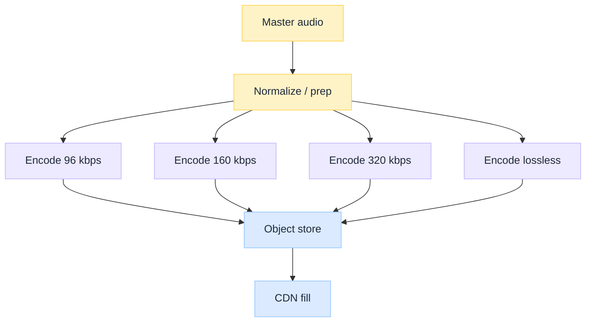
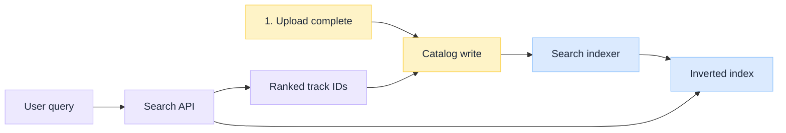
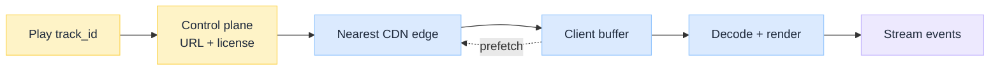
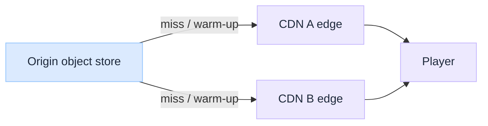

import Details from '@theme/Details';

<br/>


# Spotify Music Streaming Pipeline: From Upload to Search and Play

*A track does not become streamable when someone clicks Upload. It becomes streamable when a media factory turns one master into many bitrate objects, indexes the catalog for discovery, places immutable bytes at the edge, and lets a client player fetch the next Range chunk before the buffer runs dry.*

Most system-design interviews stop at "encode Ogg and put it on a CDN." That skips the hard parts of a Spotify-class stack: **metadata and rights as first-class ingest**, **multi-bitrate ladders without HLS/DASH manifests**, **search as a separate index plane**, and a **multi-CDN play path** where adaptive bitrate is implemented in the client over HTTP range requests.

This is an **architecture breakdown** of three stages (upload → search → play), grounded in publicly discussed Spotify Engineering patterns and common system-design reconstructions. Exact internal names and topologies evolve; the design lessons stay useful. For the video sibling, see [Netflix Video Processing Pipeline](/insights/netflix-video-processing-pipeline).

:::tip[THE CLAIM]
**Upload, search, and play are three products that share a catalog and object store.** Encoding audio is cheaper than video, but TTFB, inverted-index search, multi-CDN steering, and client-side ABR over range requests are the real pipeline. The product is the control plane plus immutable bytes, not a single MP3 file.
:::

<!-- truncate -->

## Pipeline at a glance


<br/>

| # Stage | What it does | Failure if skipped |
| --- | --- | --- |
| **1. Upload** | Accept master + metadata; validate; encode a bitrate/codec ladder into immutable objects; write catalog | Bad masters, broken rights, or missing ladder objects pollute every later stream |
| **2. Search** | Maintain a derived inverted index over catalog fields; serve ranked discovery queries | Catalog exists but discovery is slow, empty, or typo-hostile |
| **3. Play** | Resolve control-plane session; steer multi-CDN; client fetches Range chunks with ABR; emit stream events | No playback, origin melt, stalls, or blind royalties / personalization |

---

## How this differs from Netflix video

Audio tracks are small (megabytes, not gigabytes), so the factory is lighter on chunked parallel encode and ABR packaging. The pressure moves elsewhere:

| Concern | Netflix-style video | Spotify-style audio |
| --- | --- | --- |
| Source | Studio mezzanine / IMF | Label or artist master (WAV/FLAC/high-bitrate) |
| Encode shape | Chunked parallel + many resolution rungs | Whole-track encode into a few bitrate/codec files |
| Player contract | HLS/DASH manifests and segments | Single file per quality; client uses `Range` headers |
| Delivery | Purpose-built Open Connect | Multi-CDN (Akamai, CloudFront, Fastly-class edges) |
| Extra plane | Quality service (VMAF) | Search index + personalization event loop |

Video ABR mechanics (buffer, bandwidth estimate, next chunk) still apply conceptually; see [Adaptive Video Streaming Explained](/insights/adaptive-video-streaming-explained). Spotify-class audio usually implements the same idea **without** a manifest: switch quality by starting range requests against a different bitrate object.

### Player contract: HLS/DASH vs Range

**Player contract** means what the app and the CDN agree on so playback can start and adapt. Same ABR idea (pick quality from buffer and bandwidth); different wire shape.

**Netflix-style video** does not hand the player one big file per quality. The packager cuts the stream into short **segments** and writes a **manifest** (playlist) that lists them. The player fetches the manifest, picks a rung, downloads the next segment URL, and on a bad network switches to a lower rung's next segment. ABR is "which segment playlist / which next segment URL do I request?"

<Details summary="HLS/DASH shape (manifest + segments)">

```text
manifest.m3u8 / .mpd
  ├─ 1080p → seg1.ts, seg2.ts, seg3.ts, …
  ├─ 720p  → seg1.ts, seg2.ts, …
  └─ 480p  → …
```

</Details>

**Spotify-style audio** stores each quality as **one whole-track object** on the CDN (for example 160 kbps Ogg, 320 kbps Ogg). No segment playlist. The player does not download the whole file at once. It asks for byte windows with HTTP **`Range`**, fills a buffer, and adapts by continuing against a different bitrate object (aligned to a sensible time/byte offset).

<Details summary="Whole-file ladder + Range request">

```text
track_abc_96.ogg     ← full song, low quality
track_abc_160.ogg    ← full song, normal
track_abc_320.ogg    ← full song, high
```

```http
GET /track_abc_160.ogg
Range: bytes=0-524287
```

Later: `Range: bytes=524288-1048575`, and so on.

</Details>

| | HLS/DASH | Single file + Range |
| --- | --- | --- |
| **Typical media** | Long video, many resolutions | Shortish audio tracks |
| **Server work** | Packager + manifests | Store immutable whole files |
| **Client work** | Follow playlist, switch segments | Buffer + Range + pick which file |
| **Switch quality** | Next segment from another rung | New Range requests on another object |

---

## 1. Upload

Upload is the media factory: validate the master, encode the ladder, publish immutable objects, and write the catalog identities everything else will point at.

### What arrives upstream

Upstream of streaming sits a **master**: a high-quality audio package from a label, distributor, or independent creator, plus a metadata payload (ISRC, title, artists, album, release dates, territories, rights). That master is the root of every later encode. Podcasts and UGC follow similar shape with different rights rules.

### Why validate before encode

Encoding is cheaper than video, but still a catalog-wide cost, and bad metadata breaks search, royalties, and geo compliance. Fail fast on:

| Check class | Examples |
| --- | --- |
| **Conformance** | Expected containers, sample rates, channel layouts |
| **Loudness / sanity** | Gross defects; loudness normalization targets (e.g. LUFS) |
| **Identity / rights** | Track IDs, territories, exclusive windows, take-down readiness |
| **Fingerprinting** | Duplicate or rights-conflict detection where required |

Studio/label paths may also need review proxies or watermarked review copies. Those belong on an editorial path, not on every member play encode.

### Multi-bitrate encoding

Member devices and network conditions need a **ladder**: multiple bitrates and often multiple codecs. Public reconstructions commonly cite lossy tiers around **96 / 160 / 320 kbps** (historically Ogg Vorbis; AAC on Apple platforms) plus a **lossless** FLAC-class tier for HiFi. Each rung is a **whole-file object**, content-addressed or versioned, treated as immutable once published.

In plain terms, one master becomes several whole-file copies of the same song at different quality levels. The client (and the plan) pick which file to stream:

| Tier | Rough role |
| --- | --- |
| **~96 kbps** | Low / mobile-friendly: less data, weaker fidelity |
| **~160 kbps** | Default / "Normal" middle rung |
| **~320 kbps** | High / "Very High" premium-class lossy |
| **Lossless** | HiFi (FLAC-class): bigger files, no lossy compression |

These numbers are the usual lossy quality steps in a Spotify-class ladder, not exact public API constants. Adaptive bitrate means switching which of these files you fetch, not re-encoding on the fly.


<br/>

| Concern | Design implication |
| --- | --- |
| Device diversity | Multiple codecs per track, not one universal MP3 |
| Network diversity | Client picks a rung; switches mid-play by changing the target object |
| Immutability | New master = new object identity; long CDN TTLs stay safe |
| Cost | Encode at ingest time, not on every play |

**Multiple codecs per track** means the same song is stored in more than one encoding format, not only at different bitrates. A single universal MP3 for everyone is a weak fit: iOS often prefers AAC, Spotify-class desktop/Android paths historically used Ogg Vorbis, and HiFi needs FLAC (or similar lossless). Devices, OS audio stacks, and licenses differ, so the encode ladder may include codec variants of the same quality rung (for example Vorbis at 320 and AAC at a nearby bitrate). The play path picks the object that matches the client's codec and quality choice.

### Why not HLS/DASH for tracks?

HLS/DASH exists because **video is huge**. A movie is gigabytes and hours long. You cannot treat it as one download. You cut it into short segments, publish a playlist, and let the player fetch the next few seconds at the right quality. That needs a packager fleet and manifest plumbing for every title.

A song is usually a few megabytes and a few minutes. The whole file already fits the "fetch a little, then a little more" model if the client uses HTTP `Range`. You still get ABR by switching to a different bitrate file mid-play. Building segment playlists for every track would add packaging cost and ops for almost no extra product value.

So the why is not "Range is cooler than HLS." It is **video-scale packaging is overkill for short audio**. Keep one immutable file per quality; put adaptation in the client.

### Catalog write closes upload

The **catalog** holds track, album, artist, and relationship data the rest of the system points at. When encode completes, upload writes (or updates) those identities and the object keys for each ladder rung. Play requests later resolve `track_id` → object keys and metadata. Playlist collaboration, library follows, and recommendations hang off the same identities. Storage choices here look like classic [SQL vs NoSQL](/insights/sql-vs-nosql-under-the-hood) tradeoffs: strong relational models for rights and ownership graphs, document or cache layers for hot read paths.

Upload is done when masters are validated, ladder objects are immutable in the object store, and the catalog can name them. Discovery and playback are the next stages.

---

## 2. Search

Upload wrote the **catalog** (who owns the track, which object keys to play, rights, relationships). Search answers a different question: **given messy typed text, which track IDs should we show?** Those jobs share identities, but they are not the same system.

### Why catalog is not the search box

The catalog is optimized for correctness: resolve `track_id`, check territory, find the 320 kbps object key, join album and artist. That shape is relational or document storage with strong identity.

Typeahead is the opposite workload. Millions of users type `beetl` or `blin` and expect ranked suggestions in a few milliseconds. Doing that with SQL `LIKE '%beetl%'` (or scanning catalog rows) fails at scale: full table scans, weak typo handling, and ranking that cannot easily mix popularity, locale, and personalization.

So search is a **separate product plane**: its own index, its own SLO (latency + freshness), its own failure modes. If search is slow, play can still work. If the catalog is wrong, search hits may point at IDs that cannot play. Keep those blast radii apart.

### Search is a derived index

**Derived** means: the index is built *from* catalog writes; it is not the source of truth. When upload finishes and the catalog row lands, an indexer copies the discovery fields (title, artist, album, lyrics, aliases) into a structure built for lookup.

That structure is an **inverted index** (Elasticsearch-class or equivalent). Instead of "for each track, store its text," it stores "for each term, which track IDs contain it":

| Term | Track IDs (postings) |
| --- | --- |
| `beatles` | t_101, t_204, … |
| `yesterday` | t_101, … |
| `beyonce` | t_55, … |

Deep dive: [Inverted Index Search Explained: Spotify Music Discovery](/insights/music-search-inverted-index).

A query becomes: tokenize the typed string → look up posting lists → intersect / score → return ranked track IDs → **hydrate** cards from the catalog (artwork, explicit flag, playable). Play and royalties still trust the catalog; the search box only used the index to find candidates fast.

| Capability | Why it matters |
| --- | --- |
| **Autocomplete / prefix** | Instant typeahead as the user types (`bea` → Beatles) |
| **Fuzzy / typo tolerance** | Real-world queries misspell artists (`beetl` still hits) |
| **Ranking** | Popularity, personalization signals, locale so the right Beatles song wins |
| **Freshness** | New releases must appear within the publish SLA after catalog write |


<br/>

**Analogy:** the catalog is the library's official accession record (checkout uses that number). The search index is the keyword drawers you keep in sync so patrons can find the book by typing a messy title. Find through the drawers; play through the accession number.

Podcast and natural-language playlist search may add dense retrieval (embeddings + ANN) beside the lexical index. Treat that as an extra retrieval path, not a replacement for the catalog.

---

## 3. Play

Pressing play is two planes, then multi-CDN delivery, then telemetry that closes the product loop.

### Control plane then bytes

1. **Control plane:** authenticate, resolve `track_id`, pick CDN hostname / object URL, obtain DRM or license material where required, return playback session metadata.
2. **Data plane:** client downloads audio in chunks via `Range` requests, fills a 10-30 second-class buffer, prefetches ahead, and may switch bitrate objects as network changes.


<br/>

| Play concern | Pipeline implication |
| --- | --- |
| Time to first audio | Objects must already exist at the edge for hot titles |
| Gapless / crossfade | Client buffer and decode schedule, not just CDN hit ratio |
| Offline | Encrypted local copies + license refresh; still rooted in the same object identity |
| Connect / multi-device | Control plane moves the session; bytes still come from edges |

Name → edge IP still starts with [DNS](/insights/dns-under-the-hood). Generic edge mechanics live in [CDN Under the Hood](/insights/cdn-under-the-hood).

### Global delivery: multi-CDN

After encode, listeners should not pull every byte from a single origin region. Spotify-class delivery uses a **multi-CDN** strategy: commercial CDN providers cache **immutable** audio objects near listeners, and the control plane **steers** each play toward a healthy edge (capacity, geography, failure).

**Does every track get pushed to every CDN?** No. That is the Netflix Open Connect pattern for video (owned ISP appliances + heavy **pre-positioning** of catalogs because misses are expensive). A Spotify-class catalog is too large, and audio objects are small enough that the default path is:

1. Encode lands in an **origin / object store**.
2. First listeners in a region **miss** at the edge → edge fetches from origin (or a shield) → edge **keeps** the object (long TTL; immutability makes that safe).
3. Later listeners in that region **hit** cache.
4. Big releases may get a **targeted warm-up** (popular titles, predicted regions), not a full-catalog push to every PoP on every provider.

So multi-CDN here means **several providers + steering + cache-on-demand** (plus selective pre-warm), not "copy the whole music library to every edge before anyone presses play."


<br/>

| Delivery concern | Pipeline implication |
| --- | --- |
| Hit ratio | Immutable keys + long TTL so first-miss caching sticks |
| Catalog size | Do not pre-position everything; warm hot / tentpole titles |
| Catalog bursts | Elastic encode + scheduled warm-up for big releases |
| Provider diversity | Steer away from a single CDN outage |
| Security | Signed URLs / tokens; DRM for offline where required |

### Stream events and observability

Every successful play emits **stream events**: what played, for how long, device, quality rung, errors, skip behavior. That telemetry feeds:

| Consumer | Why |
| --- | --- |
| **Royalties / reporting** | Rights holders and finance depend on play accounting |
| **Personalization** | Taste profiles, Discover Weekly-class candidates |
| **QoE** | Startup delay, stall rate, bitrate mix |
| **Ops** | CDN miss storms, encode defects, regional incidents |

Spotify's public name for this path is **Event Delivery** (EDI). It is separate from the audio CDN path. Clients send typed events through SDKs into an ingest API (**Event Service** / receiver), which validates schemas and publishes onto **Google Cloud Pub/Sub** (their cloud-era backbone after an earlier Kafka-based system). Each event type gets its own topic, ETL, and storage so high-volume noise cannot starve business-critical streams. Pipelines dedupe (Pub/Sub is at-least-once), land data in **GCS**, and warehouse in **BigQuery**; consumers often run on **Dataflow / Scio** (Apache Beam).

The flagship play-accounting event they call out is **`EndSong`**: emitted when a user finishes listening to a track. It is treated as business-critical because it feeds royalties, DAU/MAU-style metrics, and related reporting. Skips, stalls, quality, and other client signals ride the same machinery with looser SLOs.

```mermaid
flowchart LR
    Pl["Player finishes / skips / stalls"] --> SDK["Client SDK"]
    SDK --> ES["Event Service\nvalidate"]
    ES --> PS["Pub/Sub\nper event type"]
    PS --> ETL["ETL\ndedupe + transform"]
    ETL --> Store["GCS / BigQuery"]
    Store --> Jobs["Royalties / reco / QoE / ops"]

    classDef a fill:#fef3c7,stroke:#fcd34d,color:#1e293b
    classDef b fill:#dbeafe,stroke:#93c5fd,color:#1e293b
    classDef c fill:#ede9fe,stroke:#c4b5fd,color:#1e293b
    classDef d fill:#ffedd5,stroke:#fdba74,color:#1e293b
    class Pl,SDK a
    class ES,PS b
    class ETL,Store c
    class Jobs d
```


<br/>

| Piece | Role |
| --- | --- |
| **Client SDKs** | Emit typed events; buffer and retry if ingest is down |
| **Event Service** | Parse, validate, reject malformed or unknown types |
| **Cloud Pub/Sub** | Reliable transport; one topic per event type |
| **ETL** | Window, dedupe, transform, anonymize where required |
| **GCS + BigQuery** | Durable datasets and warehouse for downstream jobs |

Separating **encode** (make bytes in stage 1) from **observability** (judge sessions in stage 3) keeps product analytics from blocking the media factory. Treat play telemetry as a first-class contract, not a client-side log dump. Names and topologies evolve; Spotify Engineering's Event Delivery posts are the public vocabulary.

---

## Design lessons (what to steal)

| Lesson | Why it matters |
| --- | --- |
| **Validate masters and rights before encode** | Fail fast on garbage and geo/rights debt |
| **Pre-encode the ladder at ingest** | Play path should fetch, not transcode |
| **Immutable objects + long CDN TTL** | Safe caching at multi-CDN scale |
| **Client ABR over Range, not always manifests** | Simpler audio contract; still adaptive |
| **Catalog ≠ search index** | Source of truth vs discovery plane |
| **Control plane then data plane** | Auth, URL, license before bytes |
| **CDN is part of the release** | Warm hot titles; do not assume full-catalog push |
| **Stream events close the loop** | Royalties, reco, and QoE need the same play signal |

## Where teams go wrong copying this

| Mistake | Why it hurts |
| --- | --- |
| **One bitrate for all users** | Free and premium share a bad middle; mobile burns buffer |
| **Search queries against the catalog DB** | Latency and load explode; ranking stays naive |
| **Mutable object URLs after publish** | CDN caches serve stale or broken audio |
| **HLS packaging cargo-culted for short tracks** | Extra packager complexity without video-scale need |
| **CDN bolted on after launch** | Origin storms on tentpole releases |
| **No play-event contract** | Broken royalties and blind personalization |

:::tip[TAKEAWAY]
**From upload to search and play is three numbered stages:** (1) validate and encode a bitrate ladder into immutable objects, then write the catalog; (2) index for discovery on a separate search plane; (3) resolve play on the control plane, fetch Range chunks from multi-CDN edges, and emit stream events. A Spotify-class design is less about a brand-name codec and more about **boundaries between catalog, index, bytes, and telemetry**.
:::

:::info[Builds on]
[Netflix Video Processing Pipeline](/insights/netflix-video-processing-pipeline) · [Adaptive Video Streaming Explained](/insights/adaptive-video-streaming-explained) · [CDN Under the Hood](/insights/cdn-under-the-hood) · [DNS Under the Hood](/insights/dns-under-the-hood) · [SQL vs NoSQL Under the Hood](/insights/sql-vs-nosql-under-the-hood) · [Inverted Index Search Explained: Spotify Music Discovery](/insights/music-search-inverted-index)
:::

## Further reading

Public engineering write-ups and system-design reconstructions behind this case study. Prefer primary Spotify Engineering posts where available; treat interview-style designs as vocabulary, not internal blueprints.

### Pipeline and delivery

| Resource | Why read it |
| --- | --- |
| [Spotify Engineering Blog](https://engineering.atspotify.com/) | Primary source for platform, delivery, and client topics |
| [Netflix Video Processing Pipeline](/insights/netflix-video-processing-pipeline) | Contrast: video factory, ABR packaging, Open Connect |
| [Spotify's Event Delivery: Life in the Cloud](https://engineering.atspotify.com/2019/11/spotifys-event-delivery-life-in-the-cloud) | Pub/Sub backbone, event-type isolation, EndSong as business-critical |
| [Changing the Wheels on a Moving Bus (EDI migration)](https://engineering.atspotify.com/2021/10/changing-the-wheels-on-a-moving-bus-spotify-event-delivery-migration) | Later EDI shape: SDKs, receiver, batch + streaming |
| [Adaptive Video Streaming Explained](/insights/adaptive-video-streaming-explained) | Buffer, bandwidth estimate, quality switching ideas |
