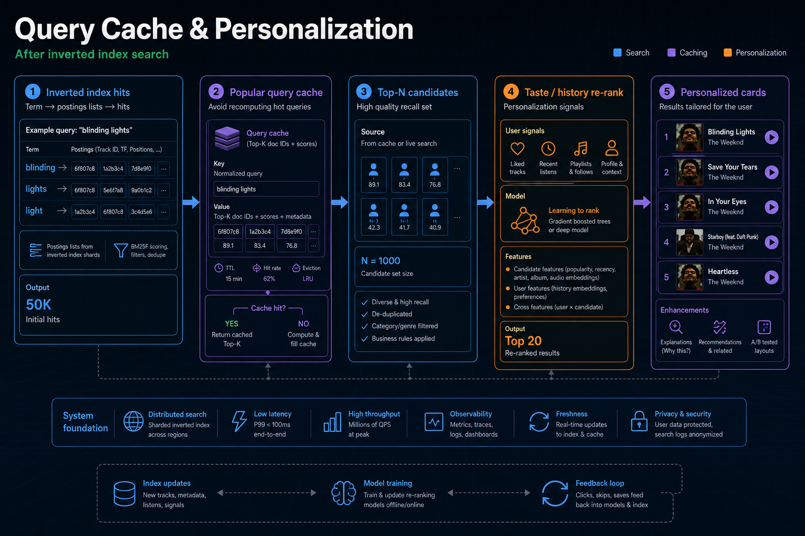
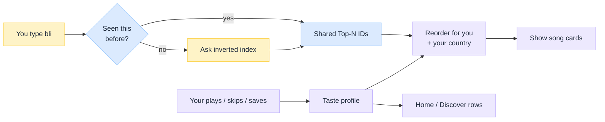
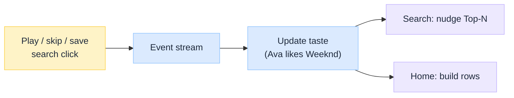
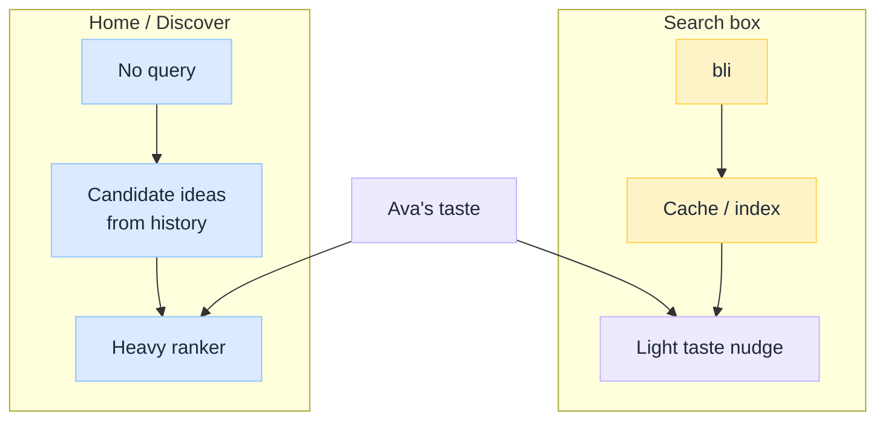

import Details from '@theme/Details';

<br/>


# Query Cache and Personalization: Spotify Music Discovery

*Three questions after [inverted index search](/insights/music-search-inverted-index):*

1. **Match:** which track IDs fit `bli`?
2. **Cache:** did a million people already ask that, so we can reuse the answer?
3. **Personalize:** for *this* listener, which of those IDs should float up, and what should Home suggest with no query at all?

The index handles (1). This article is (2) and (3), still using Spotify-shaped music discovery. Parent pipeline: [Spotify Music Streaming Pipeline](/insights/spotify-music-streaming-pipeline).

:::tip[THE CLAIM]
**Reuse one shared answer for popular searches. Personalize only a short list afterward.** Putting every user's taste into the cache (or into every index shard) makes search slow and expensive. Treating Home like "search with an empty box" mixes two different products.
:::

<!-- truncate -->

## The simple picture

Imagine a busy restaurant:

| Piece | Kitchen metaphor | Music search |
| --- | --- | --- |
| **Inverted index** | Back-of-book index in the cookbook | Finds track IDs for words you type |
| **Query cache** | Sticky note: "`bli` → these 20 dishes" | Remembers the popular Top-N ID list |
| **Personalization** | Waiter knows *you* like spicy | Reorders that short list for your taste |
| **Home recommendations** | "Chef's picks for you" with no menu search | Rows built from history, not from a typed query |


<br/>

**Worked cast** (same IDs as the parent article):

| ID | Track | Why it matters |
| --- | --- | --- |
| **t42** | Blinding Lights · The Weeknd | Huge hit; wins most `bli` searches |
| **t91** | Blippi Theme · Blippi | Also matches prefix `bli`; kids audience |
| **t17** | Blink-182 track | Another `bli` collision |

Two listeners:

| Listener | History | What they want from `bli` |
| --- | --- | --- |
| **Ava** | Plays The Weeknd a lot | Blinding Lights first |
| **Maya** | Plays kids music; saved Blippi | Blippi Theme higher |

---

## 1. Caching: remember the shared answer

### Why bother?

Without a cache, every person who types `bli` makes the system:

1. Talk to many index shards
2. Merge big posting lists
3. Score the same global winners again

At Spotify scale, `bli`, `the weeknd`, and `taylor` happen constantly. You want the **second** request for `bli` to be cheap.

### Concrete example: first vs second keystroke wave

**10:00:00: Ava types `bli` (cache miss)**

1. Normalize: `bli`
2. Cache lookup: miss
3. Index returns candidates including `t42`, `t91`, `t17`, …
4. Stage-1 rank (popularity + match quality): roughly `[t42, t17, t91, …]`
5. **Write cache:** key `prefix:bli` → that Top-N ID list (no user name on the key)
6. Then personalize for Ava (next section) and show cards

**10:00:01: Maya types `bli` (cache hit)**

1. Normalize: `bli`
2. Cache lookup: **hit** → same shared list `[t42, t17, t91, …]`
3. Skip the expensive shard fan-out
4. Personalize for Maya, show cards

Same sticky note. Different waiters (personalization).

<Details summary="Example cache entry (what gets stored)">

Think of this as the sticky note. Notice there is **no** `user_id`.

```json
{
  "key": "prefix:bli",
  "ttl_seconds": 60,
  "top_n": [
    { "track_id": "t42", "title_hint": "Blinding Lights", "score": 0.96 },
    { "track_id": "t17", "title_hint": "Blink-182…", "score": 0.55 },
    { "track_id": "t91", "title_hint": "Blippi Theme", "score": 0.41 }
  ]
}
```

</Details>

### What goes in the cache key?

| Do | Example | Why |
| --- | --- | --- |
| Normalize the text | `Blinding Lights` and `blinding lights` → same key | One sticky note, not two |
| Include the mode | `prefix:bli` vs `full:blinding lights` | Typeahead ≠ submit |
| Keep keys small and popular | Hot prefixes and top queries | High reuse |

| Don't | Bad example | Why it hurts |
| --- | --- | --- |
| Put the user in the key | `prefix:bli:ava` | Almost never reused; cache fills with junk |
| Cache final personalized order | Ava's exact list forever | Maya would steal Ava's ranking |
| Cache "available in DE" flags as global truth | One country baked into the sticky note | Other countries see wrong Play options |

### How long does the sticky note live?

Short for typeahead (seconds to about a minute). Longer is fine for stable full queries if traffic is high.

When something important changes, throw the note away:

| What happened | What you do |
| --- | --- |
| New Weeknd single goes live | Expire keys that mention that artist / title tokens |
| Track taken down | Stage-2 must still hide it even on a cache hit |
| Ranking rules change | Flush old cache generation |

:::note[Cache hit ≠ finished]
The cache only stores a **shared shortlist**. You still filter by country / policy and optionally nudge by taste, then load titles and art from the **catalog**.
:::

---

## 2. Personalization on search: reorder the shortlist

The cache (or the index) gives everyone the same Top-N. Personalization answers: **in what order should *this* person see them?**

Do this only on a **small** list (say 20-100 IDs). Never push "Ava likes synth-pop" into every index shard.

### Walkthrough: Ava and Maya, same `bli`

Shared Top-N from cache:

1. t42 Blinding Lights  
2. t17 Blink-182  
3. t91 Blippi Theme  

**Ava** (Weeknd fan, US, all three playable):

| Step | Result |
| --- | --- |
| Country / rights check | All OK |
| Taste nudge | Boost Weeknd / synth-pop → t42 stays #1; maybe lift other Weeknd over random collisions |
| Screen | **1. Blinding Lights · 2. Blink-182 · 3. Blippi…** |

**Maya** (kids listener, US):

| Step | Result |
| --- | --- |
| Country / rights check | All OK |
| Taste nudge | Boost kids / Blippi → t91 moves up |
| Screen | **1. Blinding Lights · 2. Blippi Theme · 3. Blink-182…** |

Blinding Lights often still wins because the typed prefix strongly matches a global smash. Taste is a **gentle nudge**, not a rewrite of reality.

**Bad personalization:** Maya types `Blinding Lights` in full, and the app buries it under kids tracks she likes. That feels broken. Clear title intent must win.

<Details summary="Same shortlist, two users (JSON)">

```json
{
  "query": "bli",
  "shared_from_cache": ["t42", "t17", "t91"],
  "ava_sees": ["t42", "t17", "t91"],
  "maya_sees": ["t42", "t91", "t17"]
}
```

</Details>

### What signals matter on the search box?

| Signal | Simple example | Required? |
| --- | --- | --- |
| **Country / availability** | Track not licensed in DE → hide | Yes |
| **Take-downs** | Legal removal → hide | Yes |
| **Taste** | Ava plays Weeknd → gentle boost | Soft |
| **Fresh taste** | Maya saved Blippi yesterday > old skip from last year | Soft |
| **Diversity** | Don't show five uploads of the same song | Soft |

---

## 3. Where taste comes from: plays, skips, saves

Personalization needs a memory of the listener. That memory is built from events after Play (same family of events as royalties in the streaming pipeline).

### Example week for Ava

| Day | What Ava does | What the system learns |
| --- | --- | --- |
| Mon | Plays Blinding Lights to the end, twice | + Weeknd, + synth-pop |
| Tue | Skips a metal track after 3 seconds | − that artist / style |
| Wed | Saves After Hours to Liked Songs | Strong + for album / artist |
| Thu | Types `bli`, clicks result #1 | Search click confirms intent |
| Fri | Opens Home | Home uses this profile (no query) |


<br/>

| Kind of signal | Everyday example | Effect |
| --- | --- | --- |
| **Positive, quiet** | Finished the song, replayed it | Like this more |
| **Negative, quiet** | Skip in the first seconds | Like this less |
| **Clear yes** | Follow artist, heart track | Strong like |
| **Search behavior** | Always clicks the top hit for `weeknd` | Confirms that query means that artist |

Keep Ava's taste **out of** the shared `prefix:bli` cache. The sticky note is public-ish within the product; the taste profile is hers.

---

## 4. Suggestions vs recommendations (different screens)

People say "personalized search" and mean two different UIs.

### Side-by-side example

| Screen | What the user did | What the system does | Personalization |
| --- | --- | --- | --- |
| **Typeahead** | Ava typed `bli` | Look up prefix (often from cache), light reorder | Light |
| **Search results** | Ava pressed enter on `blinding lights` | Full-text / cache, then filters + mild taste | Light to medium |
| **Home row** | Ava opened the app | No query: invent candidates from taste + co-listen | Heavy |
| **Radio** | Ava started radio from Blinding Lights | Similar tracks + exploration | Heavy |

**Search** starts from words. **Home** starts from Ava.


<br/>

One taste profile. Two pipelines. That is the design win.

---

## Design lessons

| Steal this | In plain words |
| --- | --- |
| **Cache the shared Top-N** | One sticky note for `bli`, not one per user |
| **Personalize after the cache** | Country and taste still run on a hit |
| **Taste nudges search; it does not replace it** | Typed title still wins |
| **Plays feed both search and Home** | One event stream, two products |
| **Suggestions ≠ Home rows** | Keystrokes vs "just opened the app" |

## Easy mistakes

| Mistake | What goes wrong (example) |
| --- | --- |
| **No cache** | Every `bli` in the world hits every shard |
| **Cache key includes user id** | Cache never hits; you paid for Redis and got nothing |
| **Personalize inside each shard** | Search gets slow; hard to explain ranking |
| **Serve cache past a take-down** | User sees a song they cannot play |
| **Build Home as empty search** | Wrong speed and weak variety |
| **Only count plays, ignore skips** | Profile thinks Ava loves everything she sampled |

:::tip[TAKEAWAY]
**After the inverted index, keep two simple contracts.** (1) A **shared cache** of popular Top-N IDs so `bli` is cheap the second time. (2) A **taste profile** from plays, skips, and saves that lightly reorders search and heavily powers Home. The win is not "add Redis plus a recommender." It is keeping **shared answers**, **per-person reordering**, and **no-query recommendations** on clear boundaries, as Ava and Maya typing the same `bli` shows.
:::

:::info[Builds on]
[Spotify Music Discovery: Inverted Index Search](/insights/music-search-inverted-index) · [Spotify Music Streaming Pipeline](/insights/spotify-music-streaming-pipeline) · [SQL vs NoSQL Under the Hood](/insights/sql-vs-nosql-under-the-hood)
:::
