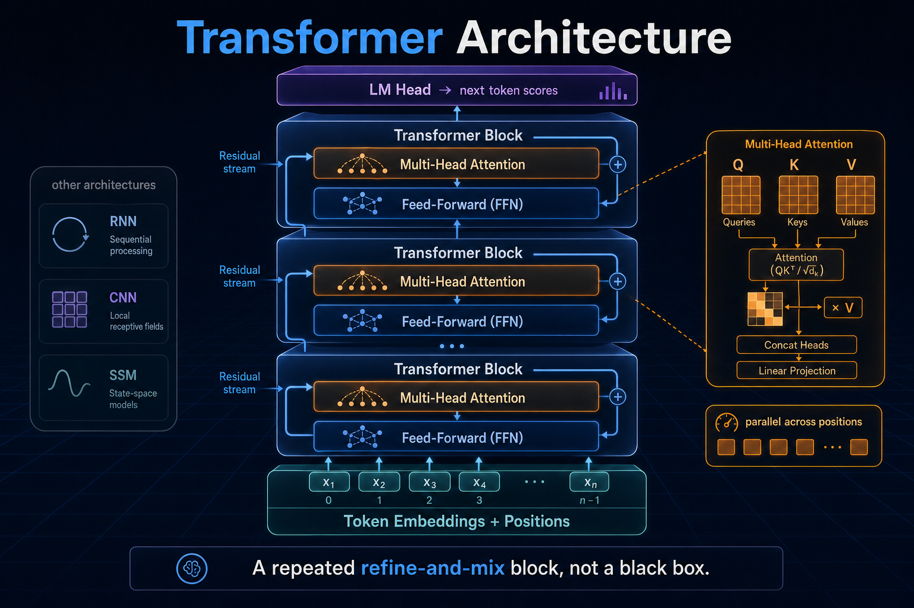
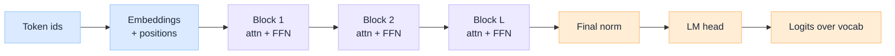
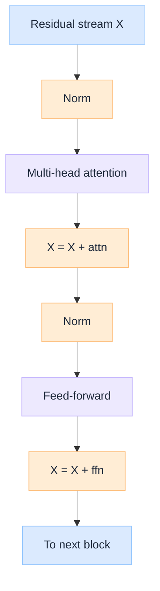

import Details from '@theme/Details';

<br/>


# Transformer Architecture: The Block Every Modern LLM Is Built From

*When people say "the model", they usually mean a stack of identical blocks doing the same two moves over and over: mix information across tokens, then transform each token on its own. That stack is the transformer. Almost everything else in an LLM (chat, tools, long context, "reasoning") is training data, serving tricks, and how you mask attention, not a different machine.*

This is a learner's pass through that block. Other architectures get a short map so you can place the names you still hear. The rest of the page stays on the transformer, because that is the shape nearly every production language model is cut from. For the full lifecycle around it, start at [How LLM Works Under the Hood](/insights/how-llm-works-under-the-hood).

:::tip[THE CLAIM]
**A transformer is a repeated refine-and-mix block, not a black box.** Embeddings put tokens on a shared vector bus. Attention mixes across positions. The feed-forward network rewrites each position. Residuals and norms let you stack the block dozens of times. Scale that stack, train next-token prediction, and you get what we call an LLM.
:::

<!-- truncate -->

## Model architectures at a glance

Before the deep dive, a light map of families you will still see in papers and vendor decks. This table is orientation only. The rest of the article is the transformer row.

| Architecture | Core idea | Strength | Weakness for language at scale | Where you still see it |
| --- | --- | --- | --- | --- |
| **RNN / LSTM / GRU** | Hidden state updated left to right | Natural sequence order, compact | Hard to parallelise; long-range signal fades | Legacy NLP, some streaming / edge niches |
| **CNN (for text)** | Local filters over token windows | Parallel, strong local patterns | Fixed receptive field unless very deep | Older text classifiers; vision remains CNN-heavy |
| **Transformer** | Attention mixes any pair of positions in a layer | Parallel training; short path for long-range deps | Quadratic attention cost in sequence length | Almost all modern LLMs |
| **State-space / linear RNN (e.g. Mamba-class)** | Recurrence with efficient long-state updates | Linear scaling in length; strong on long context | Ecosystem and tooling still thinner than transformers | Long-context research, hybrid stacks |
| **Mixture of Experts (MoE)** | Sparse routing over many FFNs inside a transformer | More parameters per FLOP at train/serve | Routing complexity, load balance, serving quirks | Large sparse LLMs (still transformer-shaped) |

Two footnotes matter more than the row labels:

1. **MoE is not a rival to the transformer.** It is usually a transformer whose feed-forward piece is replaced by a routed set of experts.
2. **Hybrids exist.** Some models mix attention layers with state-space layers. The product still markets itself in the transformer era's interface: tokens in, tokens out.

Why transformers won for language in practice: training parallelises across the sequence, every layer can connect distant tokens in one hop, and one stack plus next-token prediction proved to be a platform you can keep scaling. That is enough context to leave the table and open the block.

---

## The transformer in one picture

A decoder-style LLM (the common chat shape) is almost boring when drawn end to end:


<br/>

Every "Block" is the same recipe. Depth is mostly *how many times* you run it. The dials that size those blocks (width, heads, FFN size, vocabulary) are fixed before training; see [Before Training an LLM](/insights/before-training-an-llm).

:::tip[TAKEAWAY]
**If you can draw embeddings → stacked blocks → LM head, you already understand the skeleton of GPT-class models.** The rest of this article is what happens inside one block.
:::

---

## Token embeddings and positions

The model never sees characters. It sees integer token ids from a tokenizer.

| Piece | Role |
| --- | --- |
| **Embedding table** | A learned matrix `(vocab_size × hidden_size)`. Each id looks up one row: a vector that will ride through the stack |
| **Positional information** | Without it, the sequence is a bag of vectors. Modern LLMs usually inject position with **RoPE** (or similar) inside attention, not only as a vector added once at the bottom |

After this step you have a tensor shaped roughly `(batch, sequence_length, hidden_size)`. That shape is the residual stream: the bus every block will read from and write back to.

---

## Self-attention

Attention is the mix step. For each position, the model asks: **given what I am (query), which other positions (keys) matter, and what should I copy from them (values)?**

### Q, K, V in one breath

Each token vector is projected into three roles:

| Role | Intuition |
| --- | --- |
| **Query (Q)** | What am I looking for? |
| **Key (K)** | What do I contain that others might look for? |
| **Value (V)** | What payload do I pass along if I am selected? |

Scores come from comparing Q to every allowed K, a softmax turns scores into weights, and the output is a weighted sum of V. That is "attention" as a soft lookup over the sequence.

### Multi-head

Instead of one lookup, the model runs several in parallel (**heads**), each on a slice of the channel. One head may track syntax, another brackets, another a name mentioned earlier. Their outputs are concatenated and projected back to `hidden_size`.

### The mask (brief)

Which positions are *allowed* into that lookup is the attention contract:

| Mask | Effect |
| --- | --- |
| **Causal** | Position *t* sees only `1…t`. Required for next-token training without cheating. Default for GPT-class decoders |
| **Bidirectional** | Every position sees the full sequence. Classic encoder (BERT-class) behaviour |

Same block machinery, different visibility. The dedicated comparison of encoder vs decoder vs encoder-decoder families is Encoder vs Decoder LLM Architecture (coming soon).

<Details summary="Pseudo-code: one attention head (shape intuition)">

```text
# X: (T, D) residual stream for one sequence
Q = X @ W_Q          # (T, D_h)
K = X @ W_K          # (T, D_h)
V = X @ W_V          # (T, D_h)

scores = Q @ K.T / sqrt(D_h)    # (T, T)
scores = mask_future(scores)    # causal: forbid j > i
weights = softmax(scores, dim=-1)
out = weights @ V               # (T, D_h)
```

Multi-head repeats this with different projections, then concatenates.

</Details>

:::tip[TAKEAWAY]
**Attention is content-addressable mixing across positions.** QKV is just learned query, address, and payload. The mask decides the universe of addresses you are allowed to read.
:::

---

## The feed-forward network

After attention has mixed context into each position, the **FFN** rewrites each position independently. No cross-token traffic here: it is a per-token MLP, usually expand to a wider width (`ffn_hidden`, often ~4× `hidden_size`), nonlinear activation, project back.

| Attention | FFN |
| --- | --- |
| Mixes **across** positions | Transforms **within** a position |
| Where context enters a token | Where much of the model's "knowledge" capacity sits (parameter-heavy) |
| Quadratic in sequence length (standard form) | Linear in sequence length |

A useful mental split: attention moves information; the FFN digests it. MoE models make the FFN sparse (route each token to a few experts) but keep this split.

---

## Residual stream, norms, and stacking

Two bookkeeping ideas make depth possible.

| Idea | Why it exists |
| --- | --- |
| **Residual connection** | Each sub-layer (attention, FFN) adds its output back to the incoming stream instead of replacing it. Gradients and information can bypass a layer |
| **Normalisation** | LayerNorm or RMSNorm keeps activations in a stable range so a 30- or 80-block stack remains trainable |

A single block is usually:

1. Norm → attention → add residual  
2. Norm → FFN → add residual  

(Pre-norm vs post-norm is a placement detail; modern LLMs lean pre-norm.)

Stack that block **L** times. Early layers tend to handle local and surface patterns; deeper layers build longer-range and more abstract features. You do not get a different algorithm per layer. You get repeated refinement on the same bus.


<br/>

:::tip[TAKEAWAY]
**Depth is stacked residual edits to the same stream.** Norms keep the edits stable; residuals keep the highway open.
:::

---

## What one forward pass does

### During training

For a causal model, the whole sequence is processed in parallel with the causal mask. Every position predicts the next token at once. That is why transformers train efficiently on GPUs: the sequence is a batch dimension for matrix multiplies, not a serial loop. The four-step training loop that fills the weights is in [During Training an LLM](/insights/during-training-an-llm).

### At inference

Weights are frozen. Generation becomes:

1. **Prefill:** run the prompt through the stack once; store keys and values (**KV cache**).  
2. **Decode:** for each new token, run one step that attends to the cached past, emit a token, append to the cache.

That loop is the subject of [After Training an LLM](/insights/after-training-an-llm). Architecturally, decode is still the same block. The cache exists because recomputing K and V for the entire past on every new token would be wasteful.

---

## Why this shape scales

| Property | Practical effect |
| --- | --- |
| **Parallel over sequence at train time** | GPUs earn their keep; RNNs' serial dependency does not |
| **Constant path length between tokens (per layer)** | Distant words can interact without hopping through every in-between state |
| **Uniform block** | One kernel story, one serving story, easy to deepen or widen |
| **KV cache at decode** | Attention's cost becomes manageable for interactive generation |
| **Same interface** | Prompt tokens in, next-token distribution out: chat, tools, and agents all sit on top |

The main tax is standard attention's **O(T²)** cost in sequence length T. Long-context work (efficient attention, chunking, state-space hybrids) is mostly about paying that tax less often, not about abandoning the refine-and-mix idea.

---

## Final takeaway

Strip an LLM of product names and you are left with a short parts list: a vocabulary embedding, a positional scheme, a stack of attention-plus-FFN blocks on a residual stream, and a linear head back to tokens. Other architectures still matter at the margins, and MoE / hybrids tweak pieces of this recipe. They do not replace the need to understand the recipe.

> **Learn the transformer block once, and every GPT-class model becomes a sizing and training story on top of the same diagram.** Embeddings put tokens on the bus; attention mixes; the FFN digests; residuals let you stack. Everything else is details and dials.

:::info[Builds on]
[How LLM Works Under the Hood](/insights/how-llm-works-under-the-hood) · [Before Training an LLM](/insights/before-training-an-llm) · [During Training an LLM](/insights/during-training-an-llm) · [After Training an LLM](/insights/after-training-an-llm)
:::
