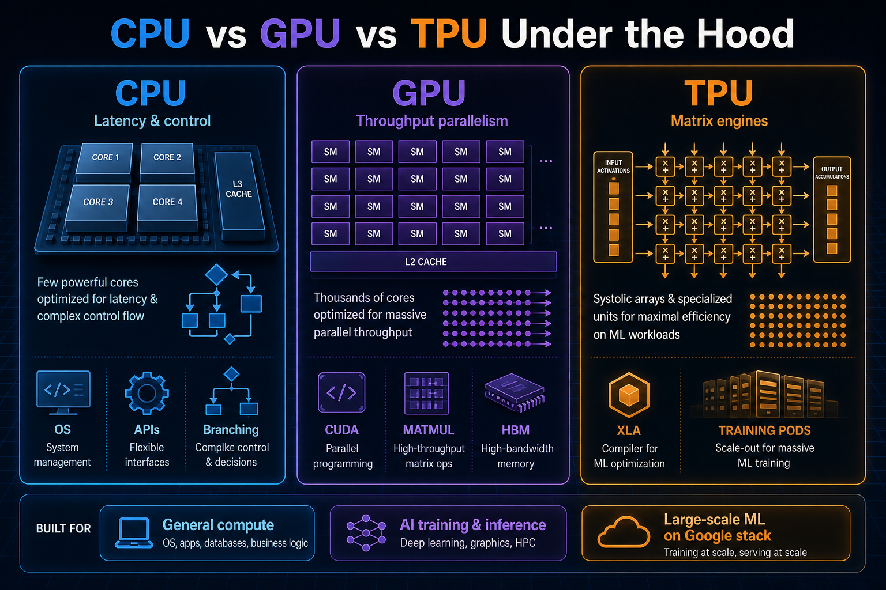
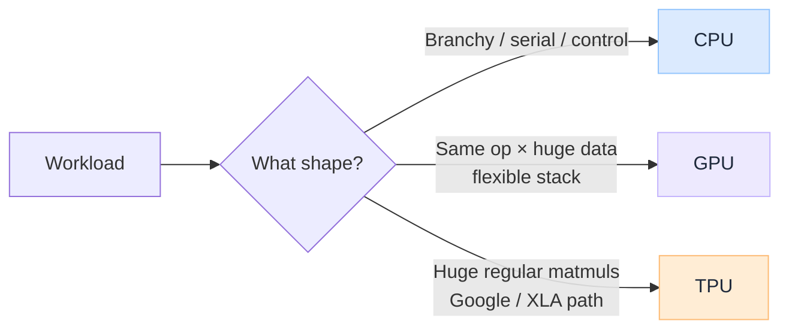
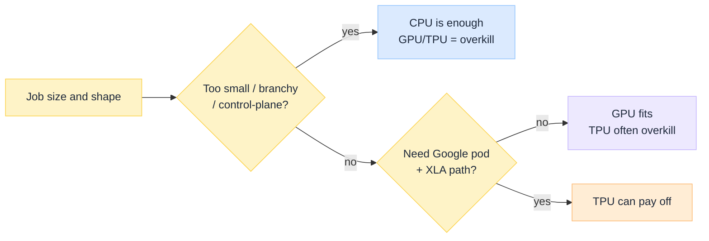
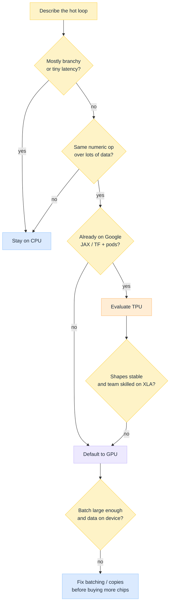

import Details from '@theme/Details';

<br/>


# CPU vs GPU vs TPU Under the Hood

*Teams still talk as if these chips sit on one speed ladder: CPU slow, GPU faster, TPU fastest. That story hides the real design choice. Each one spends transistors on a different job.*

A **CPU** finishes messy, branchy work quickly. A **GPU** keeps thousands of similar threads busy so memory latency does not idle the chip. A **TPU** (Google's Tensor Processing Unit family) is built around dense matrix multiply for training and inference at pod scale. Pick the wrong one and you do not get "a bit slower." You get idle silicon, surprise bills, or a software stack you cannot leave.

This is a **decision guide** under the hood: what each accelerator is, how they differ, where each wins, and the gotchas that show up in real ML and platform work. Companion depth on language models: [How LLM Works Under the Hood](/insights/how-llm-works-under-the-hood).

:::tip[THE CLAIM]
**Match the chip to the shape of the work, not to the marketing FLOPs number.** CPUs own latency and control flow. GPUs own data-parallel throughput on flexible CUDA-class stacks. TPUs own large, regular matrix workloads inside Google's XLA / JAX / TensorFlow world. Mixing those jobs is how GPUs sit idle behind a slow host, and how "we bought accelerators" fails to move the product metric.
:::

<!-- truncate -->

## The bottom line first

- **CPU:** few powerful cores, deep caches, great at branching, OS, APIs, orchestration, and anything serial or irregular.
- **GPU:** many simple lanes, huge memory bandwidth, great at the same math over lots of data (training, inference, analytics kernels).
- **TPU:** matrix / systolic engines aimed at neural net matmuls; shine in Google Cloud pods with XLA-compiled graphs.
- **Rule of thumb:** if the work is "one complicated path," stay on CPU. If it is "the same op on a huge batch," consider GPU. If it is "massive, regular ML on Google's stack," consider TPU.
- **Gotcha preview:** PCIe copies, tiny GPU batches, and TPU shape / lock-in kill more projects than raw TFLOPs ever save.
- **Overkill check:** a bigger chip is waste if the work is too small, too branchy, or on the wrong software stack.
- **Most real systems are heterogeneous:** CPU in charge, accelerators for the hot numeric loops.

## What each one is

### CPU: the generalist

The CPU is the computer's control plane. A handful to a few hundred strong cores, each with branch prediction, out-of-order execution, and large caches. Transistors go to **finishing one thread fast**, whatever weird shape the code takes.

**What it does well:** run the OS, serve HTTP, parse JSON, hold locks, walk irregular graphs, schedule GPU work, tokenise text, enforce auth.

**Mental model:** a skilled chef who can cook any dish, one plate at a time, very quickly.

### GPU: the throughput machine

A GPU (as programmed through CUDA and similar stacks) is a **throughput** device. Tens of thousands of simple lanes grouped into streaming multiprocessors. Small caches per thread, very high bandwidth memory (HBM on datacentre cards). The bet is: keep enough warps in flight that while one group waits on memory, another group runs.

**What it does well:** dense matrix multiply, convolutions, embeddings at scale, bulk dataframe / classical ML kernels, rendering.

**Mental model:** a factory line that stamps the same part ten thousand times. Terrible at "each item needs a different recipe."

### TPU: the matrix specialist

A TPU is an ASIC family from Google built around **systolic arrays**: grids of multiply-accumulate units that stream matrices through with high efficiency for neural network layers. High-end pods connect many chips over a fast interconnect so large models train without turning every step into a network tax.

**What it does well:** large-scale training and inference when the graph compiles cleanly through **XLA** and the team lives in **JAX / TensorFlow** (and Google Cloud) ecosystems.

**Mental model:** a custom press that only stamps matrices, but stamps them extremely well when the factory is set up for that mould.


<br/>

## Under the hood differences

| Dimension | **CPU** | **GPU** | **TPU** |
| --- | --- | --- | --- |
| **Design bet** | Low latency per thread | High throughput via massive parallelism | High efficiency on dense matmuls |
| **Cores / units** | Few, complex | Many, simple (SMs / warps) | Systolic arrays + vector/scalar units |
| **Memory** | Large caches, DDR/HBM depending on part; lower bandwidth than GPU HBM | HBM: very high bandwidth, limited capacity | High-bandwidth on-chip / HBM-class attached memory; capacity planned per generation |
| **Good code shape** | Branchy, serial, latency-sensitive | Regular, data-parallel, large batches | Static-ish graphs, large matrix shapes that XLA likes |
| **Programming model** | General languages, OS threads | CUDA / ROCm-class kernels, frameworks (PyTorch, …) | XLA, JAX, TensorFlow; Google Cloud first |
| **Who launches work** | Runs itself | Host CPU launches kernels | Host / runtime feeds compiled executables |
| **Flexibility** | Highest | High within parallel numeric work | Highest performance inside a narrower software and cloud lane |

The shared truth across GPU and TPU: **moving bytes often costs more than doing the math.** Decode-style LLM inference with batch size one is memory-bound on GPUs for that reason; TPUs face the same physics when the working set must stream from memory every token. Prefill and training with large GEMMs are where matrix engines earn their keep. See [After Training an LLM](/insights/after-training-an-llm) for prefill vs decode, and [During Training an LLM](/insights/during-training-an-llm) for the multi-device training loop.

## Side-by-side: one request

Same product idea (serve an LLM), three roles:

| Step | Usually runs on | Why |
| --- | --- | --- |
| TLS, auth, rate limits | **CPU** | Branchy control path |
| Tokenise / detokenise | **CPU** (sometimes specialised) | String-heavy, irregular |
| Batch scheduler / KV bookkeeping | **CPU** | Coordination |
| Prefill (big prompt matmuls) | **GPU or TPU** | Compute-friendly GEMMs |
| Decode (one token at a time) | **GPU or TPU** | Often bandwidth-bound; batching matters |
| Stream tokens to client | **CPU** | Network and protocol |

<Details summary="Rough intuition: when FLOPs stop mattering">

If a kernel does only a few operations per byte read from memory, the fancy matrix units wait on bandwidth. Buying a chip with twice the FLOPs does nothing until you raise batch size, fuse kernels, or cut bytes (quantisation, better layouts).

```text
Arithmetic intensity ≈ FLOPs / bytes_moved

Low  → memory bound (tiny decode batches, elementwise ops)
High → compute bound (large matmuls, fat training steps)
```

</Details>

## Use cases

| Use case | Best first choice | Why |
| --- | --- | --- |
| APIs, business logic, databases, orchestration | **CPU** | Control flow and latency |
| Feature stores, ETL orchestration, job scheduling | **CPU** | Coordination; ship bulk numeric bits elsewhere |
| LLM / CV / speech **training** at scale | **GPU** (default industry) or **TPU** (Google stack) | Huge parallel matmuls |
| LLM **inference** with PyTorch / vLLM-class stacks | **GPU** | Ecosystem, continuous batching, broad model support |
| Large JAX / TensorFlow training on Google Cloud | **TPU** | Pods + XLA tuned for that path |
| Bulk tabular ML / dataframe kernels on NVIDIA | **GPU** (RAPIDS-class libraries) | Same throughput machine, pandas-shaped APIs |
| Real-time bidding, trading triggers, OS interrupts | **CPU** | Microsecond-class latency and branching |
| Batch scoring millions of similar rows overnight | **GPU** (or TPU if already on that stack) | Throughput over latency |
| Edge device with no accelerator | **CPU** | Only option; quantise and shrink the model |

### When not to force each one

| Temptation | Better answer |
| --- | --- |
| "Put the whole app on GPU" | Keep the service on CPU; accelerate only hot kernels |
| "TPU because the FLOPs sheet looks bigger" | Only if your framework, shapes, and cloud match |
| "CPU-only for a 70B training run" | Wrong cost curve; you need accelerators |
| "One huge GPU for a 2 ms business rule" | PCIe and launch overhead will lose to a CPU function |

## When each is overkill

Overkill means you pay for silicon, power, and ops complexity that the workload cannot feed. The chip is fine; the **job is the wrong shape**.

### CPU is overkill when…

| Situation | Why it is waste | Use instead |
| --- | --- | --- |
| Training or fine-tuning a large neural net on CPU-only boxes | Weeks of wall time for work accelerators finish in hours | **GPU** (or **TPU** on the Google path) |
| Nightly scoring of millions of similar dense rows on a big CPU fleet | Throughput per dollar is poor for regular numeric bulk | **GPU** batch jobs |
| Embedding search / vector similarity at huge scale on CPU alone | Same op over millions of vectors is GPU territory | **GPU** (or specialised vector infra that already uses accelerators) |

**Plain test:** if the hot loop is "identical math on a huge batch," a room full of CPUs is the expensive way to fake a GPU.

### GPU is overkill when…

| Situation | Why it is waste | Use instead |
| --- | --- | --- |
| A 2 ms auth check, pricing rule, or feature flag | Kernel launch + PCIe dwarf the work | **CPU** function in the request path |
| Tiny arrays, one-off scripts, notebooks with megabytes of data | Transfer and launch cost beat any speedup | **CPU** (pandas / NumPy is fine) |
| Highly branchy, row-by-row business logic | Warps diverge; GPU sits half-masked | **CPU** |
| Sporadic inference with batch size 1 and no queue | Card mostly idle; you rent bandwidth you never amortise | **CPU** for small models, or a **shared GPU** pool with continuous batching |
| "We reserved an A100 for the API" that mostly does JSON and SQL | The accelerator never sees the hot path | Keep API on **CPU**; call a separate inference service only when needed |

**Plain test:** if moving the data to the device takes longer than doing the work on the host, the GPU is theatre.

### TPU is overkill when…

| Situation | Why it is waste | Use instead |
| --- | --- | --- |
| Team lives in PyTorch / vLLM and has no XLA / JAX muscle | You fight the stack more than you gain FLOPs | **GPU** |
| Prototypes, small models, or changing tensor shapes every run | Recompiles, padding, and ops gaps eat the win | **GPU** or **CPU** for the experiment |
| Work that is not dense matmul dominated (heavy branching, tiny graphs) | Systolic arrays starve | **CPU** or **GPU** |
| You need multi-cloud portability or on-prem NVIDIA estates | TPU is Google Cloud first | **GPU** |
| A single small inference endpoint with uneven traffic | Pod economics assume sustained, regular ML load | **GPU** shared serving, or **CPU** for tiny models |

**Plain test:** if you chose TPU from the FLOPs column and not from "our graphs compile cleanly on this stack at this scale," it is probably overkill.


<br/>

:::tip[Overkill in one line]
**CPU overkill** = using many CPUs for bulk identical math. **GPU overkill** = using a datacentre card for tiny or branchy work. **TPU overkill** = buying Google matrix pods without the software, shapes, or sustained load to feed them.
:::

## Gotchas

| Gotcha | What it looks like | Fix |
| --- | --- | --- |
| **Host underfeeds the device** | GPU / TPU utilisation low; CPU busy on tokenise, Python, or data loading | Profile the host path; overlap copy and compute; batch prep |
| **PCIe / copy tax** | "We moved to GPU" but end-to-end slower | Keep tensors / tables on device across steps; avoid `to_pandas()` ping-pong |
| **Tiny batches on GPU** | Decode or inference with batch 1; bandwidth bound | Continuous batching, larger effective batch, quantisation |
| **Warp divergence / irregular GPU code** | Kernel correct but slow | Restructure for regular control flow and coalesced memory |
| **TPU shape sensitivity** | Recompiles, padding waste, odd slowdowns when shapes change every step | Prefer stable shapes; pad deliberately; understand XLA recompilation |
| **Ecosystem lock-in** | Model or tooling only happy on one stack | Decide portability vs peak efficiency up front |
| **Capacity vs bandwidth** | OOM on HBM, or plenty of memory but still slow | Memory plans for weights + KV / activations; bandwidth plans for decode |
| **Cost blindness** | Idle reserved accelerators | Right-size; shared pools; measure tokens/sec/$ and utilised FLOPs |
| **Ignoring interconnect** | Multi-GPU / multi-TPU training stuck on all-reduce | Topology matters as much as chip count |

:::note[Heterogeneous is normal]
Every serious accelerated system is still a **CPU program that launches device work**. The accelerator never replaces the control plane. Low device utilisation is often a CPU or data-pipeline problem first.
:::

## How to choose


<br/>

| If your constraint is… | Lean toward |
| --- | --- |
| Product latency for irregular logic | **CPU** |
| Industry-standard ML tooling and model zoo | **GPU** |
| Max efficiency on Google-scale matmul training | **TPU** |
| Regulated hosting and vendor choice | Start from [Model Hosting Options for Regulated Industries](/insights/model-hosting-options-regulated-industries), then pick the chip that matches the runtime |

## Key takeaways

- **CPU, GPU, and TPU optimise different bets:** latency and generality vs flexible throughput vs matrix-specialised pods.
- **FLOPs on the datasheet are not the product metric.** Bytes, batch size, and software stack usually decide real speed.
- **Default ML path outside Google's stack is GPU;** TPU wins when XLA, shapes, and Cloud pods line up.
- **Keep the control plane on CPU.** Accelerators do the hot numeric loops.
- **Ask "is this overkill?" before you reserve silicon:** tiny/branchy work wastes GPUs and TPUs; bulk identical math wastes CPU fleets.
- **Fix copies, batching, and host prep before buying more silicon.**

:::info[Builds on]
[How LLM Works Under the Hood](/insights/how-llm-works-under-the-hood) · [During Training an LLM](/insights/during-training-an-llm) · [After Training an LLM](/insights/after-training-an-llm) · [Model Hosting Options for Regulated Industries](/insights/model-hosting-options-regulated-industries)
:::
