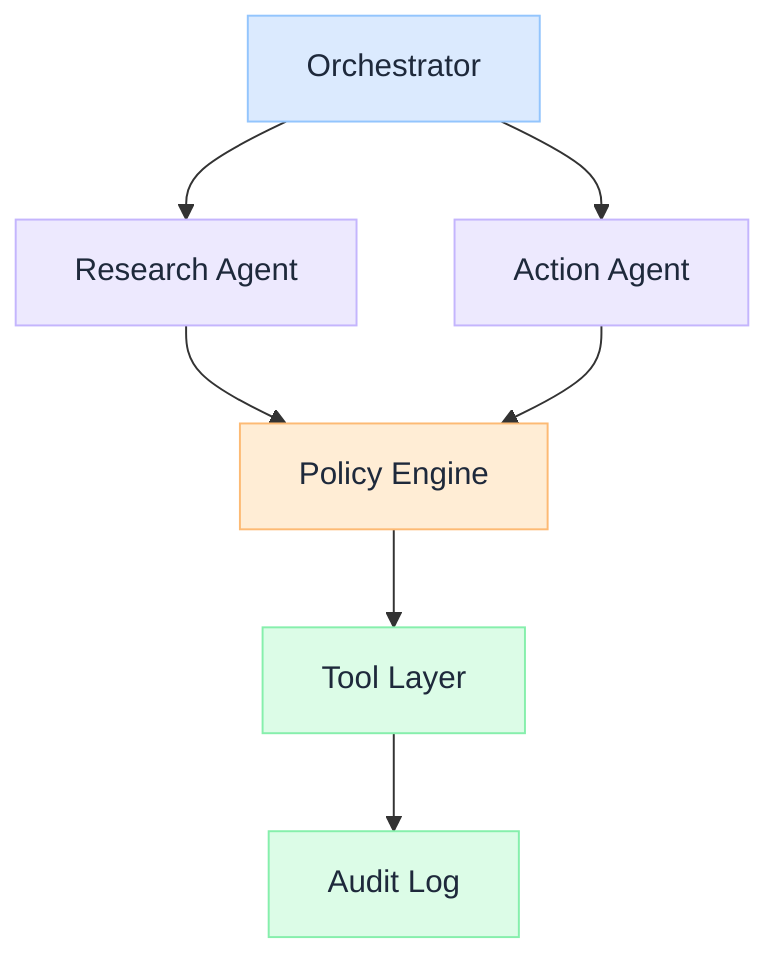

import Details from '@theme/Details';

  <h1 className="gain-doc-title">How to Build Agentic Systems</h1>
  
Design, deploy, and govern multi-agent systems in enterprise environments.

## Design for Multi-Agent Systems

  Multi-agent systems fail when coordination is implicit and governance is an afterthought. This playbook covers the architecture decisions required before agents reach production.

  

    <ul className="gain-checklist">
      <li>Define agent boundaries</li>
      <li>Register tools with schemas</li>
      <li>Enforce policy gates</li>
      <li>Design handoff protocols</li>
      <li>Instrument every action</li>
    </ul>
  

  

  

## Key Practices

  Assign each agent one clear role with bounded tool access. General-purpose agents become unpredictable: specialized agents are testable and governable.

  Define handoff formats, shared state schemas, and escalation paths between agents. Implicit coordination breaks under load and becomes impossible to debug.

  Build approval gates for high-impact actions from the start. Retrofitting human oversight into autonomous agents is expensive and error-prone.

  Evaluate decision paths, tool selections, and policy compliance: not just final responses. Agent quality is about process, not just results.

