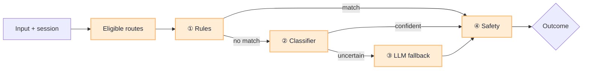

# Layered Classifier

[Blueprint](/blueprints/agents-blueprint) · [← Route table lifecycle](/playbooks/agents/intent-router/route-table-lifecycle) · **Classifier** · [Wire agentic app →](/playbooks/agents/intent-router/wire-agentic-app)

Do not send every message to one LLM with the full route table. Use a **short pipeline**: cheap layers first, capable layers only when needed, safety on every path.

:::tip[THE CLAIM]
**Eligible routes first, then rules, then classifier, then LLM fallback, then safety.** Keep Layer ③ rare.
:::

<!-- truncate -->

## Pipeline


<br/>

## Layer reference

| Layer | Job | Clarification |
| --- | --- | --- |
| **Eligible routes** | Prune table by ingress claims | No `payment_initiate` if user lacks payment role |
| **① Rules** | Commands, channel, **events**, session stickiness | `/pay`, topic `txn.flagged`, `"yes"` / `"$500"` stay on the active route |
| **② Classifier** | Small model / kNN on your golden set | Target most traffic in &lt;50ms |
| **③ LLM fallback** | Structured JSON, fixed `route_id` list | Top 3 + user pick for ambiguous or high-risk only |
| **④ Safety** | Injection, PII, veto | [Input plane](/playbooks/evaluation/plane-input): 100% adversarial pass |

## Outcomes

| Outcome | Typical action |
| --- | --- |
| **Route** | confidence ≥ threshold → hand off to agentic app |
| **Clarify** | missing entities or mid confidence → question or top-k pick |
| **Abstain** | low confidence or OOD → safe refusal or human handoff |

Tune thresholds per route risk. Prefer stricter bars on high-risk routes (payments, writes) and more clarify on ambiguous mid-risk paths.

Events have no user to ask. On no eligible routes or safety veto, fail closed or `escalate_human`. Do not run Layer ② / ③ on a Kafka payload that already named `route_id`.

## Rules: channel and events

Rules are deterministic. They may only assign a `route_id` already in the **eligible** set. First match wins. `router_layer` is `rules`. Stickiness (`"yes"`, `"$500"`) also lives here: read the **route pin** `session_id` → `route_id` + `correlation_id`, then jump to safety. The **run pin** (loop, token, copy of versions) still lives on the app ([Session custody](/playbooks/agents/orchestration/session-custody)).

| Rule kind | Example | What you skip |
| --- | --- | --- |
| Slash / command | `/hr`, `talk to a human` | Classifier and LLM fallback |
| Channel map | Finance Teams bot → finance routes only | Out-of-channel labels |
| **Topic / event map** | `txn.flagged` → `fraud_investigate` | Classifier, clarify, LLM fallback |

```json
{
  "match": { "topic": "txn.flagged" },
  "route_id": "fraud_investigate"
}
```

The worker still sends producer claims. If `fraud:investigate` is missing, eligible routes is empty and the rule cannot fire. Pattern 1 on that row is unchanged: after pin, the LLM still picks tool order inside the manifest.

Wire-up and JSON for the Kafka path: [Wire agentic app](/playbooks/agents/intent-router/wire-agentic-app#event-example-already-know-the-route).

## Trace fields

`intent_label`, `route_id`, `confidence`, `router_layer`, `eligible_routes`, `safety_flags`, `outcome`, `latency_ms`, `route_table_version`

## Read next

**[Wire agentic app →](/playbooks/agents/intent-router/wire-agentic-app)**
