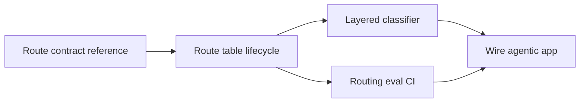

# Intent Router

[Agents overview](/playbooks/agents) · **Intent router overview** · [① Route contract reference →](/playbooks/agents/intent-router/route-contract-reference)

Implementation guides for **Plane ①** of the [Agents Blueprint](/blueprints/agents-blueprint).

:::tip[THE CLAIM]
**Route before the loop.** The router owns dispatch and trace; the agentic app owns manifest pin and orchestration. The LLM never sees tools from routes that were not selected for this turn.
:::

<!-- truncate -->

## Five playbooks

| # | Playbook | One-line purpose |
| --- | --- | --- |
| **①** | **[Route contract reference](/playbooks/agents/intent-router/route-contract-reference)** | Field dictionary: route, `activation_target`, manifest, policy, retrieval, memory |
| **②** | **[Route table lifecycle](/playbooks/agents/intent-router/route-table-lifecycle)** | Versioned contracts, storage patterns, promote and rollback |
| **③** | **[Layered classifier](/playbooks/agents/intent-router/layered-classifier)** | Eligible routes, rules (channel / event), classifier, LLM fallback, safety |
| **④** | **[Wire agentic app](/playbooks/agents/intent-router/wire-agentic-app)** | Front door, decide-only handoff, event bind, PGAR start |
| **⑤** | **[Routing eval CI](/playbooks/agents/intent-router/routing-eval-ci)** | Golden set, release gates, incident replay |

## Recommended path

 

1. **[Route contract reference](/playbooks/agents/intent-router/route-contract-reference):** define the row fields before writing classifier code
2. **[Route table lifecycle](/playbooks/agents/intent-router/route-table-lifecycle):** version, store, promote, roll back
3. **[Routing eval CI](/playbooks/agents/intent-router/routing-eval-ci):** golden set in parallel with Layer ①-②
4. **[Layered classifier](/playbooks/agents/intent-router/layered-classifier):** implement the pipeline
5. **[Wire agentic app](/playbooks/agents/intent-router/wire-agentic-app):** route pin, async start, `correlation_id`; app copies the freeze

Bridge reading: [PGAR Agentic app](/playbooks/governance/runtime/boundary/agentic-app) · [Eval Plane ①: Input](/playbooks/evaluation/plane-input) · [Manifest registry](/playbooks/agents/manifests/manifest-registry).

## Who should read what

| Role | Start with | Then |
| --- | --- | --- |
| **AI platform** | [Route contract reference](/playbooks/agents/intent-router/route-contract-reference), [Layered classifier](/playbooks/agents/intent-router/layered-classifier) | [Wire agentic app](/playbooks/agents/intent-router/wire-agentic-app) |
| **Domain squad** | [Route contract reference](/playbooks/agents/intent-router/route-contract-reference), [Route table lifecycle](/playbooks/agents/intent-router/route-table-lifecycle) | [Routing eval CI](/playbooks/agents/intent-router/routing-eval-ci) |
| **Governance** | [Routing eval CI](/playbooks/agents/intent-router/routing-eval-ci) | [Eval Input plane](/playbooks/evaluation/plane-input) |

## Read next

**[① Route contract reference →](/playbooks/agents/intent-router/route-contract-reference)** · After wiring: [Orchestration (Plane ②)](/playbooks/agents/orchestration)
