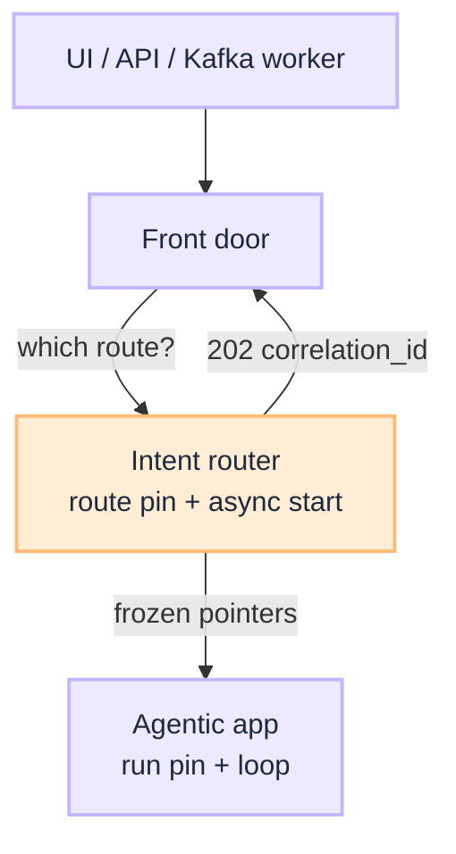
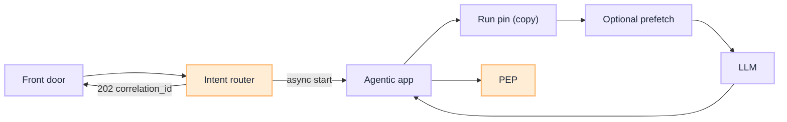

import Details from '@theme/Details';

# Wire Agentic App

[Blueprint](/blueprints/agents-blueprint) · [← Layered classifier](/playbooks/agents/intent-router/layered-classifier) · **Wire app**

The router sits **outside** plan → act → observe. Ingress (chat, API, or event) hits a **shared front door**. That door **calls the router**. On `outcome=route` the router **freezes** `route_id` + versions, **async-starts** the [agentic app](/playbooks/governance/runtime/boundary/agentic-app), and keeps `correlation_id`. The app **copies** that freeze into the [run pin](/playbooks/agents/orchestration/session-custody) and runs Plane ②. PEP lives in [PGAR](/playbooks/governance/runtime).

:::tip[THE CLAIM]
**On clarify or abstain, do not start the app.** On route, Plane ① pins the **route** and returns `202` + `correlation_id`. The app pins loop and token from **that copy**, not from `active`.
:::

<!-- truncate -->

## Shared front door, decide-only router, app owns the run

Three jobs. Do not merge them.


<br/>

| Box | Owns | Does not own |
| --- | --- | --- |
| **Front door** | Auth, slim UX, SSE/poll, `session_id` the client may see | Route table, kNN, tools, PEP |
| **Intent router** | Eligible routes, stickiness, **route pin**, async start, `correlation_id` | The loop, tokens, Temporal, waiting on the memo |
| **Agentic app** | Copy of frozen versions, run pin, Pattern 0-3, PEP, memory | Classifying the next utterance; looking up `active` |

Same process is allowed (two modules). The rule is logical: the decide path must not wait on a 12-step fraud loop.

**Default start is async.** Router (or front door) `POST`s the frozen contract, agent returns `202 { "correlation_id" }`, replies arrive later (poll, SSE, Kafka). Sync wait is acceptable only for Pattern 0 (one inference, hundreds of ms). Do not block Plane ① until the memo is done.

Channels must not dial Legal or payments URLs. That is the front door, not a second classifier.

## Ingress: UI, API, or event

Patterns 0-3 answer **who decides the next step**. They do not answer **how the run is started**. The same `route_id` can start from chat, a sync API, or a Kafka worker.

| Ingress | What it is | Typical fit |
| --- | --- | --- |
| **UI** | Chat, copilot, form | Interactive turns; clarify UX |
| **API** | Sync request or async job start | Systems integration |
| **Event** | Queue, webhook, schedule, domain event | Background Pattern 1 / 2; retries; no user to ask |

The Kafka worker **is** the front door for that message. It still calls the router (rules / explicit `route_id`), then starts the app. Pattern 1 still belongs on the route table. You skip the classifier, not Plane ①.

Topic → `route_id` lives under [Layered classifier](/playbooks/agents/intent-router/layered-classifier#rules-channel-and-events) (Layer ① rules).

## Request sequence

1. Receive message or event + session from ingress
2. **Call intent router** → route decision record
3. On `clarify` / `abstain` → UX (or fail / `escalate_human` on events); **do not** start the app
4. On `route` → router writes the **route pin**, async-starts the app with **frozen** versions; agent returns `correlation_id` (`run_id`)
5. App **copies** those versions into the [run pin](/playbooks/agents/orchestration/session-custody); it does not reload `active`
6. If `retrieval.mode` is `deterministic_prefetch` → retrieve inside `scope` (PEP-gated), assemble context, **one** LLM call with no tool schemas
7. Else if `tool_manifest` is `none` → one LLM call with no tool schemas
8. Else → load [tool manifest](/playbooks/agents/manifests/manifest-lifecycle) at the **pinned** id; call LLM with messages + **scoped schemas only**
9. On tool proposal → validate against manifest → [PEP](/playbooks/governance/runtime/boundary/pep-pdp)


<br/>

## Event example: already know the route

The producer names the capability. Classification does not run. The router still **looks up, entitles, and records**.

<Details summary="Kafka message (JSON)">

```json
{
  "event_id": "evt-9f3c",
  "topic": "txn.flagged",
  "idempotency_key": "alert-88421:v1",
  "payload": {
    "alert_id": "alert-88421",
    "account_id": "acct-4412"
  }
}
```

</Details>

<Details summary="Router request (JSON)">

```json
{
  "ingress": "event",
  "topic": "txn.flagged",
  "route_id": "fraud_investigate",
  "claims": {
    "sub": "svc-fraud-ingest",
    "emts": { "fraud:investigate": true }
  }
}
```

</Details>

<Details summary="Decision (JSON)">

```json
{
  "outcome": "route",
  "router_layer": "rules",
  "route_id": "fraud_investigate",
  "route_table_version": "2026.08.1",
  "confidence": 1.0,
  "eligible_routes": ["fraud_investigate"]
}
```

</Details>

<Details summary="Async start (JSON)">

```json
{
  "mode": "new",
  "correlation_id": "corr-9f3c",
  "session_id": "sess-88",
  "route_id": "fraud_investigate",
  "route_table_version": "2026.08.1",
  "activation_target": "https://assistant-app.internal/v1/runs",
  "contract": {
    "tool_manifest": "fraud-investigate-v2",
    "manifest_version": "2026.08.1",
    "policy_profile": "fraud_ops_read_plus_notes",
    "model_profile": "reasoning-standard",
    "max_loop_steps": 12
  },
  "goal": {
    "alert_id": "alert-88421",
    "account_id": "acct-4412"
  }
}
```

</Details>

Agent responds `202 { "correlation_id": "corr-9f3c" }` (same as `run_id`, or 1:1). The app stores **this** `contract` in the [run pin](/playbooks/agents/orchestration/session-custody), then pins loop and token. It does not look up `fraud_investigate` on the live table. Clarify does not apply. Missing claims → no eligible routes → do not start.

## Route pin and run pin

The **router** writes the route pin (`session_id` → versions + `activation_target` + `correlation_id`) when it starts the run. `activation_target` is **which agentic app to call**. Omit on the row for the shared runtime. The **app** copies those versions and adds loop/token. Mid-session promote must not change an in-flight run. Durable store and restart: [Session custody](/playbooks/agents/orchestration/session-custody). Field: [Route contract](/playbooks/agents/intent-router/route-contract-reference#activation-target).

## Failure classes

| Failure | Symptom |
| --- | --- |
| Tools from unselected routes in LLM payload | Intent bypass; manifest not scoped |
| Clarify path still loads payment manifest | High-risk leak |
| No route decision in trace | Cannot debug misroutes |
| Router waits on the agent loop | Decide SLO collapses; timeouts hide Pattern 1 |
| App re-resolves `active` after `202` | Versions drift mid-run |
| UI calls the fraud MS directly | Side door; entitlements only in the chat path |
| Event skips Plane ① | Worker hardcodes tools; pin and audit missing |

## Plane handoff

| From | To |
| --- | --- |
| Plane ① Intent (this series) | Plane ② [Orchestration](/playbooks/agents/orchestration) · [PGAR agentic app](/playbooks/governance/runtime/boundary/agentic-app) |
| `model_profile` on route row | Plane ③ [Model routing](/playbooks/llm) per call |

## Read next

**[Orchestration playbooks (Plane ②) →](/playbooks/agents/orchestration)** · [Session custody](/playbooks/agents/orchestration/session-custody) · [PGAR Agentic app](/playbooks/governance/runtime/boundary/agentic-app)
