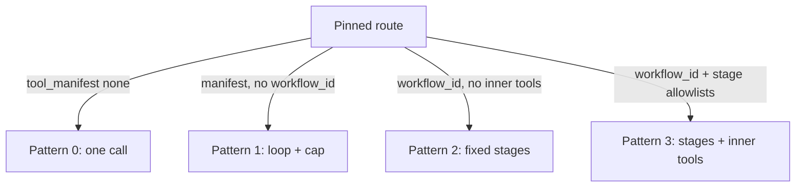
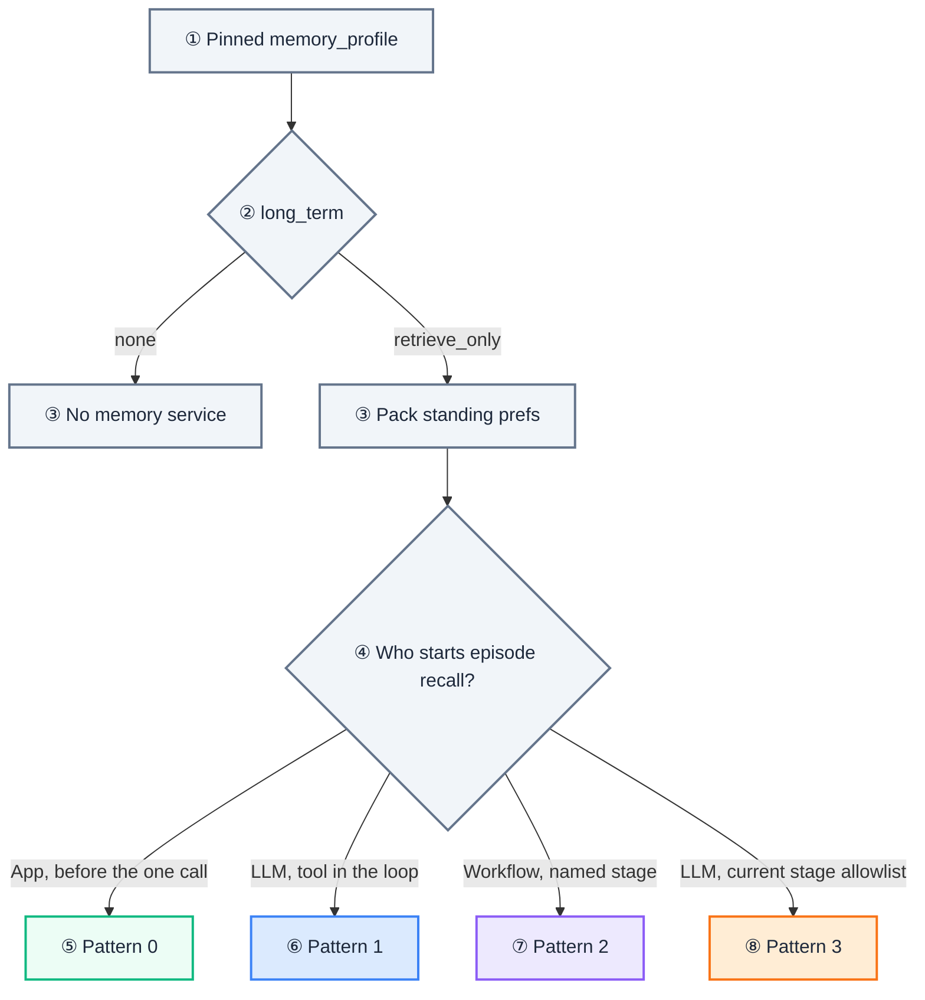

# Autonomy Shape

[Blueprint](/blueprints/agents-blueprint) · [← Memory](/playbooks/agents/orchestration/memory) · **Autonomy shape** · [Inference handoff →](/playbooks/agents/orchestration/inference-handoff)

The route row declares **how much next-step freedom** the run is allowed. The agentic app executes that pattern. The model does not pick the pattern.

:::tip[THE CLAIM]
**Escalate from Pattern 0 only when tools, order, or exploration demand it.** Autonomy is a route property, not a default agent loop.
:::

<!-- truncate -->

Reference design: [Agents Blueprint](/blueprints/agents-blueprint). Row fields: [Route contract reference](/playbooks/agents/intent-router/route-contract-reference). Decision guide: [Enterprise AI Workflow Patterns: Autonomy vs Control](/insights/enterprise-ai-workflow-patterns-autonomy-vs-control).

## Pattern from the row

| Pattern | How you know | What the app runs |
| --- | --- | --- |
| **0 Single inference** | `tool_manifest: "none"` (optional `retrieval.mode: deterministic_prefetch`) | One LLM call; no tool schemas |
| **1 Autonomous loop** | Manifest present, no `workflow_id`, `max_loop_steps` set | Observe → Decide → Tool until done or cap |
| **2 Deterministic workflow** | `workflow_id` present; LLM role is per stage, not next-step | App advances stages; model does assigned work only |
| **3 Guided hybrid** | `workflow_id` plus per-stage allowlists | App owns outer order; model proposes tools inside the current stage |

 

## App responsibilities per pattern

| Pattern | App owns | LLM owns |
| --- | --- | --- |
| **0** | Prefetch if declared, output schema validation | Completion text or structured output |
| **1** | Loop budget, manifest allowlist, PEP on each tool | Next tool proposal |
| **2** | Stage order, human gates, PEP on side-effect stages | Work assigned by `llm_role` for that stage |
| **3** | Outer stages, current-stage allowlist only | Tool choice **inside** the current stage |

Prefetch (`retrieval.mode: deterministic_prefetch`) around a single call does not make the run Pattern 1. If the model never chooses tools, stay on Pattern 0 (or Pattern 2 if `retrieve → generate` is an explicit two-stage workflow).

## prompt_id is a pack

The row has **one** `prompt_id`. That artifact can hold several templates. Pattern 2/3 stages select by `llm_role`. `none` means skip the LLM. Two search stages can share `query_formulation`. Worked table and JSON: [Prompt artifact](/playbooks/agents/intent-router/route-contract-reference#prompt-artifact).

## Durability follows the pattern

Crash recovery is **not** the same as "use Temporal." Pattern 0 needs none. Short Pattern 1 can use a checkpointer or a `runs` row. Pattern 2/3 need a **stage store** (step table, then Temporal when waits and writes get hard). The LLM framework runs **inside** a stage or loop; it does not replace the outer engine.

Which store to pick: [Session custody](/playbooks/agents/orchestration/session-custody#durability-is-a-job-not-always-temporal).

## Memory follows the pattern

`memory_profile` on the row is policy, not a stage. The app reads the pinned profile and branches. The model never sees the JSON, and never gets another session's store. Field dictionary: [Route contract reference](/playbooks/agents/intent-router/route-contract-reference).

| Pattern | Typical `memory_profile` |
| --- | --- |
| **0** | `conversation: session`; `loop: none` |
| **1** | `loop: checkpoint` so you can replay proposals |
| **2-3** | `working: session` for stage outputs |

### long_term retrieve_only is permission, not prefetch

The flag allows the app to query the **memory service** (prefs and episodic summaries). It does not mean "always fetch before the pattern starts." Corpus RAG stays a separate field (`retrieval`); see [RAG retrieval](/playbooks/rag/retrieval).

Split two loads. They must not share one slot.

| What | When it runs | Why |
| --- | --- | --- |
| **Standing prefs** (language, opt-out, accessibility) | Context assembly, around every inference call | Needed on the first token. Tiny, stable, not a workflow step. |
| **Episodes** (last week's session summary) | **Inside** the pattern, same "who starts retrieve" as RAG | Optional and query-specific. Do not dump 40 summaries before a payment run. |

`"none"` means skip the memory service and do not attach recall tools, even if another route's manifest has them.

 

| Pattern | Prefs | Episodes |
| --- | --- | --- |
| **0** | Pack before the one call | Same slot as corpus prefetch. Only moment that exists. |
| **1** | Pack before the loop (optional) | Allowlisted `recall_*` tool inside the loop. PEP still gates. Model does not get episodes unless it proposes and policy allows. |
| **2** | Pack before stage 1 (optional) | Named workflow stage. If the workflow has no recall stage, episodes never load. The model does not choose when. |
| **3** | Pack at stage entry (optional) | Only if `recall_*` is on the **current stage** allowlist. Extract cannot recall if only Analyse lists the tool. |

Writes (upsert a preference, append an episode at session close) are **not** this flag. They need an allowlisted tool and a PDP action.

Eval overlap: [Memory plane](/playbooks/evaluation/plane-memory). Build the store: [Memory](/playbooks/agents/orchestration/memory).

## Failure classes

| Failure | Symptom |
| --- | --- |
| Pattern 0 path loads a payment manifest | High-risk tool leak |
| Pattern 1 with no `max_loop_steps` | Unbounded cost |
| Pattern 2 model picks the next stage | Workflow bypass |
| Pattern 2 with no durable stage | Crash restarts KYC from step 1; see [Session custody](/playbooks/agents/orchestration/session-custody#durability-is-a-job-not-always-temporal) |
| Pattern 3 exposes the full manifest | Cross-stage tool use |
| `long_term: none` but recall tools on the payload | Cross-session memory on a write path |
| All episodes stuffed into the system prompt | `retrieve_only` ignored; unauditable pack |

## Trace fields

`autonomy_pattern`, `workflow_id`, `stage_id`, `allowed_tools`, `loop_step`, `max_loop_steps`

Eval overlap: [Eval Reasoning plane](/playbooks/evaluation/plane-reasoning) · [Eval Tool plane](/playbooks/evaluation/plane-tool).

## Read next

**[Inference handoff →](/playbooks/agents/orchestration/inference-handoff)**
