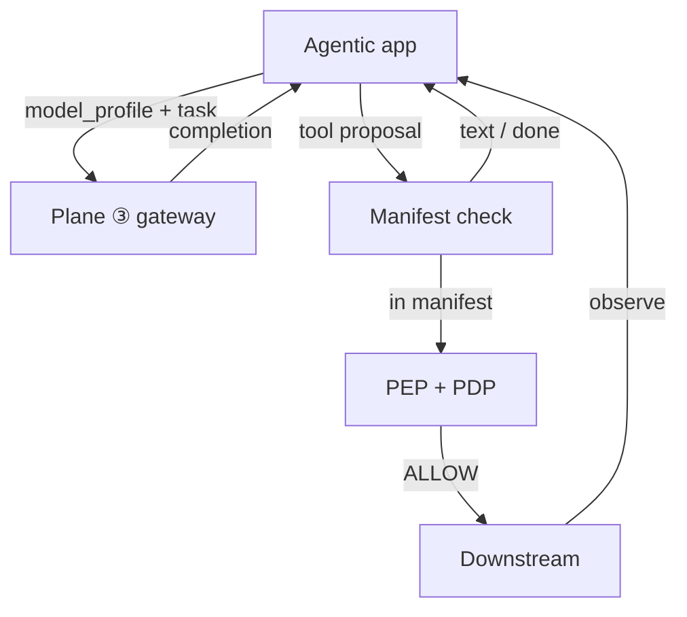

# Inference Handoff

[Blueprint](/blueprints/agents-blueprint) · [← Autonomy shape](/playbooks/agents/orchestration/autonomy-shape) · **Inference handoff** · [Model routing →](/playbooks/llm)

Inside the loop, the agentic app does **not** call a vendor model id. It asks Plane ③ for inference, then treats the completion as a proposal.

:::tip[THE CLAIM]
**Need inference → gateway. Need a side effect → PEP.** Hard-coded model URLs and auto-run tools both skip a plane.
:::

<!-- truncate -->

## Request sequence (one loop step)

1. Assemble messages from the pinned `prompt_id` pack (template for this `llm_role`, or `host` only on Pattern 0) plus session memory (no credentials)
2. Attach **scoped** tool schemas for this pattern/stage, or none
3. Call Plane ③ with `model_profile` + task type (`plan`, `synthesize`, or `classify`)
4. Receive completion (text and/or tool proposal)
5. If text / done → validate output schema; observe; return or continue
6. If tool proposal → check against pinned manifest → [PEP](/playbooks/governance/runtime/boundary/pep-pdp)
7. On ALLOW → run downstream; observe; feed result into the next step
8. On DENY / STEP_UP → follow PGAR; do not retry the same proposal as if it were allowed

 

Gateway how-to: [Model routing](/playbooks/llm). PEP how-to: [PEP enforcement](/playbooks/governance/runtime/foundation/pep-enforcement).

## Task type on each call

Pass a **task signal** so Plane ③ can pick the endpoint. Do not bury it in the prompt.

| Task | When | Typical `model_profile` use |
| --- | --- | --- |
| `plan` | Pattern 1/3 next-step, Pattern 2 `llm_role: query_formulation` or `plan` | Reasoning tier |
| `synthesize` | User-facing answer, Pattern 0 completion, Pattern 2 `llm_role: synthesis` | Chat or reasoning per route |
| `classify` | Rare in-loop; Plane ① fallback is a different caller | Lightweight |

`model_profile` on the route is a **coarse tier** (`reasoning-standard`, `fast-chat`). The gateway resolves it to an approved endpoint. The app never stores a vendor model name as the production target.

## Proposal gate (before PEP)

Unknown or out-of-manifest tools stop at the app. They never reach downstream.

| Check | Fail closed |
| --- | --- |
| Tool name ∈ pinned manifest | Reject proposal |
| Args match JSON schema | Reject proposal |
| Current-stage allowlist (Pattern 3) | Reject cross-stage tools |
| Loop / stage budget remaining | Stop the run |

See [PGAR LLM proposal](/playbooks/governance/runtime/boundary/llm-proposal) · [Manifest registry](/playbooks/agents/manifests/manifest-registry).

## Failure classes

| Failure | Symptom |
| --- | --- |
| App calls vendor chat API directly | Plane ③ bypass; no capability matrix, cost, or canary |
| Model id hard-coded in the agent | Region/data-class routing skipped |
| Framework auto-executes tools | PEP skipped |
| Proposal retried after DENY as ALLOW | Policy bypass |

## Trace fields

`orchestration_step`, `task_type`, `model_profile`, `model_route_id` (from Plane ③), `proposal`, `proposal_in_manifest`, `pep_verdict`

Eval: [Eval Tool plane](/playbooks/evaluation/plane-tool) · [Eval Action plane](/playbooks/evaluation/plane-action).

## Read next

**[Model routing playbooks (Plane ③) →](/playbooks/llm)** · [PGAR Agentic app](/playbooks/governance/runtime/boundary/agentic-app)
