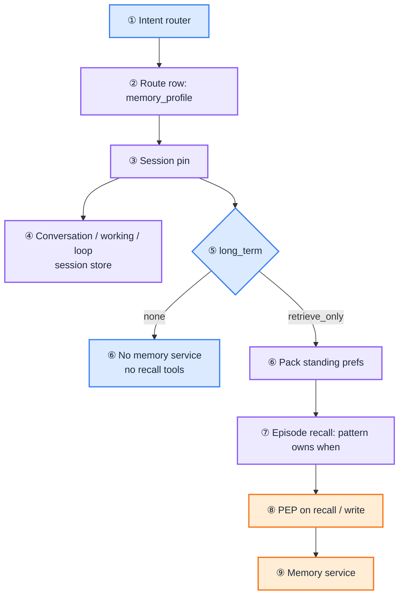

import Details from '@theme/Details';

# Memory

[Blueprint](/blueprints/agents-blueprint) · [← Session custody](/playbooks/agents/orchestration/session-custody) · **Memory** · [Autonomy shape →](/playbooks/agents/orchestration/autonomy-shape)

Memory is **route policy plus a partitioned store**. It is not a fifth autonomy pattern and not a blob in the system prompt. The [route row](/playbooks/agents/intent-router/route-contract-reference) declares `memory_profile`. The [agentic app](/playbooks/governance/runtime/boundary/agentic-app) reads, writes, and packs. The model never invents a store.

Corpus RAG is a different field (`retrieval`) and a different store. Prefs and session summaries are **not** `policy-engine`. See [RAG retrieval](/playbooks/rag/retrieval). Who starts episode recall on Patterns 0-3 lives in [Autonomy shape](/playbooks/agents/orchestration/autonomy-shape#long_term-retrieve_only-is-permission-not-prefetch).

:::tip[THE CLAIM]
**The app branches on the pinned `memory_profile`. The LLM never sees that JSON.** Session A cannot read Session B. Durable facts are retrieved, not stuffed. Writes and erase are gated tools, not a memory-mode enum.
:::

<!-- truncate -->

## How the route controls memory

The intent router selects a `route_id`. That row's `memory_profile` is the **only control** for memory on the request. After route decision, the agentic app **pins** the profile for the run. The LLM cannot switch `"none"` to `"retrieve_only"`. The workflow cannot drop isolation keys.

| Field | Values | What it does |
| --- | --- | --- |
| `conversation` | `none` / `session` | User / assistant turns for this session |
| `working` | `none` / `session` | Task slots, route entities, stage outputs under the pinned route |
| `loop` | `none` / `checkpoint` | Step count, proposals, observations |
| `long_term` | `none` / `retrieve_only` | Whether this route may query the memory service |
| `ttl_hours` | number | Soft lifetime for **session-scoped** stores |
| `isolation` | e.g. `["tenant", "user", "session"]` | Required partition keys on every read and write |

The app **reads** this object at pin time and branches. It does not infer memory from the prompt. Changing `memory_profile` on the row is a route-table bump, same as `policy_profile`. Field dictionary: [Route contract reference](/playbooks/agents/intent-router/route-contract-reference).



<br/>

<Details summary="Route memory_profile (JSON)">

```json
{
  "route_id": "fee_explain",
  "memory_profile": {
    "conversation": "session",
    "working": "session",
    "loop": "none",
    "long_term": "retrieve_only",
    "ttl_hours": 24,
    "isolation": ["tenant", "user", "session"]
  }
}
```

</Details>

### What the route does not control

Store URLs, embedding models for episode search, and compression prompts live in the memory service behind the profile. The row also does not grant permission by itself: PEP still evaluates entitlements on recall and write actions. Token and claims stay in [Token & session](/playbooks/governance/runtime/foundation/token-and-session-boundary). That playbook is "credentials never reach the LLM." This one is "Session A never reaches Session B."

## Five kinds

Split by lifecycle. Same idea as [G.A.I.N Agents](/frameworks/gain-agents).

| Kind | What it holds | Scoped to | Who owns it | On the row |
| --- | --- | --- | --- | --- |
| **Conversation** | User / assistant messages | This session | Agentic app (session store) | `conversation` |
| **Working** | Task slots, route entities, stage outputs | This session, pinned route | Agentic app | `working` |
| **Loop** | Step count, proposals, observations, checkpoints | This session / run | Agentic app (checkpointer) | `loop` |
| **Episodic** | Summaries of **past** sessions | User / tenant | Memory service + retrieval | `long_term` |
| **Long-term** | Prefs, durable facts | User / tenant | Memory service + retrieval | `long_term` |

**Episodic is not short-term.** Short-term is conversation, working, and loop (this chat / this run). Episodic is a dated story of a past session ("12 Aug: $42 ATM FX on ACC-4821"). Long-term is a stable attribute ("preferred language: English", "do not market loans"). Both survive the session. Both come back only as retrieve.

There is no separate `episodic` field. Both sit under `long_term`. The distinction is in the **store and the query**, not in a second pattern.

## Session-scoped stores

Conversation, working, and loop live in the agentic app (or its checkpointer). [Session custody](/playbooks/agents/orchestration/session-custody) is where the **run pin** and checkpoint **engine** live (Postgres `runs` v1; Temporal when you must resume at step K). This page is the **policy**: `loop: checkpoint` means that record must exist. [Inference handoff](/playbooks/agents/orchestration/inference-handoff) starts with assembly from the pin.

| Rule | Why |
| --- | --- |
| Key every record with the full `isolation` list | Missing `session` is how Jane's other chat leaks into this one |
| Apply `ttl_hours` to these stores | 24h idle drop. Durable prefs do **not** use this clock |
| Pin working and loop to the **route** | A freeze-card switch is a new pin; old slots do not ride along |
| Do not treat chat history as an agent loop | Pattern 0 can keep `conversation: session` without `loop: checkpoint` |

**Route switch (user changes intent).** Stickiness keeps `"yes"` / `"$500"` on the active route. A real new intent is a **new run**: new route decision, new pin, new downscoped token. Conversation may stay (same chat). Working and loop stay under the **old** pin. Do not dump Analyse tool results into `email_summarize` unless policy names a governed handoff of specific slots.

## Cross-session: `long_term`

`retrieve_only` is **permission**, not "always prefetch before the pattern." The flag allows the app to query the memory service. It does not stuff Jane's profile into the system prompt. `"none"` means skip the memory service and do not attach recall tools, even if another route's manifest has them.

### Two loads, not one

| What | When it runs | Why |
| --- | --- | --- |
| **Standing prefs** | Context assembly, around every inference call | Needed on the first token. Tiny, stable, not a workflow step. |
| **Episodes** | **Inside** the pattern | Optional and query-specific. Do not dump 40 summaries before a payment run. |

Who starts **episode** recall follows the autonomy pattern. Detail and diagram: [Autonomy shape](/playbooks/agents/orchestration/autonomy-shape#long_term-retrieve_only-is-permission-not-prefetch).

| Pattern | Prefs | Episodes |
| --- | --- | --- |
| **0** | Pack before the one call | Same slot as corpus prefetch. Only moment that exists. |
| **1** | Pack before the loop (optional) | Allowlisted `recall_*` tool inside the loop. PEP still gates. |
| **2** | Pack before stage 1 (optional) | Named workflow stage. No stage → episodes never load. |
| **3** | Pack at stage entry (optional) | Only if `recall_*` is on the **current stage** allowlist. |

The model never sees `long_term: "retrieve_only"`. It sees either a small pack in **this** context, or a recall tool schema the app attached because the flag and the manifest both allowed it.

<Details summary="Payment route: long_term none (JSON)">

High-risk writes usually skip cross-session memory. Last week's fee dispute must not steer a wire.

```json
{
  "route_id": "payment_initiate",
  "memory_profile": {
    "conversation": "session",
    "working": "session",
    "loop": "checkpoint",
    "long_term": "none",
    "ttl_hours": 8,
    "isolation": ["tenant", "user", "session"]
  }
}
```

</Details>

### Cross-route: last week's episode must not ride into today's route

Working and loop are already bound to **this pin**. They do not follow Jane from `fee_explain` last week into `payment_initiate` today.

**Episodes and long-term facts are user-scoped.** If both routes set `long_term: retrieve_only` and the query is only `user_id`, last week's fee dispute **can** appear on a wire. `isolation: ["tenant", "user", "session"]` does not stop that. Session is this chat, not last week's summary.

Controls (use together):

| Control | What it does |
| --- | --- |
| **`long_term: none` on high-risk rows** | Payments, freeze, KYC: no memory service, no recall tools. Default for writes. |
| **Tag on write** | Every episode stores `source_route_id` (and optional `data_class`) |
| **Filter on read** | Query is current `route_id`, or an **allowlist** of routes that may share (e.g. `fee_explain` may read `account_history`; `payment_initiate` reads none) |
| **Split prefs vs episodes** | Language / opt-out may be global. Narratives ("disputed the FX fee") stay route-scoped. Do not pack them in one blob |
| **PEP** | `recall_episodes` resource includes `source_route_id` ∩ allowlist. Widen to "all episodes for this user" is DENY |

Do **not** prefetch "everything we know about Jane" because `retrieve_only` is on. Pack standing prefs if the row allows. Load episodes only as a filtered retrieve (or a named Pattern 2 stage). Eval Plane ⑥: adversarial set must include "route A episode on route B" = **0** leaks.

## Memory service vs corpus RAG

| | Memory service | Retrieval gateway |
| --- | --- | --- |
| Route field | `memory_profile` | `retrieval` |
| Holds | Prefs, facts, session summaries | Policy / product / clause corpora |
| Isolation | `tenant`, `user`, `session` | Corpus id + document ACL |
| Typical query | "this customer, this intent" | "this question, this `scope`" |

You can prefetch policy chunks and still only tool-recall episodes, or the reverse. Same PEP discipline. Two stores. Do not put customer prefs in `retrieval.scope`.

## Writes and erase

`retrieve_only` is **read**. There is no `"read_write"` on the profile on purpose.

| Action | How | Gate |
| --- | --- | --- |
| Upsert a preference | Allowlisted tool, e.g. `upsert_preference` | Schema of known keys. PDP on `pdp_action`. Model cannot invent free-text "facts" onto the profile. |
| Append an episode | App job at session close, or gated `append_episode` | Compress the thread. Do not keep the raw transcript forever unless retention policy says so. |
| Forget / delete | Erase API keyed by subject (+ tenant) | Must empty prefs, episodes, and session-scoped stores. Eval Plane ⑥ requires this. |

Session-close compression is **not** implied by `retrieve_only`. Schedule it in the app after the run, with the same isolation keys.

## PEP on memory actions

Recall and write are governed actions. Map them to SARAC like any other tool. [Policy contracts](/playbooks/governance/runtime/foundation/policy-contracts).

<Details summary="Recall episodes SARAC (JSON)">

```json
{
  "subject": {
    "sub": "customer-jane",
    "roles": ["retail_customer"]
  },
  "action": "recall_episodes",
  "resource": {
    "type": "memory",
    "kind": "episodic",
    "subject_id": "customer-jane"
  },
  "context": {
    "tenant": "bank-au",
    "session_id": "sess-8f2a",
    "route_id": "fee_explain",
    "query": "ATM FX fee ACC-4821"
  }
}
```

</Details>

PDP checks: `long_term` on the pinned route is `retrieve_only`, isolation keys match the session, entitlement for memory read, no widen to another user, **episode `source_route_id` is on this route's allowlist**. DENY → no pack, no tool result. Prefetch of standing prefs is still a PEP-gated retrieve (app-started), not a prompt instruction.

Writes use a different `action` (`upsert_preference`, `append_episode`) and a tighter resource (allowed key list). `"none"` on the route → do not send these tools to the LLM; PEP would still DENY if they leaked through.

## Prompt pack rules

| Do | Do not |
| --- | --- |
| Pack only hits for **this** turn | Dump every past session into the system prompt |
| Log pack id, keys, token count, PEP verdict | Treat "the model remembered" as audit |
| Re-retrieve on the next turn if needed | Carry an episode into a new route pin by default |
| Keep prefs tiny (language, opt-out) | Store KYC decisions as chat vibes |

## Failure classes

| Failure | Symptom |
| --- | --- |
| Isolation missing `session` | Cross-session leak for the same user |
| Episode query is user-only | Last week's `fee_explain` summary appears on `payment_initiate` |
| Isolation missing `tenant` | Cross-bank read |
| `long_term: none` but recall tools on the payload | Cross-session memory on a write path |
| All episodes stuffed into the system prompt | `retrieve_only` ignored; unauditable pack |
| Prefs and episodes in one unqueried blob | Stale narrative treated as standing policy |
| Write via prompt ("remember that I am hostile") | Profile poison; no PDP |
| Erase API only clears conversation | Prefs / episodes remain; GDPR fail |
| Token playbook used as memory playbook | Credentials mixed with chat state |
| Customer prefs in `retrieval.scope` | Wrong store; corpus ACL is not user memory |

## Trace fields

`session_id`, `route_id`, `memory_profile`, `memory_reads`, `memory_writes`, `memory_pack_id`, `ttl_policy`, `prompt_memory_tokens`, `isolation_keys`, `pep_verdict`

## Eval overlap

[Eval Plane ⑥ Memory](/playbooks/evaluation/plane-memory): session isolation, TTL, write policy, forget/delete. Leakage adversarial set must be **0** failures.

## Who owns what

| Playbook | Memory job |
| --- | --- |
| [Route contract](/playbooks/agents/intent-router/route-contract-reference) | Declare `memory_profile` |
| **This page** | Store, isolation, TTL, pack rules, write/erase, PEP on recall |
| [Session custody](/playbooks/agents/orchestration/session-custody) | Durable run pin; checkpointer vs `runs` vs Temporal; strip credentials |
| [Autonomy shape](/playbooks/agents/orchestration/autonomy-shape) | Who starts episode recall on Patterns 0-3 |
| [RAG retrieval](/playbooks/rag/retrieval) | Corpus retrieve. Not customer prefs. |
| [Eval Plane ⑥](/playbooks/evaluation/plane-memory) | Prove isolation, TTL, erase |

See: [G.A.I.N Agents](/frameworks/gain-agents) · [Agents Blueprint](/blueprints/agents-blueprint) · [Governance Blueprint](/blueprints/governance/runtime)

## Read next

**[Autonomy shape →](/playbooks/agents/orchestration/autonomy-shape)**
