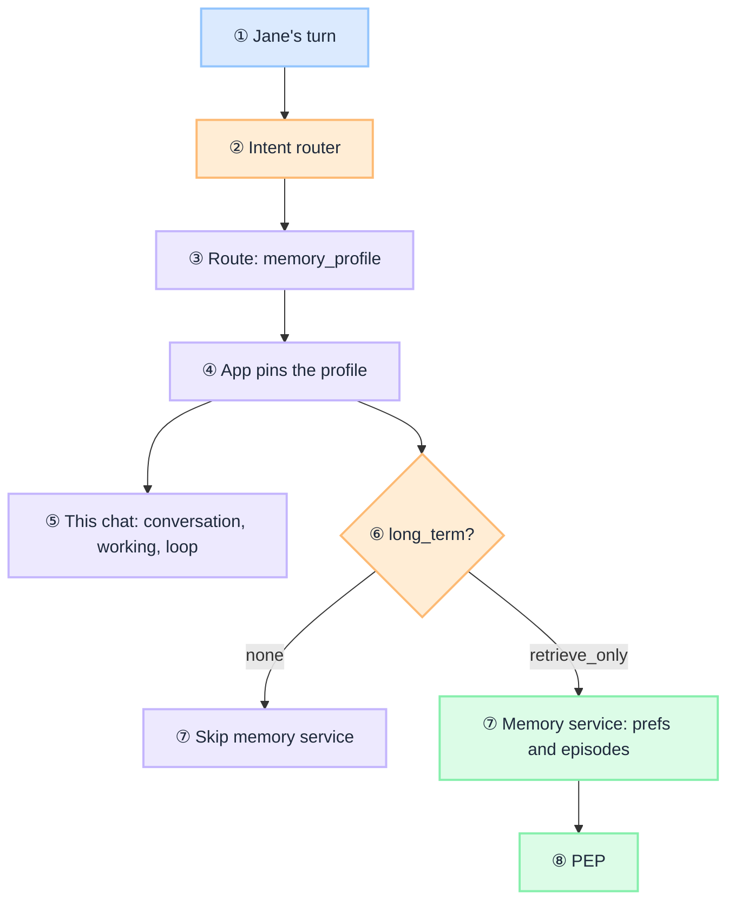

import Details from '@theme/Details';

# Memory

[Blueprint](/blueprints/agents-blueprint) · [← Session custody](/playbooks/agents/orchestration/session-custody) · **Memory** · [Autonomy shape →](/playbooks/agents/orchestration/autonomy-shape)

Memory is **what this request is allowed to remember**. The [route row](/playbooks/agents/intent-router/route-contract-reference) declares that as `memory_profile`. The [agentic app](/playbooks/governance/runtime/boundary/agentic-app) reads, writes, and packs. The model never invents a store, and never sees that JSON.

:::tip[THE CLAIM]
**The app branches on the pinned `memory_profile`.** Session A cannot read Session B. Last week's story is retrieved, not stuffed into the prompt. Writes and erase are gated tools, not a memory-mode enum.
:::

<!-- truncate -->

## Four drawers, one example

Jane is in chat about an ATM FX fee. Four drawers, not one blob:

| Drawer | What it holds in this example | Lives how long |
| --- | --- | --- |
| **Conversation** | "Why was I charged $42?" and the assistant's replies | This chat |
| **Working** | `account: ACC-4821`, `amount: 42`, `topic: ATM FX` | This chat, this route |
| **Loop** | Tool 2 of 8 just finished `fee_lookup` | This run (so a crash can resume) |
| **Long-term** | Standing: `language: English`. Episode: "12 Aug: disputed ATM FX on ACC-4821" | Past the session |

The first three die with the session (or its TTL). Long-term survives. It comes back only as a **retrieve**, never as "dump Jane's whole history into the system prompt."

You will also hear **episodic** (dated stories of past sessions) vs **prefs** (stable attributes). Both sit under the same field, `long_term`. There is no fifth route field.

Same split as [G.A.I.N Agents](/frameworks/gain-agents). Corpus search (policy PDFs, clauses) is a different field: `retrieval`. See [Memory vs RAG](#memory-vs-rag) below.

## The route is the only knob

The intent router picks a `route_id`. That row's `memory_profile` is the **only** memory control for the request. After the decision, the app **pins** the profile. The LLM cannot flip `"none"` to `"retrieve_only"`. The workflow cannot drop isolation keys.

| Field | Values | Plain meaning |
| --- | --- | --- |
| `conversation` | `none` / `session` | Keep this chat's messages, or not |
| `working` | `none` / `session` | Keep task slots / stage outputs, or not |
| `loop` | `none` / `checkpoint` | Keep step count so a crash can resume, or not |
| `long_term` | `none` / `retrieve_only` | May query last week's prefs and episodes, or must not |
| `ttl_hours` | number | Soft lifetime for **this-chat** stores only |
| `isolation` | e.g. `["tenant", "user", "session"]` | Partition keys on every read and write |

Changing `memory_profile` on the row is a route-table bump, same as `policy_profile`. Field dictionary: [Route contract reference](/playbooks/agents/intent-router/route-contract-reference).

<Details summary="Fee explain route (JSON)">

```json
{
  "route_id": "fee_explain",
  "memory_profile": {
    "conversation": "session",
    "working": "session",
    "loop": "none",
    "long_term": "retrieve_only",
    "ttl_hours": 24,
    "isolation": ["tenant", "user", "session"]
  }
}
```

</Details>

The row does **not** hold store URLs, embedding models, or compression prompts. Those live in the memory service. The row also does not grant permission by itself: PEP still evaluates recall and write. Credentials stay in [Token & session](/playbooks/governance/runtime/foundation/token-and-session-boundary). That playbook is "credentials never reach the LLM." This one is "Jane's other chat never reaches this one."


```mermaid
flowchart TB
    User["① Jane's turn"] --> Router["② Intent router"]
    Router --> Row["③ Route: memory_profile"]
    Row --> Pin["④ App pins the profile"]
    Pin --> Session["⑤ This chat: conversation, working, loop"]
    Pin --> Flag{"⑥ long_term?"}
    Flag -->|"none"| Skip["⑦ Skip memory service"]
    Flag -->|"retrieve_only"| Mem["⑦ Memory service: prefs and episodes"]
    Mem --> Pep["⑧ PEP"]

    classDef actor fill:#dbeafe,stroke:#93c5fd,color:#1e293b,stroke-width:2px
    classDef gate fill:#ffedd5,stroke:#fdba74,color:#1e293b,stroke-width:2px
    classDef process fill:#ede9fe,stroke:#c4b5fd,color:#1e293b,stroke-width:2px
    classDef platform fill:#dcfce7,stroke:#86efac,color:#1e293b,stroke-width:2px

    class User actor
    class Router,Flag gate
    class Row,Pin,Session,Skip process
    class Mem,Pep platform
```

<br/>

## This chat: conversation, working, loop

These three live in the agentic app (or its checkpointer). [Session custody](/playbooks/agents/orchestration/session-custody) is the **engine** (Postgres `runs` v1; Temporal when you must resume at step K). This page is the **policy**: `loop: checkpoint` means that record must exist.

| Rule | Why it exists |
| --- | --- |
| Key every record with the full `isolation` list | Missing `session` is how Jane's other chat leaks into this one. Missing `tenant` is a cross-bank read. |
| Apply `ttl_hours` here | 24h idle drop. Durable prefs do **not** use this clock. |
| Pin working and loop to **this route** | A freeze-card switch is a new pin. Old slots do not ride along. |
| Chat history is not an agent loop | Pattern 0 can keep `conversation: session` with `loop: none`. |

**User changes intent.** Stickiness keeps `"yes"` / `"$500"` on the **active** route. A real new intent is a **new run**: new route, new pin, new downscoped token. Conversation may stay (same chat window). Working and loop stay under the **old** pin. Do not dump Analyse tool results into `email_summarize` unless policy names a governed handoff of specific slots.

## Last week: `long_term`

`retrieve_only` means **this route may query the memory service**. It does not mean "always fetch Jane's profile before the first token." `"none"` means skip the memory service and do not attach recall tools, even if another route's manifest has them.

Split two loads. They must not share one slot.

| What | When | Size |
| --- | --- | --- |
| **Standing prefs** (language, opt-out) | Context assembly, around every inference call | Tiny. Needed on the first token. |
| **Episodes** (last week's session summary) | **Inside** the pattern, as a retrieve | Query-specific. Do not dump 40 summaries before a payment. |

Who starts episode recall follows the autonomy pattern (pack on Pattern 0; tool on Pattern 1; named stage on Pattern 2; current-stage allowlist on Pattern 3). Detail: [Autonomy shape](/playbooks/agents/orchestration/autonomy-shape#long_term-retrieve_only-is-permission-not-prefetch).

The model never sees the flag. It sees either a small pack in **this** context, or a recall tool the app attached because the flag **and** the manifest both allowed it.

### Last week's fee dispute must not steer today's wire

Working and loop are already bound to **this pin**. They do not follow Jane from `fee_explain` last week into `payment_initiate` today.

**Episodes and prefs are user-scoped.** If both routes set `long_term: retrieve_only` and the query is only `user_id`, last week's fee dispute **can** appear on a wire. `isolation: ["tenant", "user", "session"]` does not stop that. Session is this chat, not last week's summary.

Use these together:

| Control | What it does |
| --- | --- |
| **`long_term: none` on high-risk rows** | Payments, freeze, KYC: no memory service, no recall tools. Default for writes. |
| **Tag on write** | Every episode stores `source_route_id` (and optional `data_class`) |
| **Filter on read** | Query is current `route_id`, or an **allowlist** of routes that may share (e.g. `fee_explain` may read `account_history`; `payment_initiate` reads none) |
| **Split prefs vs episodes** | Language / opt-out may be global. Narratives ("disputed the FX fee") stay route-scoped. Do not pack them in one blob. |
| **PEP** | `recall_episodes` includes `source_route_id` ∩ allowlist. Widen to "all episodes for this user" is DENY. |

Do **not** prefetch "everything we know about Jane" because `retrieve_only` is on. Pack standing prefs if the row allows. Load episodes only as a filtered retrieve (or a named Pattern 2 stage). Eval Plane ⑥: "route A episode on route B" must be **0** leaks.

<Details summary="Payment route: long_term none (JSON)">

High-risk writes usually skip cross-session memory.

```json
{
  "route_id": "payment_initiate",
  "memory_profile": {
    "conversation": "session",
    "working": "session",
    "loop": "checkpoint",
    "long_term": "none",
    "ttl_hours": 8,
    "isolation": ["tenant", "user", "session"]
  }
}
```

</Details>

## Memory vs RAG

Two stores. Two route fields. Do not put customer prefs in `retrieval.scope`.

| | Memory service | Retrieval gateway |
| --- | --- | --- |
| Route field | `memory_profile` | `retrieval` |
| Holds | Prefs, facts, session summaries | Policy / product / clause corpora |
| Isolation | `tenant`, `user`, `session` | Corpus id + document ACL |
| Typical query | "this customer, this intent" | "this question, this `scope`" |

You can prefetch policy chunks and still only tool-recall episodes, or the reverse. Same PEP discipline. How-to for corpora: [RAG retrieval](/playbooks/rag/retrieval).

## Writes and erase

`retrieve_only` is **read**. There is no `"read_write"` on the profile on purpose.

| Action | How | Gate |
| --- | --- | --- |
| Upsert a preference | Allowlisted tool, e.g. `upsert_preference` | Schema of known keys. Model cannot invent free-text "facts" onto the profile. |
| Append an episode | App job at session close, or gated `append_episode` | Compress the thread. Do not keep the raw transcript forever unless retention says so. |
| Forget / delete | Erase API keyed by subject (+ tenant) | Must empty prefs, episodes, **and** session-scoped stores. |

Session-close compression is **not** implied by `retrieve_only`. Schedule it in the app after the run, with the same isolation keys.

## Policy on recall and write

Recall and write are governed actions, same as any other tool. [Policy contracts](/playbooks/governance/runtime/foundation/policy-contracts).

PDP checks: `long_term` on the pinned route is `retrieve_only`, isolation keys match the session, entitlement for memory read, no widen to another user, **episode `source_route_id` is on this route's allowlist**. DENY means no pack and no tool result. Prefetch of standing prefs is still a PEP-gated retrieve the **app** starts, not a prompt instruction.

Writes use a different `action` (`upsert_preference`, `append_episode`) and a tighter resource (allowed key list). `"none"` on the route: do not send these tools to the LLM. PEP would still DENY if they leaked through.

<Details summary="Recall episodes SARAC (JSON)">

```json
{
  "subject": {
    "sub": "customer-jane",
    "roles": ["retail_customer"]
  },
  "action": "recall_episodes",
  "resource": {
    "type": "memory",
    "kind": "episodic",
    "subject_id": "customer-jane"
  },
  "context": {
    "tenant": "bank-au",
    "session_id": "sess-8f2a",
    "route_id": "fee_explain",
    "query": "ATM FX fee ACC-4821"
  }
}
```

</Details>

## What goes in the prompt

| Do | Do not |
| --- | --- |
| Pack only hits for **this** turn | Dump every past session into the system prompt |
| Log pack id, keys, token count, PEP verdict | Treat "the model remembered" as audit |
| Re-retrieve on the next turn if needed | Carry an episode into a new route pin by default |
| Keep prefs tiny (language, opt-out) | Store KYC decisions as chat vibes |

## If this breaks

| Failure | What you will see |
| --- | --- |
| Isolation missing `session` | Cross-session leak for the same user |
| Episode query is user-only | Last week's `fee_explain` summary appears on `payment_initiate` |
| Isolation missing `tenant` | Cross-bank read |
| `long_term: none` but recall tools on the payload | Cross-session memory on a write path |
| All episodes stuffed into the system prompt | `retrieve_only` ignored; unauditable pack |
| Prefs and episodes in one unqueried blob | Stale narrative treated as standing policy |
| Write via prompt ("remember that I am hostile") | Profile poison; no PDP |
| Erase API only clears conversation | Prefs / episodes remain; GDPR fail |
| Token playbook used as memory playbook | Credentials mixed with chat state |
| Customer prefs in `retrieval.scope` | Wrong store; corpus ACL is not user memory |

Trace: `session_id`, `route_id`, `memory_profile`, `memory_reads`, `memory_writes`, `memory_pack_id`, `ttl_policy`, `prompt_memory_tokens`, `isolation_keys`, `pep_verdict`.

Prove it on [Eval Plane ⑥ Memory](/playbooks/evaluation/plane-memory): session isolation, TTL, write policy, forget/delete. Leakage adversarial set must be **0** failures.

## Who owns what

| Playbook | Job |
| --- | --- |
| [Route contract](/playbooks/agents/intent-router/route-contract-reference) | Declare `memory_profile` |
| **This page** | Store, isolation, TTL, pack, write/erase, PEP on recall |
| [Session custody](/playbooks/agents/orchestration/session-custody) | Durable run pin; checkpointer vs `runs` vs Temporal |
| [Autonomy shape](/playbooks/agents/orchestration/autonomy-shape) | Who starts episode recall on Patterns 0-3 |
| [RAG retrieval](/playbooks/rag/retrieval) | Corpus retrieve. Not customer prefs. |
| [Eval Plane ⑥](/playbooks/evaluation/plane-memory) | Prove isolation, TTL, erase |

See: [G.A.I.N Agents](/frameworks/gain-agents) · [Agents Blueprint](/blueprints/agents-blueprint) · [Governance Blueprint](/blueprints/governance/runtime)

## Read next

**[Autonomy shape →](/playbooks/agents/orchestration/autonomy-shape)**
