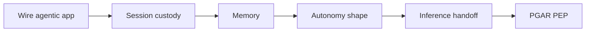

# Orchestration

[Agents overview](/playbooks/agents) · **Orchestration overview** · [① Session custody →](/playbooks/agents/orchestration/session-custody)

Implementation guides for **Plane ②** of the [Agents Blueprint](/blueprints/agents-blueprint). After Plane ① **freezes** the route and async-starts the run, the [agentic app](/playbooks/governance/runtime/boundary/agentic-app) **copies** that freeze into the run pin and executes the loop. Policy enforcement lives in [PGAR Runtime](/playbooks/governance/runtime).

:::tip[THE CLAIM]
**The agentic app orchestrates; the LLM proposes steps; the PEP permits side effects.** This is not intent routing and not model routing.
:::

<!-- truncate -->

## Four playbooks

| # | Playbook | One-line purpose |
| --- | --- | --- |
| **①** | **[Session custody](/playbooks/agents/orchestration/session-custody)** | Route copy, run pin, durability store (not always Temporal) |
| **②** | **[Memory](/playbooks/agents/orchestration/memory)** | Isolation, TTL, retrieve_only, writes, erase |
| **③** | **[Autonomy shape](/playbooks/agents/orchestration/autonomy-shape)** | Run Pattern 0-3 from the route: single call, loop, fixed stages, or hybrid |
| **④** | **[Inference handoff](/playbooks/agents/orchestration/inference-handoff)** | Every plan or synthesize call goes through Plane ③, then proposal gates at PEP |

## Recommended path

 

1. **[Wire agentic app](/playbooks/agents/intent-router/wire-agentic-app):** Plane ① handoff, front door, event bind, clarify/abstain
2. **[Session custody](/playbooks/agents/orchestration/session-custody):** copy the route freeze; run pin; restart by `run_id`
3. **[Memory](/playbooks/agents/orchestration/memory):** isolation, TTL, recall pack
4. **[Autonomy shape](/playbooks/agents/orchestration/autonomy-shape):** which pattern the route allows
5. **[Inference handoff](/playbooks/agents/orchestration/inference-handoff):** gateway call, proposal check, PEP
6. **[PGAR Runtime](/playbooks/governance/runtime):** SARAC, PEP/PDP, audit

Bridge reading: [Agents Blueprint](/blueprints/agents-blueprint) · [PGAR Agentic app](/playbooks/governance/runtime/boundary/agentic-app) · [Eval Action plane](/playbooks/evaluation/plane-action) · [Eval Tool plane](/playbooks/evaluation/plane-tool).

## What this plane decides

| Decides | Does not decide |
| --- | --- |
| Next tool proposal inside a scoped manifest | Which workflow or manifest is active (Plane ①) |
| When to call PEP, validation, step-up | Which LLM endpoint serves the call (Plane ③) |
| Session state, token custody, loop bounds | Entitlements at ingress (IdP + Plane ①) |

## Who should read what

| Role | Start with | Then |
| --- | --- | --- |
| **AI platform** | [Session custody](/playbooks/agents/orchestration/session-custody), [Memory](/playbooks/agents/orchestration/memory), [Inference handoff](/playbooks/agents/orchestration/inference-handoff) | [PGAR Agentic app](/playbooks/governance/runtime/boundary/agentic-app), [PEP enforcement](/playbooks/governance/runtime/foundation/pep-enforcement) |
| **Domain squad** | [Autonomy shape](/playbooks/agents/orchestration/autonomy-shape) | [Agents Blueprint](/blueprints/agents-blueprint), [Manifest registry](/playbooks/agents/manifests/manifest-registry) |
| **Governance** | [Inference handoff](/playbooks/agents/orchestration/inference-handoff) | [Eval Action plane](/playbooks/evaluation/plane-action), [Audit and replay](/playbooks/governance/runtime/foundation/audit-and-replay) |

## Read next

**[① Session custody →](/playbooks/agents/orchestration/session-custody)**
