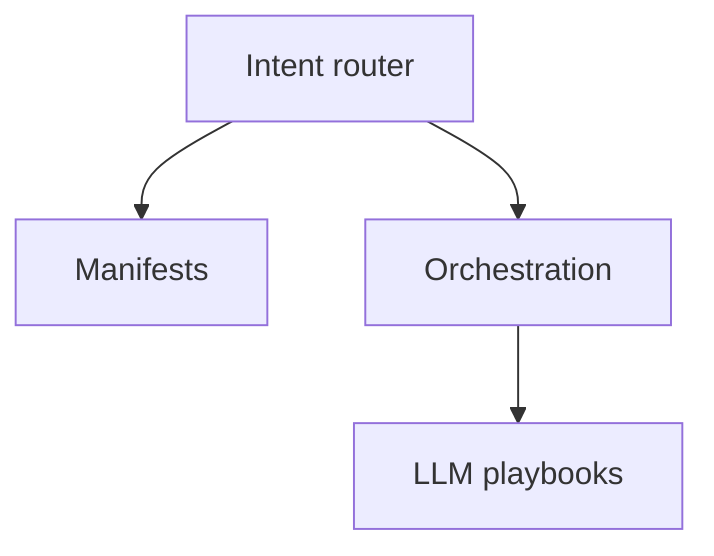

# Agents Playbooks

[Playbooks](/playbooks) · **Agents overview** · [Intent router (Plane ①) →](/playbooks/agents/intent-router)

Implementation guides for the [Agents Blueprint](/blueprints/agents-blueprint). These playbooks are the **how** for intent dispatch and the agent loop. Model selection is a separate series: [LLM](/playbooks/llm).

:::tip[THE CLAIM]
**Route before the loop.** Plane ① picks the governed path; Plane ② runs the agent loop. Each plane has its own contracts, eval gates, and ownership. The LLM gateway is [G.A.I.N LLM](/frameworks/gain-llm), not this series.
:::

<!-- truncate -->

## Two planes, plus manifests

| Group | Overview | What you build |
| --- | --- | --- |
| **[Intent router](/playbooks/agents/intent-router)** | [Open →](/playbooks/agents/intent-router) | Route contract, lifecycle, layered classifier, agentic app wiring, routing eval CI |
| **[Orchestration](/playbooks/agents/orchestration)** | [Open →](/playbooks/agents/orchestration) | Session custody, memory, autonomy shape, inference handoff; PEP in [Runtime](/playbooks/governance/runtime) |
| **[Manifests](/playbooks/agents/manifests/manifest-registry)** | [Open →](/playbooks/agents/manifests/manifest-registry) | Tool contract, `pdp_action`, version, pin. Transport-agnostic (MCP is one adapter) |

Model routing (capability matrix, gateway, canary) lives in [LLM playbooks](/playbooks/llm).

## Recommended path

 

1. **[Intent router](/playbooks/agents/intent-router):** contract reference → lifecycle → eval CI in parallel → classifier → wire app
2. **[Manifests](/playbooks/agents/manifests/manifest-registry):** registry shape, then lifecycle (the route pins `tool_manifest`)
3. **[Orchestration](/playbooks/agents/orchestration):** copy the route freeze into the run pin → autonomy pattern → every inference through the gateway, then [Runtime](/playbooks/governance/runtime) for PEP
4. **[LLM](/playbooks/llm)** when you have multiple models or regions: capability matrix → task routing → canary

Bridge reading: [PGAR Agentic app](/playbooks/governance/runtime/boundary/agentic-app) · [Agents Blueprint](/blueprints/agents-blueprint) · [G.A.I.N LLM](/frameworks/gain-llm) · [Eval Plane ①: Input](/playbooks/evaluation/plane-input).

## Intent router playbooks at a glance

| Playbook | One-line purpose |
| --- | --- |
| [Route contract reference](/playbooks/agents/intent-router/route-contract-reference) | Field dictionary: route, `activation_target`, manifest, policy, retrieval, memory |
| [Route table lifecycle](/playbooks/agents/intent-router/route-table-lifecycle) | Versioned route contracts, storage patterns, promote and rollback |
| [Layered classifier](/playbooks/agents/intent-router/layered-classifier) | Eligible routes, rules (channel / event), classifier, LLM fallback, safety |
| [Wire agentic app](/playbooks/agents/intent-router/wire-agentic-app) | Front door, decide-only handoff, event bind, PGAR start |
| [Routing eval CI](/playbooks/agents/intent-router/routing-eval-ci) | Golden set, release gates, incident replay |

## Orchestration playbooks at a glance

| Playbook | One-line purpose |
| --- | --- |
| [Session custody](/playbooks/agents/orchestration/session-custody) | Durable run pin, token, loop bounds; credentials never reach the model |
| [Memory](/playbooks/agents/orchestration/memory) | Isolation, TTL, retrieve_only prefs and episodes |
| [Autonomy shape](/playbooks/agents/orchestration/autonomy-shape) | Pattern 0-3 from the route: one call, loop, fixed stages, or hybrid |
| [Inference handoff](/playbooks/agents/orchestration/inference-handoff) | LLM gateway for every LLM call; manifest check then PEP |

Enforcement detail stays in [Runtime](/playbooks/governance/runtime) (foundation, boundary, assurance). Pattern contracts: [Agents Blueprint](/blueprints/agents-blueprint).

## Manifests at a glance

| Playbook | One-line purpose |
| --- | --- |
| [Manifest registry](/playbooks/agents/manifests/manifest-registry) | Tool schema, `pdp_action`, risk tier; unknown tools never reach PEP |
| [Manifest lifecycle](/playbooks/agents/manifests/manifest-lifecycle) | Where manifests live, version, pin, promote, roll back |

MCP is one way to expose these tools. See [MCP](/playbooks/mcp).

## Who should read what

| Role | Start with | Then |
| --- | --- | --- |
| **AI platform** | [Intent router](/playbooks/agents/intent-router), [Session custody](/playbooks/agents/orchestration/session-custody) | [Wire agentic app](/playbooks/agents/intent-router/wire-agentic-app), [Inference handoff](/playbooks/agents/orchestration/inference-handoff) |
| **Domain squad** | [Route contract reference](/playbooks/agents/intent-router/route-contract-reference), [Autonomy shape](/playbooks/agents/orchestration/autonomy-shape) | [Route table lifecycle](/playbooks/agents/intent-router/route-table-lifecycle), [Routing eval CI](/playbooks/agents/intent-router/routing-eval-ci) |
| **Governance** | [Routing eval CI](/playbooks/agents/intent-router/routing-eval-ci) | [Eval Input plane](/playbooks/evaluation/plane-input), [Eval Action plane](/playbooks/evaluation/plane-action) |

## Read next

**[Intent router →](/playbooks/agents/intent-router)** · [Orchestration](/playbooks/agents/orchestration) · [Manifests](/playbooks/agents/manifests/manifest-registry) · [LLM](/playbooks/llm) · [Enterprise AI Workflow Patterns](/insights/enterprise-ai-workflow-patterns-autonomy-vs-control) (choose Pattern 0-3)
