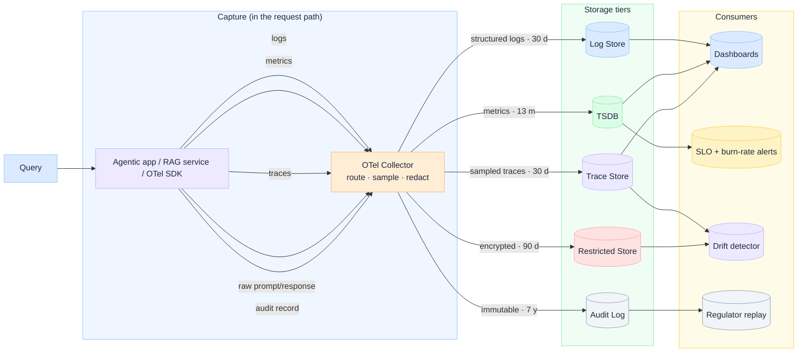

import Details from '@theme/Details';

  <h1 className="gain-doc-title">AI Observability</h1>
  

    Five signals, five storage tiers, five retention policies: and four consumers that read them.
  

## Design for AI Observability

  AI observability is not a dashboard. It is a capture-and-retention architecture. Each signal has a
  different consumer, retention window, and blast radius if you get it wrong. Read left to right:{' '}
  <strong>capture → store → consume</strong>.

 

| Signal | Store | Retention | Consumer |
| --- | --- | --- | --- |
| **Structured logs** | Log store | 30 d | Dashboards |
| **Metrics** | TSDB | 13 mo | Dashboards, SLO alerts |
| **Sampled traces** | Trace store | 30 d | Dashboards, drift detector |
| **Raw prompt/response** | Restricted store | encrypted, 90 d | Drift detector |
| **Audit record** | Audit log | immutable, 7 y | Regulator replay |

## Key practices

  Instrument at the point of inference through an OTel SDK into a collector on the hot path, not as a
  batch job afterward. Routing, sampling, and redaction happen once in the collector.

  Do not collapse logs, metrics, traces, raw prompts, and audit records into one bucket. Retention is
  a governance decision: raw prompts are short and encrypted; audit logs are long and immutable.

  Dashboards answer <em>what is happening now</em>. SLO alerts answer <em>are we burning budget</em>.
  Drift detection answers <em>is quality eroding</em>. Regulator replay answers <em>can we prove what
  we did</em>.

  Strip PII and sensitive payloads before persistence. The collector is the privacy boundary: not the
  dashboard.

  Metrics are always-on; traces and raw prompt/response are sampled or gated. Instrumentation is not
  free on the request path.

For the framework view, see [G.A.I.N Observability](/frameworks/gain-observability). For the full
architecture breakdown, see
[Insights → AI Observability in Enterprise](/insights/ai-observability-in-enterprise).
