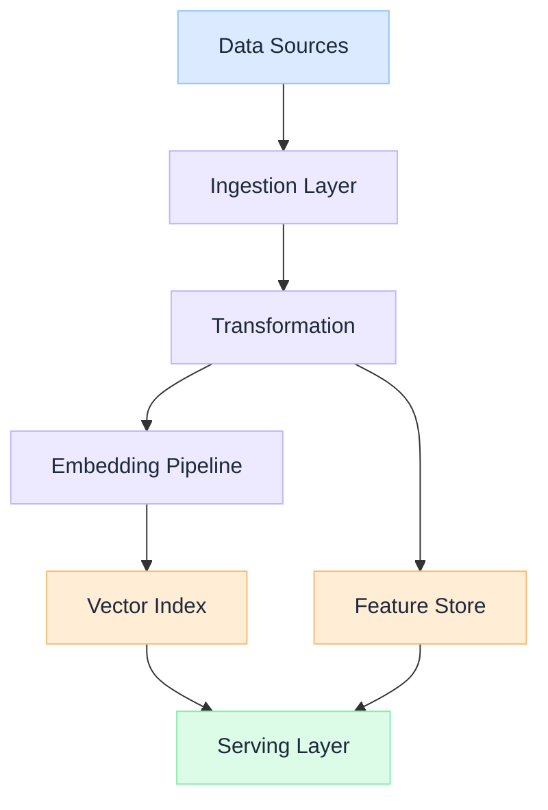

import Details from '@theme/Details';

  <h1 className="gain-doc-title">How to Build Data Pipelines for AI</h1>
  
End-to-end pipeline design for ingestion, transformation, embedding, and feature stores.

## Design for AI Data Pipelines

  AI systems are only as reliable as the data flowing through them. Pipelines must handle ingestion at scale, preserve lineage, and keep embeddings fresh as source data evolves.

  

    <ul className="gain-checklist">
      <li>Source ingestion</li>
      <li>Data transformation</li>
      <li>Embedding generation</li>
      <li>Feature store sync</li>
      <li>Freshness monitoring</li>
    </ul>
  

  

  

## Key Practices

  Data pipelines need SLAs, monitoring, and ownership: just like any production service. Undocumented batch jobs become silent failure points.

  Track every transformation from source document to embedded vector. Lineage is essential for debugging retrieval quality and compliance audits.

  Design for incremental updates rather than full re-indexing. Source data changes continuously: pipelines must keep pace without full rebuilds.

  Schema validation, embedding quality checks, and index integrity tests catch problems before they reach production retrieval.

