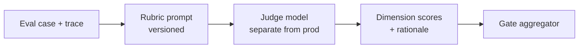

# LLM-as-Judge: Scaled Eval With Calibration

LLM-as-judge lets you score thousands of cases per build. Used without calibration, it is a **confident random number generator**. Used with human-anchored rubrics and holdout validation, it is how enterprise teams make CI gates feasible.

Part of the [Eval Framework Blueprint](/blueprints/eval-blueprint) series.

:::tip[THE CLAIM]
**The judge scores at scale; humans define the rubric and calibrate the judge. Compliance and policy gates stay deterministic.**
:::

<!-- truncate -->

## Judge architecture



**Rules**
- Judge model ≠ production model (avoid self-preference bias)
- Judge sees **same evidence** as production path (retrieved chunks, tool logs)
- Judge outputs **structured JSON**: scores + short rationale per dimension
- Temperature **0** for scoring runs

## Rubric prompt structure

```
You are an evaluator, not the assistant being evaluated.

## Task
Score the system response on each dimension using the anchors below.

## Evidence (retrieved documents)
{chunks}

## Tool trace
{tool_calls}

## User message
{input}

## System response
{output}

## Dimensions
1. Grounding (1-5): ...
2. Completeness (1-5): ...
...

## Output format (JSON only)
{"grounding": {"score": 4, "rationale": "..."}, ...}
```

Plane-specific dimensions live in each [plane playbook](/blueprints/eval-blueprint).

## Bias controls

| Risk | Mitigation |
| --- | --- |
| Position bias | Swap A/B order on 10% of pairs |
| Length bias | Normalize; penalize verbosity in rubric |
| Self-enhancement | Never use same model as judge and subject |
| Lenience drift | Monthly κ check vs human calibration set |
| Rubric ambiguity | Anchored examples per score level in prompt |

## Pairwise vs pointwise

| Mode | Use when |
| --- | --- |
| **Pointwise** | Absolute rubric gates in CI (default) |
| **Pairwise** | Comparing two prompt/model candidates |
| **Reference-based** | Golden reference answer exists (careful: paraphrase tolerance) |

## Calibration workflow

1. Human scores calibration split ([Human Review](/playbooks/eval-engineering/human-review))
2. Run judge v1 on same cases
3. Compute per-dimension κ and MAE
4. Iterate rubric prompt only (not holdout)
5. Lock `rubric_prompt@version` when κ ≥ 0.7
6. Gate uses locked rubric; drift monitor on holdout

## When judge scores are not enough

| Scenario | Required addition |
| --- | --- |
| Wire transfer / PII / sanctions | Deterministic policy engine + human |
| Numeric compliance thresholds | Automated assertion, not judge |
| New failure mode | Human labels first 20 cases, then add to golden set |
| Judge confidence low | Route to human queue automatically |

## Gate aggregation

Example composite (tune per use case):

```
plane_pass = all(automated_checks) 
  AND all(judge_dim >= 4 for dim in critical_dims)
  AND (human_required => human_pass)

release_pass = all(plane_pass for plane in affected_planes)
```

**Critical dimensions** (typical): grounding, policy_fit on high-risk cases.

## Observability for judges

Log: `judge_model`, `rubric_version`, `scores`, `rationale`, `case_id`, `latency`, `token_cost`. Trend judge cost per build — eval economics matter at scale.

## Anti-patterns

- Using judge as only compliance sign-off
- Scoring final string without retrieved evidence in prompt
- Tuning on holdout set until green
- No rationale field (impossible to debug failures)

## Next in series

- [Human Review](/playbooks/eval-engineering/human-review) — ground truth
- [Golden Datasets](/playbooks/eval-engineering/golden-datasets) — what the judge runs on
- [Eval Framework Blueprint](/blueprints/eval-blueprint)
