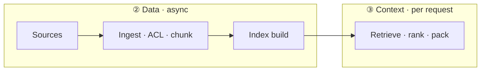

# Eval Plane ②: Data

[Blueprint](/blueprints/eval-blueprint) · [← Input](/playbooks/eval-engineering/plane-input) · **Data** · [Context →](/playbooks/eval-engineering/plane-context)

The Data plane is the **source-of-truth layer** behind your AI system. It owns what exists in the world the model can cite: document catalogs, APIs, knowledge bases, embedding indexes, chunk stores, and the pipelines that ingest, transform, and publish them.

It answers four questions that Context and Reasoning assume are already true:

1. **Correctness** — is the material factually right?
2. **Freshness** — is it current enough for the use case?
3. **Lineage** — can every chunk be traced to an authoritative source?
4. **Access** — is only entitled material indexed and reachable?

When the Data plane fails, downstream planes often look fine. Retrieval returns chunks confidently. The model grounds answers in those chunks. The outcome reads polished — but it is built on stale policy, wrong catalog, or material a principal should never see. That is why Data eval is not "did we find a chunk?" It is **is the corpus itself trustworthy before query time begins**.

:::tip[THE CLAIM]
**Eval the Data plane for freshness, lineage, and access — not just whether a chunk exists in the index.**
:::

<!-- truncate -->

## What the Data plane owns (and what it does not)

| In scope (Data) | Out of scope (other planes) |
| --- | --- |
| Source ingestion, normalization, chunking | Query parsing, intent routing ([Input](/playbooks/eval-engineering/plane-input)) |
| Catalog / schema of documents and APIs | Retrieve, rank, pack for one call ([Context](/playbooks/eval-engineering/plane-context)) |
| ACL at ingest and index-time entitlement | Whether the model reasoned correctly ([Reasoning](/playbooks/eval-engineering/plane-reasoning)) |
| Index builds, embeddings, tombstones | Tool calls and side effects ([Tool](/playbooks/eval-engineering/plane-tool), [Action](/playbooks/eval-engineering/plane-action)) |
| Freshness SLAs, reindex jobs, deletion propagation | Whether the user got a useful answer ([Outcome](/playbooks/eval-engineering/plane-outcome)) |

The vector store is a **component** in the Data plane, not the whole plane. Buying a better embedding model does not fix stale sources, missing tombstones, or dev data in prod.

## Data ≠ Context (eval them separately)

Teams often merge Data and Context into one "RAG eval." That hides who owns the fix and sends you tuning the ranker when the index is stale — or re-indexing everything when scoped retrieval is broken.

| Question | Plane | When it runs |
| --- | --- | --- |
| Is policy v4 in the index? Was v3 tombstoned? | **Data** | Async pipelines, nightly gates |
| For *this user* and *this question*, is policy v4 in top-k? | **Context** | Per inference, CI + online sample |

**Same bad answer, different root cause:**

- User gets 2023 refund rules → **Data** failure (stale source indexed)
- User gets 2025 rules but ranked fifth → **Context** failure (recall@k)
- HR doc visible to non-HR user in the index → **Data** failure (ACL at ingest)
- HR doc indexed correctly but retrieved for wrong principal → **Context** failure (filter at query time)

Eval gates should be able to read **data green, context red** (or the reverse). See [Context plane eval →](/playbooks/eval-engineering/plane-context) and [RAG Is Not a Database](/insights/rag-is-not-a-database).



## The Data lifecycle (where evals attach)

Data quality is mostly **pipeline and index** work, not per-request magic. Map evals to each stage:

| Stage | What can go wrong | Eval type |
| --- | --- | --- |
| **Source publish** | Wrong version promoted, API returns stale JSON | Golden reference vs live source |
| **Ingest / transform** | Bad chunking drops tables, wrong metadata | Fixture docs → expected chunk boundaries |
| **ACL / entitlement** | Doc indexed without role filter | Principal × doc matrix |
| **Index build** | Partial build, wrong catalog env | `index_build_id`, row counts, hash checks |
| **Deletion / tombstone** | Revoked doc still searchable | Tombstone tests after delete events |
| **Drift over time** | SLA breach on time-sensitive corpora | Scheduled freshness probes |

Most Data gates run **offline on index snapshots** plus **scheduled probes** — not on every user request. Context eval still runs per query; Data eval proves the substrate those queries run on.

## What to evaluate

| Signal | What it means | Pass criteria |
| --- | --- | --- |
| **Freshness** | Indexed version matches authoritative source within SLA | `source_version` on chunks matches golden; time-sensitive cases within TTL |
| **Lineage** | Every chunk maps to source id, version, and transform step | 100% of sampled chunks resolve in catalog |
| **Access** | Only entitled documents exist in the searchable set for each principal class | ACL adversarial matrix: 0 violations |
| **Correctness** | Facts in indexed extracts match domain reference | Spot-check vs golden extracts; hash match on fixtures |
| **Deletion** | Revoked material absent from index | Tombstone within SLA after delete event |
| **Catalog integrity** | Right environment, right corpus | No cross-env leakage (dev in prod) |

**Freshness SLAs are use-case specific.** A product FAQ might tolerate 24h lag; a rate table or compliance policy might require minutes after publish. Define SLAs per corpus, not one global number.

## Failure classes

| Class | Example | How you usually catch it |
| --- | --- | --- |
| **Stale source** | Refund policy v3 indexed; v4 live in CMS for a week | Freshness probe; incident replay |
| **Wrong catalog** | Staging index attached to prod router | `index_build_id` / env tags in trace |
| **Entitlement gap** | HR-only PDF embedded without ACL metadata | Principal × doc adversarial set |
| **Bad chunking** | Rate table split across chunks; model sees partial numbers | Fixture ingest → expected chunk boundaries |
| **Tombstone miss** | Deleted customer PII still retrievable | Delete event → search still returns doc |
| **Lineage break** | Chunk has no `source_id`; audit cannot reconstruct | Monthly lineage sample |

Tag production incidents with these classes. Promote each to a golden case within a week ([Golden Datasets](/playbooks/eval-engineering/golden-datasets)).

## Golden dataset examples

Build slices per corpus (policy, product, support, rates) — not one generic "RAG set."

| Scenario | Setup | Expected |
| --- | --- | --- |
| Representative | Query corpus for current policy v3 | All returned chunk metadata: `source_version: v3`, entitled principal |
| Edge | Doc updated 1h ago in CMS | Index freshness within SLA for that corpus |
| Adversarial | Principal without HR role | No HR-only `doc_id` in searchable set for that principal class |
| Adversarial | Tombstone after legal hold lift | Doc absent from index within SLA |
| Incident replay | Stale rate table caused wrong answer in prod | v4 present and hash-matched after reindex |

**Schema fields every Data golden case should carry:**

```json
{
  "plane": "data",
  "corpus": "refund_policy",
  "principal_class": "customer_tier_1",
  "expected": {
    "source_versions": ["v3"],
    "forbidden_doc_ids": ["hr-handbook-2024"],
    "max_staleness_minutes": 60
  },
  "failure_class": null,
  "source": "incident_replay"
}
```

## Automated checks (primary scorer for Data)

Data eval should be **mostly deterministic**. Judges and humans supplement; they do not replace ACL and version checks.

```python
# Version assertion on indexed chunks
for chunk in index_sample(corpus="refund_policy"):
    assert chunk.source_version in ALLOWED_VERSIONS

# Principal × document entitlement matrix
for principal, forbidden_ids in ACL_ADVERSARIAL_FIXTURES:
    searchable = index.searchable_doc_ids(principal)
    assert forbidden_ids.isdisjoint(searchable)

# Tombstone after deletion
publish_delete_event(doc_id="policy-v3")
wait_until_within_sla()
assert doc_id not in index.searchable_doc_ids(any_principal)

# Golden extract hash (correctness on fixtures)
assert sha256(index.get_extract(fixture_id)) == FIXTURE_HASHES[fixture_id]
```

Also enforce:

- `source_version`, `source_id`, `ingest_timestamp` on **every** chunk
- `index_build_id` and `catalog_env` on every trace that touches retrieval
- Row-count and corpus-size bounds after each build (catch partial failures)

## LLM-as-judge (limited role)

Judges are weak at proving ACL or version metadata. Use them only where human judgment on *appropriateness* matters at corpus level:

1. **Source appropriateness** (1–5) — for a representative question set, is this corpus the right authority? (Not: did retrieval rank well.)
2. **Recency plausibility** (1–5) — would a domain expert trust the vintage of sampled extracts?

Calibrate against human experts on a fixed monthly sample. Do **not** gate ACL or tombstone compliance on judge scores.

## Human review

| Trigger | Who | Cadence |
| --- | --- | --- |
| Monthly correctness audit | Domain expert | Random sample per corpus |
| All `stale_source` / `wrong_catalog` incidents | Domain + platform | Within 1 week → golden case |
| New corpus before first prod gate | Domain owner | Sign-off on golden fixtures |
| High-risk corpora (legal, rates, clinical) | Governance | Quarterly full spot-check |

Humans anchor **what correct source material looks like**. Automation encodes **non-negotiables** (ACL, versions, tombstones).

## Release gate (Data-specific changes)

When the change touches ingest, catalog, ACL, or index:

| Gate | Threshold |
| --- | --- |
| ACL adversarial set | **0** violations |
| Freshness SLA | **100%** on time-sensitive golden cases |
| Source-version assertions | No regression vs baseline |
| Tombstone tests | **100%** pass after delete fixtures |
| Catalog / env integrity | No cross-env doc ids in prod index |

**Pair with Context gates** on the same release: Data green does not imply Context green. Model swap → Context + Reasoning; index-only change → Data + Context recall@k.

## Online eval (async, not per-request)

Data plane online eval is **probes and dashboards**, not sampling every user query:

- Scheduled freshness probes against authoritative APIs/CMS
- Drift alerts when `source_version` distribution shifts
- Index build success / duration / row-count monitors
- ACL regression jobs on synthetic principals nightly

Feed failures into the same incident → golden case loop as offline CI.

## Trace fields

Capture these so Data failures are diagnosable without re-running ingest:

| Field | Why |
| --- | --- |
| `source_ids` | Which authoritative objects backed the chunks |
| `source_versions` | Detect stale corpus in prod traces |
| `index_build_id` | Tie behavior to a specific build |
| `catalog_env` | Catch wrong-catalog incidents |
| `acl_decision_log` | Prove entitlement at index or query filter |
| `ingest_timestamp` | Freshness vs SLA |
| `chunk_id` → `source_id` map | Lineage for audit |

## Further reading

- [Context plane eval](/playbooks/eval-engineering/plane-context) — query-time retrieval (paired with this page)
- [Golden Datasets](/playbooks/eval-engineering/golden-datasets) — how to structure and version Data cases
- [RAG Is Not a Database](/insights/rag-is-not-a-database) — why the store is not the architecture
- [Further reading (external)](/playbooks/eval-engineering/further-reading) — Evidently RAG guide (corpus vs retrieval split)

---

[Blueprint](/blueprints/eval-blueprint) · [Context →](/playbooks/eval-engineering/plane-context)
