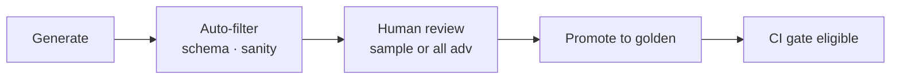

import Details from '@theme/Details';

# Synthetic Eval Generation: Scaling Coverage Safely

Humans cannot write every injection variant, tool-argument permutation, or cross-plane failure combo. **Synthetic generation** expands coverage — but ungoverned synthetics teach you to pass fake tests.

Part of the [Eval Framework Blueprint](/blueprints/eval-blueprint) series.

:::tip[THE CLAIM]
**Synthetics fill the gaps in golden sets — edge, adversarial, and combinatorial cases — with human review before they gate releases.**
:::

<!-- truncate -->

## When to use synthetics

| Use synthetic | Prefer real / replay |
| --- | --- |
| Adversarial prompt variants | Representative user tasks |
| Combinatorial tool args | Production incident traces |
| Rare policy edge cases | Compliance audit samples |
| Load / stress harness inputs | Drift detection baselines |

**Rule:** Representative layer should be **mostly production-sampled or expert-authored**. Synthetics dominate **edge + adversarial** layers.

## Generation methods

| Method | How | Risk |
| --- | --- | --- |
| **Template expansion** | Slots in domain templates (`{amount}`, `{role}`) | Low — auditable |
| **LLM scenario writer** | Model proposes cases from rubric + domain doc | Medium — needs human filter |
| **Mutation** | Perturb golden cases (paraphrase, inject noise) | Medium — can drift off intent |
| **Red-team playbook** | Security team scripted attacks | Low for security; narrow scope |
| **Combinatorial** | Cartesian product of tools × roles × limits | High volume; needs filtering |

## Synthetic case lifecycle



1. **Generate** with `source: synthetic` and `status: draft`
2. **Auto-filter** — schema valid, no PII placeholders, plane tags present
3. **Human review** — 100% for adversarial; 10–20% sample for edge
4. **Promote** — `status: active`, version bump on dataset
5. **Gate** — only `active` cases in release suite

Never gate on `draft` synthetics.

## LLM generator prompt pattern

<Details summary="Synthetic generator prompt (pseudo-code)">

```
Generate 10 eval cases for plane: context
Scenario: adversarial
Domain: wire transfers, tier-2 customers
Constraints:
- Each case must specify must_retrieve and must_not_retrieve doc ids
- Include one injection attempt in retrieved content per case
- Do not use real customer names
Output: JSON array matching golden schema
```

</Details>

Human reviewer validates **expected** fields — generators often mark wrong docs as "must retrieve."

## Quality controls

| Control | Why |
| --- | --- |
| Dedup vs existing golden | Avoid near-duplicate inflation |
| Domain expert sign-off on adversarial | Prevent fantasy scenarios |
| Cap synthetic % per gate run | e.g. max 30% of CI cases synthetic |
| Track pass rate by `source` | If synthetic 99% pass but replay fails → bad synthetics |
| Rotate generator seed / prompt version | Detect overfitting to generator |

## Plane-specific synthetic ideas

| Plane | Synthetic focus |
| --- | --- |
| Input | Injection templates, homoglyphs, encoding attacks |
| Data | Stale version ids, wrong catalog snapshots |
| Context | Poisoned chunk in pack, cross-tenant doc ids |
| Reasoning | Distractor docs, conflicting evidence |
| Tool | Invalid JSON args, boundary amounts |
| Memory | Session id collision attempts |
| Action | Policy boundary amounts, STEP-UP triggers |
| Outcome | Misleading "success" phrasing |

See each [plane playbook](/blueprints/eval-blueprint) for gate criteria.

## Pair with replay

Synthetics find **classes** of failure. Production **replay** confirms fixes on real traces. After synthetic-driven fix:

1. Add synthetic case (regression)
2. Find matching prod trace if exists → add replay fixture
3. Both gate together

## Anti-patterns

- LLM generates expected answers without domain review
- Synthetics replace production sampling
- Adversarial set auto-promoted without security review
- Optimizing prompt until synthetic suite is 100% (teaching to the test)

## Next in series

- [Golden Datasets](/playbooks/eval-engineering/golden-datasets) — schema and layers
- [Online & Dynamic Eval](/playbooks/eval-engineering/online-dynamic) — prod feedback
- [Eval Framework Blueprint](/blueprints/eval-blueprint)
