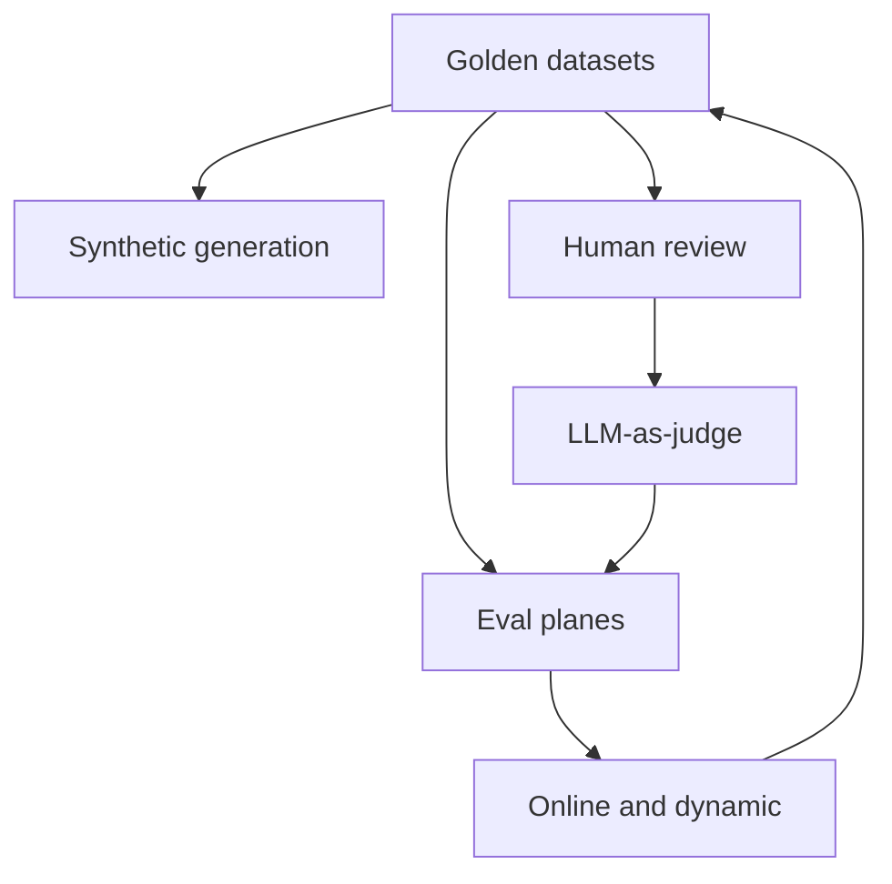

# Eval Engineering Playbooks

[Playbooks](/playbooks) · **Eval engineering overview** · [Golden datasets →](/playbooks/evaluation/golden-datasets)

Implementation guides for the [Eval Blueprint](/blueprints/evaluation-blueprint). [G.A.I.N Evaluation](/frameworks/gain-evaluation) covers principles. These playbooks are the **how**: data sources, scorers, and plane-specific gates.

:::tip[THE CLAIM]
**Eval is a control system, not a scoreboard.** Build golden cases first, score every plane that can fail, and promote production signals back into the dataset. One end-of-pipeline number is not enough.
:::

<!-- truncate -->

## Two playbook groups

| Group | Overview | What you build |
| --- | --- | --- |
| **Methods** | [Golden datasets →](/playbooks/evaluation/golden-datasets) | Datasets, synthetic coverage, online/dynamic scoring, human review, LLM-as-judge |
| **Planes** | [Input →](/playbooks/evaluation/plane-input) | Per-plane gates from Input ① through Outcome ⑧ |

Plus [Further reading (external)](/playbooks/evaluation/further-reading) for third-party eval tools and guides mapped to this series.

## Recommended path

 

1. **[Golden datasets](/playbooks/evaluation/golden-datasets):** versioned, plane-tagged cases before automation
2. **[Synthetic generation](/playbooks/evaluation/synthetic-generation)** and **[Human review](/playbooks/evaluation/human-review):** expand coverage and calibrate rubrics
3. **[LLM-as-judge](/playbooks/evaluation/llm-as-judge):** scale scoring once humans set ground truth
4. **Eval planes:** gate each plane your system actually owns (start with failure modes you already see)
5. **[Online & dynamic](/playbooks/evaluation/online-dynamic):** score live traffic and feed incidents back into goldens

Bridge reading: [Eval Blueprint](/blueprints/evaluation-blueprint) · [G.A.I.N Evaluation](/frameworks/gain-evaluation).

## Method playbooks at a glance

| Playbook | One-line purpose |
| --- | --- |
| [Golden datasets](/playbooks/evaluation/golden-datasets) | Versioned, plane-tagged, risk-tiered case libraries |
| [Synthetic generation](/playbooks/evaluation/synthetic-generation) | Edge and adversarial coverage without polluting goldens |
| [Online & dynamic](/playbooks/evaluation/online-dynamic) | Live sampling, shadow scoring, drift, promote-back loops |
| [Human review](/playbooks/evaluation/human-review) | Sampling, rubrics, adjudication that anchors automation |
| [LLM-as-judge](/playbooks/evaluation/llm-as-judge) | Scaled judging with bias controls and human calibration |

## Eval planes at a glance

| # | Playbook | One-line purpose |
| --- | --- | --- |
| ① | [Input](/playbooks/evaluation/plane-input) | Parsing, intent, injection resistance, PII before inference |
| ② | [Data](/playbooks/evaluation/plane-data) | Source freshness, lineage, access boundaries |
| ③ | [Context](/playbooks/evaluation/plane-context) | Retrieval precision, ranking, packing, abstention |
| ④ | [Reasoning](/playbooks/evaluation/plane-reasoning) | Faithfulness, conclusion quality, multi-step logic |
| ⑤ | [Tool](/playbooks/evaluation/plane-tool) | Selection, arguments, idempotency, schema compliance |
| ⑥ | [Memory](/playbooks/evaluation/plane-memory) | Session scope, TTL, cross-session leakage |
| ⑦ | [Action](/playbooks/evaluation/plane-action) | Policy enforcement, authorization, audit before side effects |
| ⑧ | [Outcome](/playbooks/evaluation/plane-outcome) | Task success, clarity, usefulness, trust in the final response |

## Who should read what

| Role | Start with | Then |
| --- | --- | --- |
| **AI platform** | [Golden datasets](/playbooks/evaluation/golden-datasets), [LLM-as-judge](/playbooks/evaluation/llm-as-judge) | [Online & dynamic](/playbooks/evaluation/online-dynamic), relevant plane playbooks |
| **Domain squad** | [Golden datasets](/playbooks/evaluation/golden-datasets), [Human review](/playbooks/evaluation/human-review) | Plane playbooks for your surface (e.g. [Context](/playbooks/evaluation/plane-context), [Tool](/playbooks/evaluation/plane-tool)) |
| **Governance / risk** | [Human review](/playbooks/evaluation/human-review), [Action](/playbooks/evaluation/plane-action) | [Input](/playbooks/evaluation/plane-input), [Outcome](/playbooks/evaluation/plane-outcome) |
| **RAG / knowledge** | [Data](/playbooks/evaluation/plane-data), [Context](/playbooks/evaluation/plane-context) | [RAG playbooks](/playbooks/rag), [Eval Blueprint](/blueprints/evaluation-blueprint) |
| **Agent / PGAR teams** | [Tool](/playbooks/evaluation/plane-tool), [Action](/playbooks/evaluation/plane-action) | [PGAR Runtime](/playbooks/governance/runtime), [Memory plane](/playbooks/evaluation/plane-memory), [Memory](/playbooks/agents/orchestration/memory) |

## Read next

**[Golden datasets →](/playbooks/evaluation/golden-datasets)**
