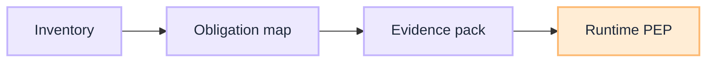

# Operating Playbooks

[Governance](/playbooks/governance) · **Operating overview** · [Inventory →](/playbooks/governance/operating/inventory)

How-to for the [Operating blueprint](/blueprints/governance/operating). These playbooks make the estate control system runnable: inventory, mapped obligations, and an evidence pack before scale. They are not PEP, SARAC, or five trust boundaries. Those live in [Runtime](/playbooks/governance/runtime).

:::tip[THE CLAIM]
**Approve before scale.** No inventory, no owner, no go-live. Runtime guardrails without this path is an agent with PEP and no examiner pack.
:::

<!-- truncate -->

## Three playbooks

| # | Playbook | What you build |
| --- | --- | --- |
| **①** | **[Inventory record](/playbooks/governance/operating/inventory)** | Named use case, owner, pattern, data class, go-live state |
| **②** | **[Obligation-to-control map](/playbooks/governance/operating/obligation-to-control)** | Must-we → named control + evidence artifact |
| **③** | **[Go-live evidence pack](/playbooks/governance/operating/go-live-evidence)** | What examiners get before scale |

 

## Recommended path

1. **[Inventory](/playbooks/governance/operating/inventory):** every in-production agent has a row before it calls a tool
2. **[Obligation-to-control](/playbooks/governance/operating/obligation-to-control):** each must-we maps to a control you can point at
3. **[Evidence pack](/playbooks/governance/operating/go-live-evidence):** assemble the pack; then [Runtime](/playbooks/governance/runtime) for the request path

Blueprint: [Four questions, one control system](/blueprints/governance/operating). Org planes: [G.A.I.N AIOM](/frameworks/gain-aiom).

## Read next

**[Inventory record →](/playbooks/governance/operating/inventory)**
