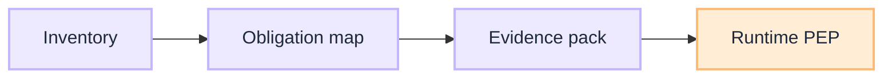

# Operating Playbooks

[Governance](/playbooks/governance) · **Operating overview** · [Inventory →](/playbooks/governance/operating/inventory)

How-to for the [Operating blueprint](/blueprints/governance/operating). These playbooks make the estate control system runnable: inventory, mapped obligations, and an evidence pack before scale. They are not PEP, SARAC, or five trust boundaries. Those live in [Runtime](/playbooks/governance/runtime).

:::tip[THE CLAIM]
**Approve before scale.** No inventory, no owner, no go-live. Runtime guardrails without this path is an agent with PEP and no examiner pack.
:::

<!-- truncate -->

## Three playbooks

| # | Playbook | What you build |
| --- | --- | --- |
| **①** | **[Inventory record](/playbooks/governance/operating/inventory)** | Named use case, owner, pattern, data class, go-live state |
| **②** | **[Obligation-to-control map](/playbooks/governance/operating/obligation-to-control)** | Must-we → named control + evidence artifact |
| **③** | **[Go-live evidence pack](/playbooks/governance/operating/go-live-evidence)** | What examiners get before scale |

```mermaid
flowchart LR
  I[Inventory]
  O[Obligation map]
  E[Evidence pack]
  R[Runtime PEP]

  I --> O --> E
  E --> R

  classDef gate fill:#ffedd5,stroke:#fdba74,color:#1e293b,stroke-width:2px
  classDef process fill:#ede9fe,stroke:#c4b5fd,color:#1e293b,stroke-width:2px

  class R gate
  class I,O,E process
```
 

## Recommended path

1. **[Inventory](/playbooks/governance/operating/inventory):** every in-production agent has a row before it calls a tool
2. **[Obligation-to-control](/playbooks/governance/operating/obligation-to-control):** each must-we maps to a control you can point at
3. **[Evidence pack](/playbooks/governance/operating/go-live-evidence):** assemble the pack; then [Runtime](/playbooks/governance/runtime) for the request path

## Worked example: bank refund agent

Same `use_case_id` on every artifact. If the id drifts, the examiner pack is fiction.

| Playbook | What exists for `uc-refund-agent` |
| --- | --- |
| **[Inventory](/playbooks/governance/operating/inventory)** | Row: Payments owner, Pattern 3 (guided hybrid), `customer_financial`, AU residency, status `approved` until the pack lands |
| **[Obligation map](/playbooks/governance/operating/obligation-to-control)** | Four must-we rows (operational resilience, privacy, consumer duty, internal fraud limit), each with a `control_id` you can open |
| **[Evidence pack](/playbooks/governance/operating/go-live-evidence)** | `ev-refund-agent-2026-03`: sample ALLOW / STEP_UP / DENY, eval suite green, named residual accept |

Then status may move to `live`. [Runtime](/playbooks/governance/runtime) owns the request path: PEP on `issue_refund`, HITL above the fraud band, verdict log.

A staff HR policy FAQ is the same three playbooks with a thinner row: Pattern 0, `internal_unclassified`, no write-tool PEP. Do not copy the refund pack onto that use case.

## What "not done" looks like

| Symptom | Missing playbook |
| --- | --- |
| Refund bot in Slack; nobody can name the owner | [Inventory](/playbooks/governance/operating/inventory) |
| Legal memo "we comply with CPS 230" and no `control_id` | [Obligation map](/playbooks/governance/operating/obligation-to-control) |
| Screenshot PDF assembled the week before the auditor | [Evidence pack](/playbooks/governance/operating/go-live-evidence) |
| Inventory `live`, tools called without PEP | [Runtime](/playbooks/governance/runtime) (not these playbooks) |

Blueprint: [Approve before scale](/blueprints/governance/operating). Canonical model: [G.A.I.N Governance](/frameworks/gain-governance). Org planes: [G.A.I.N AIOM](/frameworks/gain-aiom).

## Read next

**[Inventory record →](/playbooks/governance/operating/inventory)**
