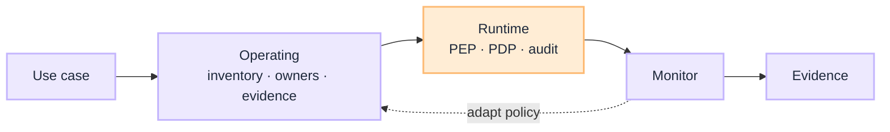

# Governance Playbooks

[Playbooks](/playbooks) · **Governance overview** · [Operating →](/playbooks/governance/operating)

Two views, one G.A.I.N subject. Operating is estate how-to. Runtime is PGAR on the request path. Reference design: [Governance blueprints](/blueprints/governance). Principles live in [G.A.I.N Governance](/frameworks/gain-governance).

:::tip[THE CLAIM]
**Do not split these into two G.A.I.N subjects.** Exec, risk, and compliance start at Operating. Platform, security, and SRE start at Runtime. Same domain, different question.
:::

<!-- truncate -->

## Two views

| View | Question | Audience | Start here |
| --- | --- | --- | --- |
| **[Operating](/playbooks/governance/operating)** | How do we ensure it across the estate? | Exec, risk, compliance, enterprise architects | Inventory, obligation map, evidence pack |
| **[Runtime](/playbooks/governance/runtime)** | How does one request stay governed on the path? | Platform, security/IAM, SRE | Foundation, assurance, five boundaries |

 

PGAR gates side effects. It does not own RAG corpora, tool manifests, or the memory store. Those stay on [RAG](/playbooks/rag), [Agents: Manifests](/playbooks/agents/manifests/manifest-registry), and [Memory](/playbooks/agents/orchestration/memory).

## Read next

**[Operating →](/playbooks/governance/operating)** · [Runtime](/playbooks/governance/runtime) · [Governance blueprints](/blueprints/governance)
