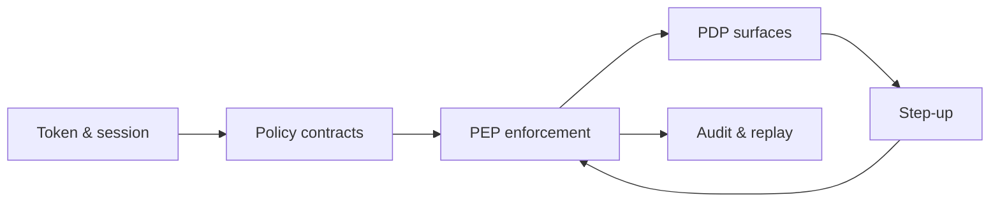

# PGAR Foundation Playbooks

[Runtime](/playbooks/governance/runtime) · [Blueprint](/blueprints/governance/runtime) · **Foundation overview** · [Policy contracts →](/playbooks/governance/runtime/foundation/policy-contracts)

Foundation playbooks define **how PGAR works before you wire a specific agent surface**. They cover contracts, custody, enforcement, verdicts, attestation, and audit. Read them before [boundary](/playbooks/governance/runtime/boundary) playbooks.

:::tip[THE CLAIM]
**Build foundations first.** Boundaries describe where control lives. RAG, MCP, and memory are other G.A.I.N series that PGAR gates. Neither replaces SARAC, PEP, or audit.
:::

<!-- truncate -->

## Implementation order

| # | Playbook | What it defines | Read when |
| --- | --- | --- | --- |
| 1 | [Policy contracts](/playbooks/governance/runtime/foundation/policy-contracts) | SARAC shape the PDP evaluates | Designing PEP-to-PDP payloads |
| 2 | [Token & session](/playbooks/governance/runtime/foundation/token-and-session-boundary) | What crosses the LLM line (and what never does) | PGAR test, credential stripping |
| 3 | [PEP enforcement](/playbooks/governance/runtime/foundation/pep-enforcement) | Receive, ask PDP, audit, act | Building the choke point |
| 4 | [PDP surfaces](/playbooks/governance/runtime/foundation/pdp-policy-surfaces) | ALLOW, DENY, STEP_UP rules | Authoring policy versions |
| 5 | [Step-up & attestation](/playbooks/governance/runtime/foundation/step-up-and-attestation) | Re-eval after human approval | High-risk actions, four-eyes |
| 6 | [Audit & replay](/playbooks/governance/runtime/foundation/audit-and-replay) | Immutable verdict chain for examiners | Retention, replay packs |

Then [boundary playbooks](/playbooks/governance/runtime/boundary) (where each control sits in the request path). Cross-call [Manifests](/playbooks/agents/manifests/manifest-registry), [RAG](/playbooks/rag), or [Memory](/playbooks/agents/orchestration/memory) for the gated contract or store.

## How foundations connect

Every tool proposal at runtime flows: agentic app assembles SARAC → PEP asks PDP → verdict logged → ALLOW reaches downstream or DENY/STEP_UP returns to app.

## Assurance (after foundations)

| Playbook | Purpose |
| --- | --- |
| [Policy test scenarios](/playbooks/governance/runtime/assurance/policy-test-scenarios) | Golden authorization cases in CI |
| [Adversarial testing](/playbooks/governance/runtime/assurance/adversarial-testing) | Bypass attempts, prompt injection against enforcement |

See the [Assurance playbooks](/playbooks/governance/runtime/assurance/policy-test-scenarios) category in the sidebar for both.

## Read next

**[Policy contracts →](/playbooks/governance/runtime/foundation/policy-contracts)**
