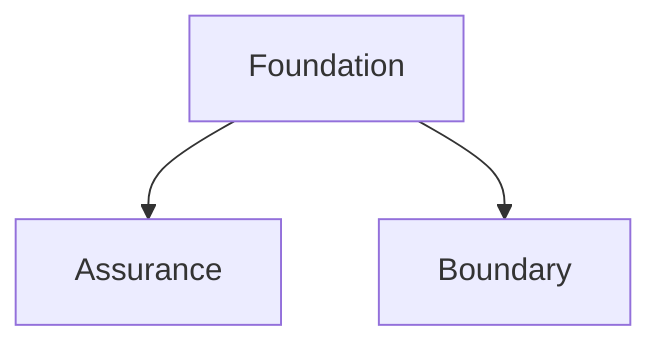

# Runtime Playbooks

[Governance](/playbooks/governance) · **Runtime overview** · [Foundation →](/playbooks/governance/runtime/foundation)

Implementation guides for Policy-Governed Agent Runtime. The [Runtime blueprint](/blueprints/governance/runtime) is the reference design. Estate how-to: [Operating](/playbooks/governance/operating). These playbooks are the **how** for the request path: contracts, enforcement, boundaries, and tests.

RAG, tool manifests, and memory are **other G.A.I.N subjects**. PGAR gates their side effects. Their how-to lives in [RAG](/playbooks/rag), [Agents: Manifests](/playbooks/agents/manifests/manifest-registry), and [Memory](/playbooks/agents/orchestration/memory).

:::tip[THE CLAIM]
**The LLM proposes. The PEP enforces. The PDP decides. Every side effect gates at the PEP before downstream runs. These playbooks show you how to build that path.**
:::

<!-- truncate -->

## Three playbook groups

| Group | Overview | What you build |
| --- | --- | --- |
| **[Foundation](/playbooks/governance/runtime/foundation)** | [Open →](/playbooks/governance/runtime/foundation) | SARAC contracts, token custody, PEP/PDP loop, step-up, audit replay |
| **[Assurance](/playbooks/governance/runtime/assurance/policy-test-scenarios)** | Policy test scenarios | Golden authorization cases in CI, adversarial bypass tests |
| **[Boundary](/playbooks/governance/runtime/boundary)** | [Open →](/playbooks/governance/runtime/boundary) | Five trust boundaries from ingress through downstream |

Plus [Further reading (external)](/playbooks/governance/runtime/further-reading) for third-party PDP/PEP and OAuth patterns mapped to this series.

## Recommended path

 

1. **[Foundation](/playbooks/governance/runtime/foundation)** (6 playbooks): policy contracts → token & session → PEP → PDP → step-up → audit
2. **[Assurance](/playbooks/governance/runtime/assurance/policy-test-scenarios)** (2 playbooks): scenario library and adversarial bypass set (start in parallel once PEP exists)
3. **[Boundary](/playbooks/governance/runtime/boundary)** (5 playbooks + overview): ingress, agentic app, LLM proposal, PEP + PDP, downstream

Then call other G.A.I.N series for the thing being gated: [Manifests](/playbooks/agents/manifests/manifest-registry), [RAG](/playbooks/rag), [Memory](/playbooks/agents/orchestration/memory).

Eval overlap: [Action plane](/playbooks/evaluation/plane-action) · [Tool plane](/playbooks/evaluation/plane-tool).

## All playbooks at a glance

### Foundation

| Playbook | One-line purpose |
| --- | --- |
| [Policy contracts](/playbooks/governance/runtime/foundation/policy-contracts) | SARAC payload shapes the PDP evaluates |
| [Token & session](/playbooks/governance/runtime/foundation/token-and-session-boundary) | Credentials stay out of the LLM boundary |
| [PEP enforcement](/playbooks/governance/runtime/foundation/pep-enforcement) | Receive, ask PDP, audit, act on every proposal |
| [PDP surfaces](/playbooks/governance/runtime/foundation/pdp-policy-surfaces) | ALLOW, DENY, STEP_UP rule authoring |
| [Step-up & attestation](/playbooks/governance/runtime/foundation/step-up-and-attestation) | Re-eval after human approval |
| [Audit & replay](/playbooks/governance/runtime/foundation/audit-and-replay) | Immutable verdict chain for examiners |

### Assurance

| Playbook | One-line purpose |
| --- | --- |
| [Policy test scenarios](/playbooks/governance/runtime/assurance/policy-test-scenarios) | Representative, edge, and incident replay cases in CI |
| [Adversarial testing](/playbooks/governance/runtime/assurance/adversarial-testing) | Direct downstream bypass, injection, shadow tools |

### Boundary

| # | Playbook | One-line purpose |
| --- | --- | --- |
| ① | [Ingress](/playbooks/governance/runtime/boundary/ingress) | Token validation and claims at the edge |
| ② | [Agentic app](/playbooks/governance/runtime/boundary/agentic-app) | Orchestration, token custody, validation gates |
| ③ | [LLM proposal](/playbooks/governance/runtime/boundary/llm-proposal) | Tool schemas only; proposal not permission |
| ④ | [PEP + PDP](/playbooks/governance/runtime/boundary/pep-pdp) | Verdict before any side effect |
| ⑤ | [Downstream](/playbooks/governance/runtime/boundary/downstream) | Re-auth, execute, return to app |

See [Boundary overview](/playbooks/governance/runtime/boundary) for request flow and multi-agent patterns.

## Cross-calls (not nesting)

| Side effect | G.A.I.N subject | Playbook |
| --- | --- | --- |
| Tool execute | Agents | [Manifest registry](/playbooks/agents/manifests/manifest-registry) |
| Corpus retrieve | RAG | [RAG retrieval](/playbooks/rag/retrieval) |
| Prefs / episodes | Agents | [Memory](/playbooks/agents/orchestration/memory) |

PGAR still evaluates SARAC on those actions. The store and contract live in the subject series.

## Who should read what

| Role | Start with | Then |
| --- | --- | --- |
| **Security / IAM** | [Token & session](/playbooks/governance/runtime/foundation/token-and-session-boundary), [Ingress](/playbooks/governance/runtime/boundary/ingress) | [PDP surfaces](/playbooks/governance/runtime/foundation/pdp-policy-surfaces), [Audit & replay](/playbooks/governance/runtime/foundation/audit-and-replay) |
| **AI platform** | [PEP enforcement](/playbooks/governance/runtime/foundation/pep-enforcement), [Agentic app](/playbooks/governance/runtime/boundary/agentic-app) | [MCP](/playbooks/mcp), [RAG](/playbooks/rag) |
| **Governance / compliance** | [Policy contracts](/playbooks/governance/runtime/foundation/policy-contracts), [Audit & replay](/playbooks/governance/runtime/foundation/audit-and-replay) | [Policy test scenarios](/playbooks/governance/runtime/assurance/policy-test-scenarios) · [Operating](/playbooks/governance/operating) |

## Read next

**[Foundation →](/playbooks/governance/runtime/foundation)**
