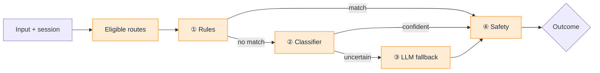

# Layered Classifier

[Blueprint](/blueprints/intent-router-blueprint) · [← Route table](/playbooks/intent-router/route-table-lifecycle) · **Classifier** · [Wire agentic app →](/playbooks/intent-router/wire-agentic-app)

Do not send every message to one LLM with the full route table. Use a **short pipeline**: cheap layers first, capable layers only when needed, safety on every path.

:::tip[THE CLAIM]
**Eligible routes first, then rules, then classifier, then LLM fallback, then safety.** Keep Layer ③ rare.
:::

<!-- truncate -->

## Pipeline

## Layer reference

| Layer | Job | Clarification |
| --- | --- | --- |
| **Eligible routes** | Prune table by ingress claims | No `payment_initiate` if user lacks payment role |
| **① Rules** | Commands, channel, session stickiness | "yes", "$500" stay on active route |
| **② Classifier** | Small model / kNN on your golden set | Target most traffic in &lt;50ms |
| **③ LLM fallback** | Structured JSON, fixed `route_id` list | Top 3 + user pick for ambiguous or high-risk only |
| **④ Safety** | Injection, PII, veto | [Input plane](/playbooks/eval-engineering/plane-input): 100% adversarial pass |

## Outcomes

| Outcome | Typical action |
| --- | --- |
| **Route** | confidence ≥ threshold → hand off to agentic app |
| **Clarify** | missing entities or mid confidence → question or top-k pick |
| **Abstain** | low confidence or OOD → safe refusal or human handoff |

Tune thresholds per route risk. Details: [How to Design an Intent Router](/insights/design-intent-router) (Step 3).

## Trace fields

`intent_label`, `route_id`, `confidence`, `router_layer`, `eligible_routes`, `safety_flags`, `outcome`, `latency_ms`, `route_table_version`

## Read next

**[Wire agentic app →](/playbooks/intent-router/wire-agentic-app)**
