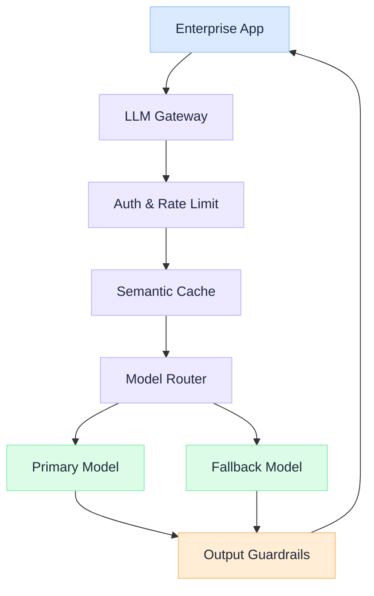

import Details from '@theme/Details';

  <h1 className="gain-doc-title">How to Integrate LLMs in Production</h1>
  
Integrate LLMs into existing enterprise systems. APIs, gateways, caching, and fallbacks.

## Design for Enterprise Integration

  Integrating an LLM into an existing system is an architecture problem, not a API call. Gateways, caching, authorization, and fallback paths must be designed before the first production request.

  

    <ul className="gain-checklist">
      <li>API gateway layer</li>
      <li>Authentication & authz</li>
      <li>Response caching</li>
      <li>Rate limiting</li>
      <li>Fallback routing</li>
    </ul>
  

  

  

## Key Practices

  Route all LLM traffic through a gateway that handles auth, logging, caching, and routing. Direct model calls bypass every production safeguard.

  Build a provider-agnostic interface so you can swap models without rewriting application code. Vendor lock-in is a operational risk, not just a cost issue.

  Semantic caching reduces cost and latency dramatically. Define cache invalidation rules based on data freshness requirements, not arbitrary TTLs.

  When the primary model is unavailable, route to fallbacks, cached responses, or human escalation. Users should never see a raw API error.

