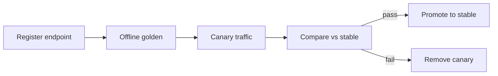

# Canary Promotion

[Blueprint](/blueprints/llm-blueprint) · [← Gateway task routing](/playbooks/llm/gateway-task-routing) · **Canary promotion**

A new model revision does not become production by updating a URL. It enters the [capability matrix](/playbooks/llm/capability-matrix) as `canary`, passes eval, then earns `stable`.

:::tip[THE CLAIM]
**Swap the endpoint the same way you promote a route table: version, eval, pin, rollback.** Console-only model changes are not a release process.
:::

<!-- truncate -->

## Promotion sequence

1. Register the new endpoint in the catalog (revision, region, data class)
2. Attach it as `canary` on the target `profile_id` + task (bump `matrix_version`)
3. Run the offline golden suite for that profile and task
4. Split a small share of live traffic to canary (same filters as stable)
5. Compare quality, latency, cost, and abstain rate against stable
6. On pass: repoint `stable`, drop or keep canary for the next candidate
7. On fail: remove canary from the matrix; stable is unchanged

 

## Offline gate (before live split)

Align scoring with [Eval Reasoning plane](/playbooks/evaluation/plane-reasoning) for plan/synthesize quality. Task routing correctness is a gateway test, not a judge score.

| Gate | Bar |
| --- | --- |
| Golden task set | No regression vs current stable (baseline − 1% max) |
| Safety / abstain fixtures | **100%** expected abstain or block |
| Schema / tool-proposal well-formedness | **100%** on structured tasks |
| Cost estimate | At or under profile `max_cost_usd_per_1k_tokens` |

Attach `eval_run_id` to the change record that bumps `matrix_version`.

## Online follow-up

| Signal | Action |
| --- | --- |
| Quality drop vs stable | Halt split; keep stable |
| Latency or error rate over SLO | Halt split |
| Cost per call over cap | Halt split even if quality is better |
| Abstain rate spike | Check filter; do not widen data class to recover volume |
| Shadow disagreement (canary ≠ stable) | Sample for human review before promote |

Canary sees the **same** data class, region, and entitlements as stable. A canary that only runs on public traffic is not evidence for confidential.

## Rollback

| Event | Action |
| --- | --- |
| Canary failing | Delete canary pointer; no `stable` change |
| Bad `stable` after promote | Repoint `stable` to prior endpoint id; bump `matrix_version` |
| Provider yank / CVE | Remove endpoint from catalog; matrix publish; in-flight pins keep old id until session ends |

In-flight sessions keep the `matrix_version` they pinned. New requests take `active`. Same rule as [route table lifecycle](/playbooks/agents/intent-router/route-table-lifecycle).

## Change record

Every matrix publish includes:

- `matrix_version`
- `eval_run_id`
- Profile + task ids touched
- `stable` and `canary` endpoint ids before and after
- Approver (governance for model approval; platform for publish)

## Failure classes

| Failure | Symptom |
| --- | --- |
| Swap model URL in app config | No eval, no rollback pointer |
| Canary on a weaker data class | False confidence at promote |
| Promote on latency alone | Quality regression in production |
| No `eval_run_id` on the change | Cannot prove the gate ran |

## Trace fields

`matrix_version`, `model_route_id`, `canary`, `eval_run_id`, `stable_endpoint_id`, `canary_endpoint_id`

## Read next

**[G.A.I.N LLM →](/frameworks/gain-llm)** · [Eval Reasoning plane](/playbooks/evaluation/plane-reasoning) · [Agents overview](/playbooks/agents)
