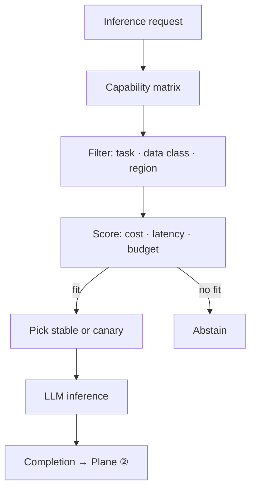

# Gateway Task Routing

[Blueprint](/blueprints/llm-blueprint) · [← Capability matrix](/playbooks/llm/capability-matrix) · **Gateway task routing** · [Canary promotion →](/playbooks/llm/canary-promotion)

Every inference request from Plane ② hits the gateway with `model_profile` + task type. The gateway filters the [capability matrix](/playbooks/llm/capability-matrix), applies constraints, and returns a completion (or abstains).

:::tip[THE CLAIM]
**Abstention is a first-class outcome.** No approved fit means no call, not "use whatever is cheapest."
:::

<!-- truncate -->

## Per-call path

1. **Receive** inference request: messages, `model_profile`, `task_type`, data class, region, tenant budget remaining
2. **Load** pinned `matrix_version` (request or session pin)
3. **Filter** endpoints: profile ∩ task ∩ data class ∩ region ∩ entitlements
4. **Score** remaining: cost cap, latency SLO, budget remaining
5. **Pick** `stable` or `canary` per promotion policy
6. **Run** inference; apply output filter
7. **Return** completion + `model_route_id` to Plane ②
8. **Abstain** if the filtered set is empty or every candidate exceeds caps

 

Caller contract: [Inference handoff](/playbooks/agents/orchestration/inference-handoff). Platform stack: [G.A.I.N LLM](/frameworks/gain-llm).

## Filter then score

| Stage | Inputs | Drop if |
| --- | --- | --- |
| Profile | `model_profile` | Unknown profile id |
| Task | `plan` / `synthesize` / `classify` | Task not listed on the profile |
| Data class | Request classification | Endpoint not approved for that class |
| Region | Residency claim | Endpoint region mismatch |
| Cost | `max_cost_usd_per_1k_tokens` | Candidate over cap |
| Latency | `max_latency_ms` vs recent SLO | Candidate over SLO (unless only fit) |
| Budget | Tenant remaining | Would exceed remaining budget |

Do not skip data class or region to save cost. Those are hard filters. Cost and latency are scored among the remaining set.

## Failover

Failover stays **inside the filtered set**.

| Event | Action |
| --- | --- |
| Primary 5xx / timeout | Next scored endpoint in the same profile + task + region |
| Primary over SLO | Canary or secondary if still in matrix |
| All endpoints fail | Abstain; Plane ② escalates (cached answer, human, or user-visible failure) |
| Provider outage in one region | Do not silently route to another region unless the matrix lists it for that data class |

Log every failover hop: `attempted_route_id`, `error_class`, `next_route_id`.

## Cost caps

| Cap | Enforced at |
| --- | --- |
| Per-call token cost | Gateway, before the request |
| Per-tenant budget | Gateway, remaining budget on the request |
| Per-profile ceiling | Matrix `max_cost_usd_per_1k_tokens` |

Over cap → next cheaper fit in the filtered set, else abstain. Do not downgrade data-class or region to find a cheaper model.

## Abstain

Return a structured abstain to Plane ②. Do not invent a completion.

| Reason | Plane ② should |
| --- | --- |
| `no_approved_endpoint` | Fail closed; do not call a vendor SDK as backup |
| `budget_exhausted` | User-visible throttle or queue |
| `residency_unsatisfied` | Escalate; never cross region |
| `task_not_on_profile` | Fix the route row or matrix; do not guess a task |

## Failure classes

| Failure | Symptom |
| --- | --- |
| Model choice only in the system prompt | Plane ③ skipped |
| Failover to any healthy endpoint | Residency or data-class leak |
| Empty filter set still calls a default model | Silent policy bypass |
| No `model_route_id` in trace | Cannot attribute cost or incidents |

## Trace fields

`matrix_version`, `model_profile`, `task_type`, `model_route_id`, `endpoint_id`, `canary` (bool), `failover_hops`, `cost_usd`, `abstain_reason`

## Read next

**[Canary promotion →](/playbooks/llm/canary-promotion)**
