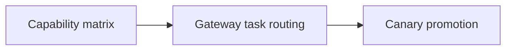

# Model Routing

[Playbooks](/playbooks) · **LLM overview** · [① Capability matrix →](/playbooks/llm/capability-matrix)

Implementation guides for the [LLM Blueprint](/blueprints/llm-blueprint). Plane ① on [Agents](/playbooks/agents) may pin `model_profile` on the route row. The **LLM gateway** resolves that to a registry-approved endpoint. Principles: [G.A.I.N LLM](/frameworks/gain-llm).

:::tip[THE CLAIM]
**The model does not choose which model runs.** Task-aware routing, abstention, and the capability matrix live on the gateway, not in the agent prompt.
:::

<!-- truncate -->

## Three playbooks

| # | Playbook | One-line purpose |
| --- | --- | --- |
| **①** | **[Capability matrix](/playbooks/llm/capability-matrix)** | Approved endpoints per profile, task, data class, and region |
| **②** | **[Gateway task routing](/playbooks/llm/gateway-task-routing)** | Plan vs synthesize vs classify; failover, cost caps, abstain |
| **③** | **[Canary promotion](/playbooks/llm/canary-promotion)** | Eval-gated model swap, rollback, and change records |

## Recommended path

 

1. **[Capability matrix](/playbooks/llm/capability-matrix):** version the approved pool before writing routing code
2. **[Gateway task routing](/playbooks/llm/gateway-task-routing):** filter, score, pick or abstain on every inference call
3. **[Canary promotion](/playbooks/llm/canary-promotion):** eval gates and rollback before a new endpoint becomes `stable`

Bridge reading: [G.A.I.N LLM](/frameworks/gain-llm) · [Inference handoff](/playbooks/agents/orchestration/inference-handoff) · [Route contract reference](/playbooks/agents/intent-router/route-contract-reference) · [Eval Reasoning plane](/playbooks/evaluation/plane-reasoning).

## What this plane decides

| Decides | Does not decide |
| --- | --- |
| Which approved model endpoint for this call | Which workflow or manifest (Plane ①) |
| Cost, latency, region, data-class constraints | Which tool to propose (Plane ②) |
| Canary vs stable route for a task tier | PEP verdict on side effects |

## Who should read what

| Role | Start with | Then |
| --- | --- | --- |
| **AI platform** | [Capability matrix](/playbooks/llm/capability-matrix), [Gateway task routing](/playbooks/llm/gateway-task-routing) | [Canary promotion](/playbooks/llm/canary-promotion), [G.A.I.N LLM](/frameworks/gain-llm) |
| **Domain squad** | [Capability matrix](/playbooks/llm/capability-matrix) | Route `model_profile` in [Route contract reference](/playbooks/agents/intent-router/route-contract-reference) |
| **Governance** | [Canary promotion](/playbooks/llm/canary-promotion) | Model approval, eval sign-off |
| **SRE / FinOps** | [Gateway task routing](/playbooks/llm/gateway-task-routing) | Cost caps, SLOs, failover |

## Read next

**[① Capability matrix →](/playbooks/llm/capability-matrix)**
