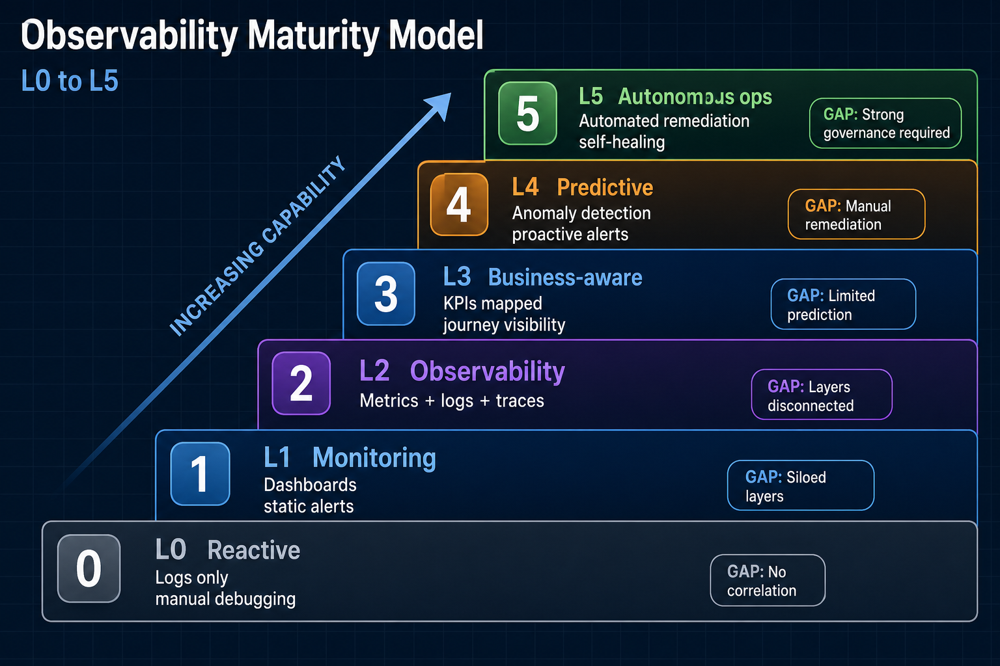

# Maturity Assessment

Use this playbook to score the estate, agree a target level, and sequence investment. Maturity is **per domain** (payments, claims, agents), not one global number.

## Maturity levels

| Level | Name | You have | You lack |
| --- | --- | --- | --- |
| **0** | Reactive | Ad-hoc logs, SSH debugging | Correlation, SLOs |
| **1** | Monitoring | Dashboards, threshold alerts | Traces, business context |
| **2** | Observability | Metrics + logs + traces | Cross-layer graph |
| **3** | Business-aware | KPIs mapped to services, journeys | Predictive signals |
| **4** | Predictive | Anomaly detection, proactive alerts | Safe automation |
| **5** | Autonomous ops | Remediation on select paths | Broad governance for auto-heal |

Most regulated enterprises should target **level 3** broadly and **level 4** on tier-1 journeys before attempting level 5.

## Scoring checklist

Score each row **0** (no), **1** (partial), **2** (production default) for a priority domain.

| Area | Criterion | 0 | 1 | 2 |
| --- | --- | --- | --- | --- |
| **Business** | Named journeys with owners | | | |
| **Business** | Outcome KPIs alertable | | | |
| **Business** | Events carry `correlation_id` | | | |
| **Service** | Golden signals per tier-1 service | | | |
| **Service** | Distributed traces on critical path | | | |
| **Service** | SLOs and error budgets | | | |
| **Infra** | Workload labels join to services | | | |
| **Infra** | Saturation alerts before hard fail | | | |
| **Graph** | KPI → trace drill documented | | | |
| **Graph** | Quarterly E2E drill executed | | | |
| **Governance** | Alert registry complete | | | |
| **Governance** | Structured logging standard | | | |
| **AI** (if applicable) | Multi-hop agent/RAG traces | | | |
| **AI** (if applicable) | Audit tier for verdict chain | | | |

**Rough level mapping:**

| Total score (max 28) | Level |
| --- | --- |
| 0–7 | 0–1 |
| 8–14 | 2 |
| 15–21 | 3 |
| 22–25 | 4 |
| 26–28 | 5 |

Adjust weights for domains without AI.

## Gap → roadmap template

| Gap | Next action | Owner | Quarter |
| --- | --- | --- | --- |
| No journey KPIs | [Business journey mapping](/playbooks/observability/business-journey-mapping) | Product | Q1 |
| Broken trace propagation | [Correlation graph](/playbooks/observability/correlation-graph) | Platform | Q1 |
| Orphan alerts | [Governance rules](/playbooks/observability/governance-rules) | SRE | Q2 |

## Release gate (assessment complete)

- [ ] Priority domain scored with product + platform + SRE present
- [ ] Target level agreed for 12 months
- [ ] Top three gaps have owners and dates
- [ ] Re-assessment scheduled (quarterly or semi-annual)

## Related

- [Observability Blueprint](/blueprints/observability-blueprint#maturity-model)
- [Operating model](/playbooks/observability/operating-model)
