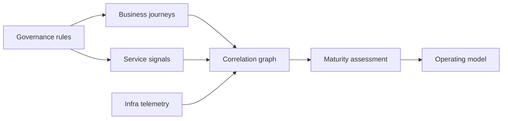

# Unified Observability Playbooks

[Playbooks](/playbooks) · **Observability overview** · [Business journeys →](/playbooks/observability/business-journey-mapping)

Implementation guides for the [Observability Blueprint](/blueprints/observability-blueprint). [G.A.I.N Observability](/frameworks/gain-observability) covers AI capture depth. These playbooks cover the **horizontal stack**: business KPIs, service golden signals, infrastructure telemetry, and the graph that connects them.

:::tip[THE CLAIM]
**Instrument the journey, trace the service, explain the infra, and join all three with correlation IDs. These playbooks show how to build that path in a regulated enterprise.**
:::

<!-- truncate -->

## Playbook map

| Playbook | What you build |
| --- | --- |
| **[Business journey mapping](/playbooks/observability/business-journey-mapping)** | KPIs, journeys, business events, outcome SLOs |
| **[Service golden signals](/playbooks/observability/service-golden-signals)** | Latency, traffic, errors, saturation, SLIs/SLOs, traces |
| **[Infrastructure telemetry](/playbooks/observability/infrastructure-telemetry)** | Resource health linked to services and workloads |
| **[Correlation graph](/playbooks/observability/correlation-graph)** | KPI → service → infra linking, IDs, dependency map |
| **[Governance rules](/playbooks/observability/governance-rules)** | Standards that prevent observability sprawl |
| **[Maturity assessment](/playbooks/observability/maturity-assessment)** | L0–L5 ladder, gap analysis, roadmap |
| **[Operating model](/playbooks/observability/operating-model)** | RACI across product, engineering, platform, SRE, architecture |

## Recommended path

 

1. **[Governance rules](/playbooks/observability/governance-rules):** agree standards before instrumenting
2. **[Business journey mapping](/playbooks/observability/business-journey-mapping)** and **[Service golden signals](/playbooks/observability/service-golden-signals)** in parallel
3. **[Infrastructure telemetry](/playbooks/observability/infrastructure-telemetry):** bind resources to service identities
4. **[Correlation graph](/playbooks/observability/correlation-graph):** wire the three layers
5. **[Maturity assessment](/playbooks/observability/maturity-assessment):** score and plan next level
6. **[Operating model](/playbooks/observability/operating-model):** lock ownership

## AI and agent workloads

Service-layer playbooks apply to all applications. For **governed AI** (agents, RAG, policy gates), extend service instrumentation with:

- [G.A.I.N Observability](/frameworks/gain-observability)
- [AI Observability in Enterprise](/insights/ai-observability-in-enterprise)
- [PGAR audit and replay](/playbooks/pgar-runtime/foundation/audit-and-replay)
- [Eval plane: Outcome](/playbooks/eval-engineering/plane-outcome)

Bridge reading: [Observability Blueprint](/blueprints/observability-blueprint).
