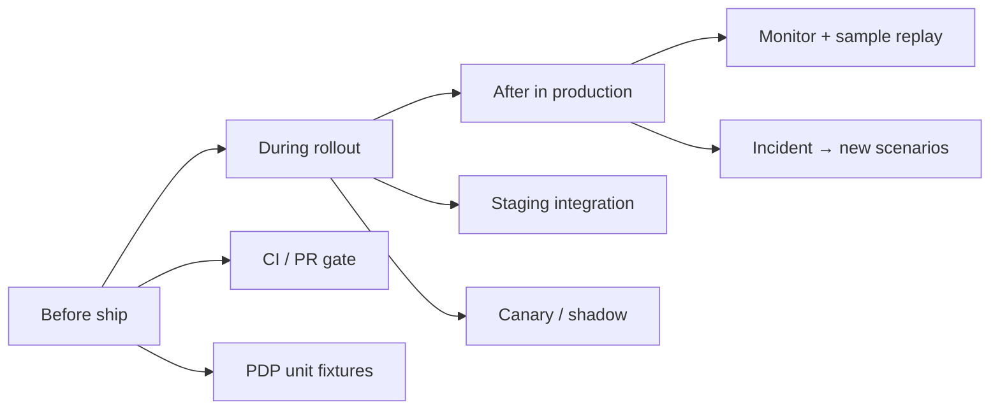

# Policy Test Scenarios

[Blueprint](/blueprints/pgar-blueprint) · [← Audit & replay](/playbooks/pgar-runtime/foundation/audit-and-replay) · **Policy scenarios** · [Adversarial →](/playbooks/pgar-runtime/assurance/adversarial-testing)

Policy regressions are deterministic. Build a versioned scenario library parallel to [eval golden datasets](/playbooks/eval-engineering/golden-datasets).

:::tip[THE CLAIM]
**Policy scenarios are SARAC fixtures with expected verdicts, not prompts you hope the model respects.**
:::

<!-- truncate -->

## Scenario schema

```json
{
  "id": "pgar-wire-001",
  "version": "2026.07.1",
  "domain": "payments",
  "scenario": "representative",
  "risk_tier": "high",
  "input": {
    "subject": { "sub": "officer-123", "emts": { "payments.wire.initiate": true } },
    "action": "initiate_wire",
    "resource": { "beneficiary_id": "bene-acme-441" },
    "context": { "amount": 15000, "sanctions_status": "clear" }
  },
  "expected": {
    "verdict": "ALLOW",
    "downstream_called": true,
    "policy_version": "pgar.payments.wire/v3"
  }
}
```

## Four scenario layers

| Layer | Purpose | Examples |
| --- | --- | --- |
| **Representative** | Happy path under policy | Under-limit wire ALLOW |
| **Edge** | Boundaries | At-limit amount, expired token |
| **Adversarial** | Bypass attempts | Direct downstream, wrong subject |
| **Incident replay** | Production failures | Sanctions DENY, scope leak |

## CI gate

```
for case in active_scenarios:
    result = pep_simulate(case.input)
    assert result.verdict == case.expected.verdict
    assert result.downstream_called == case.expected.downstream_called
```

Only `status: active` scenarios block releases.

## When to run (before, during, after)

Assurance runs at different depths across the delivery lifecycle. **Policy test scenarios** are the deterministic core (SARAC in, verdict out). **[Adversarial testing](/playbooks/pgar-runtime/assurance/adversarial-testing)** adds bypass and injection paths on top.

**Teams** (aligned with [PGAR Blueprint ownership](/blueprints/pgar-blueprint#ownership)):

| Team | Assurance role |
| --- | --- |
| **AI platform** | Harness, CI jobs, PEP integration tests, staging/canary wiring, trace evals |
| **Governance / compliance** | PDP regression policy, adversarial + incident fixtures, examiner replay rules, pen-test findings → CI |
| **Domain** | Representative + edge business rules, UAT journeys, downstream sandbox behavior |
| **Security / IAM** | Token/entitlement fixtures, infra bypass tests, network choke-point validation |
| **SRE** | Production replay jobs, drift alerts, audit log infra, rollout monitoring |



### Who runs what (summary)

| Phase | Primary runner | Authors fixtures | Approves gate |
| --- | --- | --- | --- |
| **Before** (CI) | AI platform | Domain (rep/edge), Governance (adversarial/incident), Security (authz shape) | Governance + Domain lead for policy/manifest changes |
| **During** (staging/rollout) | AI platform + Domain | Same as before; Domain owns UAT scripts | Domain sign-off on journeys; Governance on adversarial 100% |
| **After** (production) | SRE + Governance | Governance (incident replay), Security (pen test) | Governance for new `active` incident scenarios |

### Before (design and CI)

Run **offline, blocking** on every change that touches policy, PEP, manifest, or agent orchestration.

| When | What runs | **Runs test** | **Authors fixture** | How | Gate |
| --- | --- | --- | --- | --- | --- |
| **Local / PR** | Representative + edge for changed domain | Engineer (AI platform) | Domain | `pep_simulate(case.input)` or PDP unit test | Verdict match on touched domains |
| **Merge to main** | All `status: active` scenarios | AI platform (CI) | All teams (PR contributors) | CI job: PEP harness + mock PDP/downstream | **100%** verdict match |
| **Policy version bump** | Full regression suite | AI platform (CI) | Governance | Re-run every active case vs new `policy_version` | No ALLOW↔DENY drift without Governance sign-off |
| **New tool in manifest** | Tool + PEP scenarios for that action | AI platform (CI) | Domain + AI platform | Block merge if new action has zero active scenarios | Schema + verdict coverage |

**Before** is where most scenarios live: fast, deterministic, no real downstream. Domain and Governance **write** cases; AI platform **runs** them in CI.

### During (staging, pre-prod, rollout)

Run **integration and adversarial** tests against a deployed stack (real PEP, real PDP, mock or sandbox downstream).

| When | What runs | **Runs test** | **Authors / validates** | How | Gate |
| --- | --- | --- | --- | --- | --- |
| **Staging deploy** | Full active library + adversarial set | AI platform | Governance reviews adversarial coverage | E2E: LLM stub → PEP → mock downstream | Adversarial **100%**; `downstream_called` as expected |
| **Pre-prod / UAT** | Representative business journeys | Domain (with AI platform support) | Domain (business rules), Governance (STEP_UP/DENY policy) | Scripted or manual flows with test principals | STEP_UP and DENY exercised, not only ALLOW |
| **Canary / shadow** | Production-shaped SARAC sample | SRE + AI platform | Governance (baseline thresholds) | Shadow PEP or anonymized replay; no side effects | Verdict distribution within baseline |
| **Infra change** | Network bypass checks | Security / IAM + SRE | Security / IAM | Agentic app cannot reach downstream except via PEP | Zero critical bypass findings |

**During** proves wiring. AI platform owns the pipeline; Domain owns “does this match business intent?”; Security owns “can anything skip the choke point?”

### After (production and incidents)

Run **monitoring, sampling, and replay**, not the full CI suite on every request.

| When | What runs | **Runs test** | **Authors fixture** | How | Gate |
| --- | --- | --- | --- | --- | --- |
| **Steady state** | Sample audit replay | SRE (scheduled job) | Governance (replay rules) | Replay `audit_id` chains: SARAC + `policy_version` → verdict | Alert if replay ≠ logged verdict |
| **Online** | Trace eval overlap | AI platform (eval pipeline) | AI platform + Governance (thresholds) | [Action](/playbooks/eval-engineering/plane-action) / [Tool](/playbooks/eval-engineering/plane-tool) planes on traces | Dashboard: block rate, step-up rate, unknown tools |
| **Incident / near-miss** | New incident replay scenario | Governance (lead) | Governance + Domain + AI platform (redacted audit export) | `status: candidate` → review → `active` | Same failure cannot merge without scenario |
| **Periodic** | Adversarial + pen test | Security / Governance (red team) | Governance → CI fixtures | Injection, manifest escape, subject swap | Findings become active scenarios in **before** CI |

**After** does not replace **before**. SRE and Governance detect drift; AI platform keeps CI green so regressions do not ship again.

## How to run (minimal harness)

1. **Store** scenarios as versioned JSON/YAML (git), same schema as above.
2. **Simulate** at the lowest useful layer:
   - **Unit:** PDP only (`input` → verdict), fastest for policy edits.
   - **Integration:** PEP + mock downstream (`downstream_called` assertion).
   - **E2E (staging):** agentic app + stub LLM proposal, real PEP path.
3. **Tag** each case: `status: active | candidate | retired`. Only **active** blocks release.
4. **Record** `regression_run_id`, `policy_version`, and `actual_verdict` in CI artifacts for audit.

Example CI step (pseudocode):

```bash
# Before merge — blocking
pnpm run pgar:scenarios --status active --policy-version pgar.payments.wire/v3

# After deploy — non-blocking sample (cron)
pnpm run pgar:replay-audit --sample 100 --since 24h
```

Pair with the [PGAR release gate matrix](/blueprints/pgar-blueprint#release-gate-matrix) for which scenario layers to re-run per change type.

## Ownership (fixture library)

| Role | Authors | Runs |
| --- | --- | --- |
| **Governance / compliance** | Adversarial, incident replay, policy regression cases | Approves new `active` scenarios; leads incident → fixture workflow |
| **Domain** | Representative + edge business rules | UAT during rollout; validates business journeys |
| **AI platform** | Harness, CI wiring, integration fixtures | PR + merge CI, staging E2E, online trace evals |
| **Security / IAM** | Token, entitlement, bypass fixtures | Infra bypass tests during rollout |
| **SRE** | Replay job config (with Governance) | Nightly audit replay, canary/shadow ops, drift alerts |

See **When to run** above for phase-by-phase runner vs author split.

## Trace fields

`scenario_id`, `expected_verdict`, `actual_verdict`, `policy_version`, `regression_run_id`

See: [Adversarial testing](/playbooks/pgar-runtime/assurance/adversarial-testing) · [PDP policy surfaces](/playbooks/pgar-runtime/foundation/pdp-policy-surfaces)
