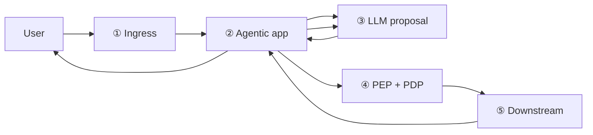
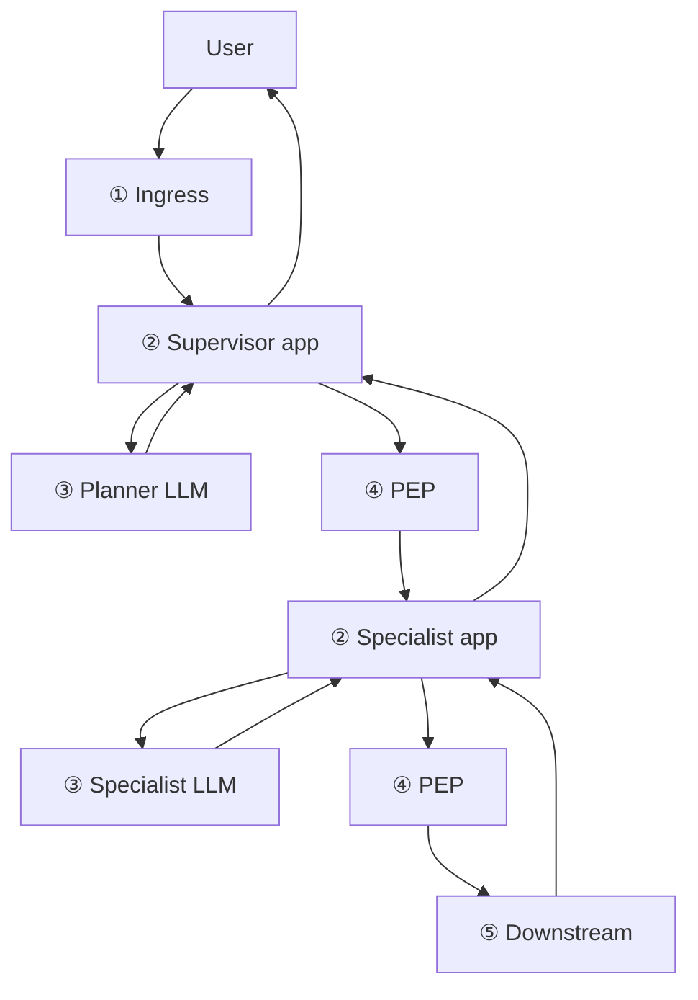

# PGAR Boundary Playbooks

[PGAR overview](/playbooks/pgar-runtime) · [Blueprint](/blueprints/pgar-blueprint) · **Boundary overview** · [① Ingress →](/playbooks/pgar-runtime/boundary/ingress)

Every agent request crosses **five boundaries** before a side effect completes. Each boundary has a single owner, a narrow job, and a playbook with failure classes and trace fields.

:::tip[THE CLAIM]
**Proposal is not permission until boundary ④ returns ALLOW. Credentials never cross boundary ③. Downstream never runs on DENY.**
:::

<!-- truncate -->

## Request flow (in order)

The loop is intentional: the agentic app orchestrates multiple LLM calls and PEP gates. The model proposes; the app and policy layer permit.

## The five boundaries

| # | Boundary | Question it answers | Playbook |
| --- | --- | --- | --- |
| **①** | **Ingress** | Who is this principal, and are their claims valid? | [Ingress](/playbooks/pgar-runtime/boundary/ingress) |
| **②** | **Agentic app** | Who holds the token, routes proposals, and initiates validation? | [Agentic app](/playbooks/pgar-runtime/boundary/agentic-app) |
| **③** | **LLM proposal** | What did the model propose, with no authority or credentials? | [LLM proposal](/playbooks/pgar-runtime/boundary/llm-proposal) |
| **④** | **PEP + PDP** | Does policy ALLOW, DENY, or require STEP_UP before any side effect? | [PEP + PDP](/playbooks/pgar-runtime/boundary/pep-pdp) |
| **⑤** | **Downstream** | Does the target service re-auth and execute, returning results to the app? | [Downstream](/playbooks/pgar-runtime/boundary/downstream) |

Read them **in order** when implementing a new agent surface. Foundations ([token boundary](/playbooks/pgar-runtime/foundation/token-and-session-boundary), [PEP enforcement](/playbooks/pgar-runtime/foundation/pep-enforcement), [policy contracts](/playbooks/pgar-runtime/foundation/policy-contracts)) should be in place first.

## What each boundary does

### ① Ingress

The API gateway and IdP validate the token and normalize claims (`sub`, roles, entitlements, limits). Every PEP call and audit record inherits identity from here. No anonymous agent sessions.

**Start here when:** wiring OAuth/OIDC, claims shape, or correlation ids for audit.

### ② Agentic app

The orchestrator holds session state and credentials, loads the [tool manifest](/playbooks/pgar-runtime/domain/manifest-lifecycle), calls the LLM with schemas only, forwards proposals to the PEP, receives downstream results, runs validation (for RAG), and only then sends validated context back to the model.

**Start here when:** building the request loop, step-up UX handoff, or validation gates after retrieval.

### ③ LLM proposal

The model sees conversation and tool schemas. It **proposes** tool calls; it does not **permit** them. Policy limits and entitlements live in the PDP, not the system prompt.

**Start here when:** defining tool manifests, stripping credentials from LLM payloads, or blocking unknown proposals before PEP.

### ④ PEP + PDP

The policy choke point. PEP receives proposal + token + claims, asks PDP for a SARAC verdict, writes audit **before** acting, and returns ALLOW, DENY, or STEP_UP. Downstream never runs on DENY.

**Start here when:** implementing the four-step PEP loop, wiring OPA/Cedar/custom PDP, or handling STEP_UP re-evaluation.

### ⑤ Downstream

Payment hubs, retrieval gateways, and CRM APIs execute only after PEP ALLOW. They **re-authorize** the token on the resource. Results return to the agentic app, not directly to the LLM.

**Start here when:** integrating side-effect services, idempotency keys, or return-path sanitization before synthesis.

## Multi-agent workflows

The five boundaries do **not** change when you add more agents. Multi-agent adds **more trips through the same five**, not a sixth boundary. Every model still proposes at ③; every side effect still gates at ④ before ⑤.

The diagram above shows one agentic app and many LLM turns. With multiple agents, you get nested or parallel ②→③→④→⑤ loops under the same ingress session.

### What stays the same

| Boundary | Multi-agent rule |
| --- | --- |
| **① Ingress** | One user session still binds to one principal and claims set at the edge |
| **② Agentic app** | Something holds the token and routes every proposal. May be one supervisor or several apps; credentials never reach any model |
| **③ LLM proposal** | Planner, specialist, critic: all propose only; none permit |
| **④ PEP + PDP** | Every side effect from any agent gets ALLOW, DENY, or STEP_UP before execution |
| **⑤ Downstream** | Still re-auth and return to an app, never raw to any LLM |

### Two common patterns

| Pattern | How ② works | Token shape | When to use |
| --- | --- | --- | --- |
| **Supervisor** | One orchestrator holds the user token. Sub-agents receive messages and schemas only. Tool proposals bubble up to the supervisor's PEP path | User token stays in supervisor | Single product surface, tight central control |
| **Federated** | Each agent is its own agentic app with a **delegated** token and scoped claims | Downscoped from user entitlements per agent role | Independent teams, specialist agents with narrow manifests |

In both patterns, PEP and PDP are usually **shared infrastructure**. Each proposal is still evaluated on its own SARAC. The PDP must know **which subject** is acting: end user, delegating agent, or service identity.

### Agent-to-agent calls

Treat "invoke agent B" like any other tool when it can cause side effects (API calls, retrieval, spend):

1. Entry in the caller's [tool manifest](/playbooks/pgar-runtime/domain/manifest-lifecycle)
2. Proposal at ③, validation in caller's ②
3. PEP at ④ (may delegate with a narrowed token before specialist ② runs)
4. Specialist runs its own ②→③→④→⑤ loop for downstream work

Pure internal messaging with no side effects can stay inside ②, but audit should still record `session_id`, `orchestration_step`, and which agent proposed what.

### Failure classes (multi-agent)

- **Credential fan-out:** user token copied to every sub-agent runtime
- **Shadow tools:** specialist executes downstream without PEP because "only the planner is governed"
- **Wrong subject in SARAC:** PDP evaluates user entitlements when a service agent is actually acting
- **Lost delegation context:** step-up or approval on the supervisor does not bind to specialist execution

See [Agentic app](/playbooks/pgar-runtime/boundary/agentic-app) for the single-agent request loop and [Policy contracts](/playbooks/pgar-runtime/foundation/policy-contracts) for SARAC subject shapes under delegation.

## After the boundaries

Domain playbooks apply PGAR to specific side effects:

- [Tool registry](/playbooks/pgar-runtime/domain/tool-registry) and [manifest lifecycle](/playbooks/pgar-runtime/domain/manifest-lifecycle) for API and workflow tools
- [RAG retrieval](/playbooks/pgar-runtime/domain/rag-retrieval) for governed context packs

Bridge reading: [PGAR with RAG](/insights/retrieval-is-a-governed-action) · [PGAR Blueprint](/blueprints/pgar-blueprint)

## Read next

**[① Ingress →](/playbooks/pgar-runtime/boundary/ingress)**
