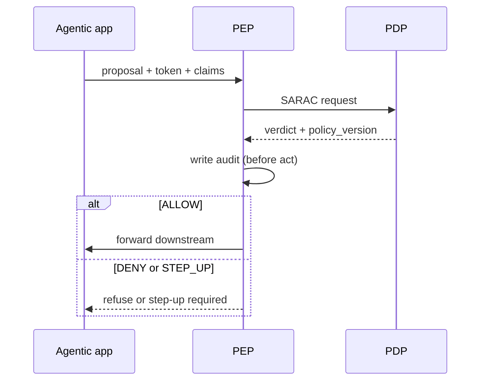

# PGAR Boundary ④: PEP + PDP

[Blueprint](/blueprints/pgar-blueprint) · [← LLM proposal](/playbooks/pgar-runtime/boundary/llm-proposal) · **PEP + PDP** · [Downstream →](/playbooks/pgar-runtime/boundary/downstream)

Boundary ④ is where **proposal becomes permission** (or explicit DENY / STEP_UP). This is the PGAR choke point.

:::tip[THE CLAIM]
**PEP enforces. PDP decides. Downstream never runs on DENY; never runs on STEP_UP until re-eval returns ALLOW.**
:::

<!-- truncate -->

## PEP ↔ PDP loop

## DENY is success

When sanctions hit or entitlements fail, **DENY with audit** is the control working, not an error to retry around.

## Co-location vs separation

| Pattern | When |
| --- | --- |
| **PEP sidecar** | Same cluster as agentic app; PDP remote |
| **Central PEP service** | Many apps; one enforcement API |
| **PDP as product** | OPA, Cedar, custom rules engine |

PEP and PDP are logically separate even if deployed together.

## Failure classes

- **PEP as pass-through:** always forwards
- **PDP in prompt:** rules only in system message
- **Missing DENY path:** errors become 500 instead of refusal
- **Async fire-and-forget:** downstream called before verdict

## Trace fields

`pep_verdict`, `pdp_policy_version`, `reason_code`, `audit_id`, `pdp_latency_ms`

See: [PEP enforcement](/playbooks/pgar-runtime/foundation/pep-enforcement) · [PDP policy surfaces](/playbooks/pgar-runtime/foundation/pdp-policy-surfaces) · [Boundary overview](/playbooks/pgar-runtime/boundary)
