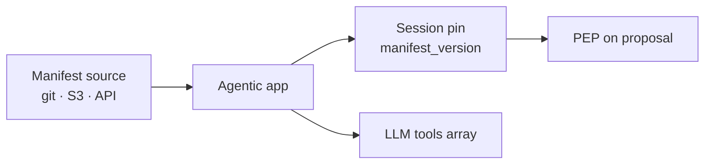

# Manifest Lifecycle & Registry Patterns

[Blueprint](/blueprints/pgar-blueprint) · [← Tool registry](/playbooks/pgar-runtime/domain/tool-registry) · **Manifest lifecycle** · [RAG retrieval →](/playbooks/pgar-runtime/domain/rag-retrieval)

The [tool manifest](/playbooks/pgar-runtime/domain/tool-registry) defines **what** tools exist and **how** proposals are enforced. This page covers **where** manifests live, **how** apps load them, and **which pattern** fits your scale.

:::tip[THE CLAIM]
**The manifest is versioned platform config, not application business logic and not LLM prompt text. Every proposal audit must pin `manifest_version`.**
:::

<!-- truncate -->

## What you are deciding

Before picking storage, these requirements are non-negotiable in PGAR:

| Requirement | Why |
| --- | --- |
| **Version id** (`2026.07.1`) | Examiners ask which contract was active |
| **Pin per session or request** | Mid-session manifest swap breaks replay |
| **Agentic app loads; LLM never owns file** | PGAR test: no credentials or policy in model payload |
| **CI gate on change** | New tool = schema + [policy scenarios](/playbooks/pgar-runtime/assurance/policy-test-scenarios) |
| **Audit field** | `manifest_version` on every proposal ([Audit & replay](/playbooks/pgar-runtime/foundation/audit-and-replay)) |

Manifest **shape** and **enforcement** live in [Tool registry](/playbooks/pgar-runtime/domain/tool-registry). This page is **operations and architecture choice**.

## Pattern comparison

| Pattern | Maintain where | App loads how | Best for |
| --- | --- | --- | --- |
| **Hardcoded in code** | Python/TS dict in agent repo | Compile time | Demos, unit tests only |
| **Versioned file in repo** | `manifests/payments-agent/2026.07.1.json` | Path from env at startup | Single team, few agents |
| **Object storage + GitOps** | Git source; S3/GCS published artifact | Fetch on deploy or startup | Regulated, auditable releases |
| **Manifest registry API** | Platform service; git or UI as source | `GET /manifests/{agent}/active` | Many agents, central ops |
| **Config service** | Consul, AppConfig, etc. | SDK watch + cache | Existing enterprise config stack |

## Pros and cons

### Hardcoded in code

| Pros | Cons |
| --- | --- |
| Fastest spike | No independent versioning |
| Simple local dev | Couples policy to app deploy |
| | `manifest_version` often missing or fake |
| | **Not production PGAR** |

### Versioned file in repo

| Pros | Cons |
| --- | --- |
| Git review on every tool change | Each app deploy picks up manifest |
| Easy CI validation | No central runtime rollback without redeploy |
| Clear audit trail in VCS | Multi-region sync is manual |
| Good first production step | |

**Typical layout:**

```text
platform/manifests/
  payments-agent/
    2026.07.1.json
    2026.08.1.json
  policy-assistant/
    2026.07.1.json
```

**Load:** `MANIFEST_PATH=/config/manifests/payments-agent/2026.07.1.json` or `MANIFEST_AGENT=payments-agent` + resolve active version from small index file.

### Object storage + GitOps

| Pros | Cons |
| --- | --- |
| Immutable published artifacts | Extra pipeline to build/publish |
| Rollback = repoint active pointer | Apps need fetch + cache logic |
| Matches policy-as-artifact mindset | Latency on cold start unless cached |

**Flow:** Merge to git → CI validates → publish `s3://manifests/payments-agent/2026.07.1.json` → update `active` pointer → apps refresh on interval or signal.

### Manifest registry API

| Pros | Cons |
| --- | --- |
| Single source of truth | Service to build and operate |
| Runtime rollback without app redeploy | Cache consistency across instances |
| Per-agent, per-tenant manifests | Session must pin version at start |
| Natural home for `manifest_version` audit | |

**Example:**

```text
GET /v1/manifests/payments-agent/active
→ { "manifest_version": "2026.07.1", "tools": [ ... ] }
```

**Session pin:** On session open, app fetches manifest and stores `manifest_version` on the session. All proposals in that session use the same version even if registry publishes `2026.08.1` mid-flight.

## Use cases

### Single payments agent (one team)

**Pattern:** Versioned file in repo → env var at deploy.

One manifest per agent. CI runs schema + policy scenario suite. Deploy agent + manifest together.

### Policy assistant (RAG tools)

**Pattern:** Same as above; separate manifest file or separate agent id.

RAG tools (`retrieve_documents`, etc.) use the same JSON shape as payment tools. See [Tool registry § RAG tools](/playbooks/pgar-runtime/domain/tool-registry#rag-tools-in-the-same-model).

### Composed manifest (platform merges modules)

**Pattern:** Registry API or build-time merge in CI.

```text
base-tools.json + payments-tools.json + rag-tools.json
  → build → payments-agent/2026.07.1.json (published)
```

Platform owns merge rules; squads own fragment files. One published `manifest_version`.

### Multi-tenant SaaS

**Pattern:** Registry API with tenant dimension.

```text
GET /v1/manifests/{agent_id}?tenant=bank-eu
```

Tenant-specific tool subsets or schemas. PDP still decides authorization; manifest defines **what can be proposed at all**.

## Runtime load sequence



1. **Startup or session open:** App loads manifest (cached).
2. **Pin version:** Store `manifest_version` on session.
3. **Derive LLM tools:** Strip `pdp_action`, `risk_tier`, entitlements ([Tool registry § manifest → LLM](/playbooks/pgar-runtime/domain/tool-registry#manifest--llm--pep)).
4. **On proposal:** Validate against pinned manifest; log `manifest_version`; route to PEP.

Boundary detail: [Agentic app](/playbooks/pgar-runtime/boundary/agentic-app).

## Release and rollback

| Event | Action |
| --- | --- |
| **New tool added** | Bump manifest version; add [policy scenarios](/playbooks/pgar-runtime/assurance/policy-test-scenarios); CI must pass |
| **Schema change** | Same; treat as breaking unless backward compatible |
| **Promote** | Point `active` to new version (file pointer, S3 object, or registry) |
| **Rollback** | Repoint `active` to prior version; no LLM redeploy required if using registry/S3 |
| **Audit** | Every PEP log includes `manifest_version` from session pin |

Align manifest promotion with [PGAR blueprint release gate matrix](/blueprints/pgar-blueprint#release-gate-matrix): tool / ACL changes re-run Tool + Action evals.

## Anti-patterns

| Anti-pattern | Why it fails PGAR |
| --- | --- |
| Manifest only in system prompt | Not enforceable; model can ignore |
| Per-instance ad hoc tool lists | Drift; audit cannot replay |
| Debug flag exposes all tools | Bypass manifest; [Adversarial testing](/playbooks/pgar-runtime/assurance/adversarial-testing) must catch |
| Download manifest from LLM | Model must not own contract |
| No `manifest_version` in audit | Examiners cannot identify active contract |
| Swap manifest mid-session without pin | Proposal 1 vs proposal 2 incomparable in replay |

## Ownership

| Role | Owns |
| --- | --- |
| **AI platform** | Registry service, publish pipeline, session pin contract |
| **Agent / domain squad** | Tool entries, schemas, fragment files |
| **Governance** | Policy scenarios for new tools; approve high `risk_tier` additions |
| **SRE** | Cache, rollback runbooks, active pointer alerts |

## Trace fields

`manifest_version`, `manifest_source`, `manifest_loaded_at`, `session_manifest_pin`, `active_manifest_pointer`

See: [Tool registry](/playbooks/pgar-runtime/domain/tool-registry) · [Boundary: Agentic app](/playbooks/pgar-runtime/boundary/agentic-app) · [Audit & replay](/playbooks/pgar-runtime/foundation/audit-and-replay)
