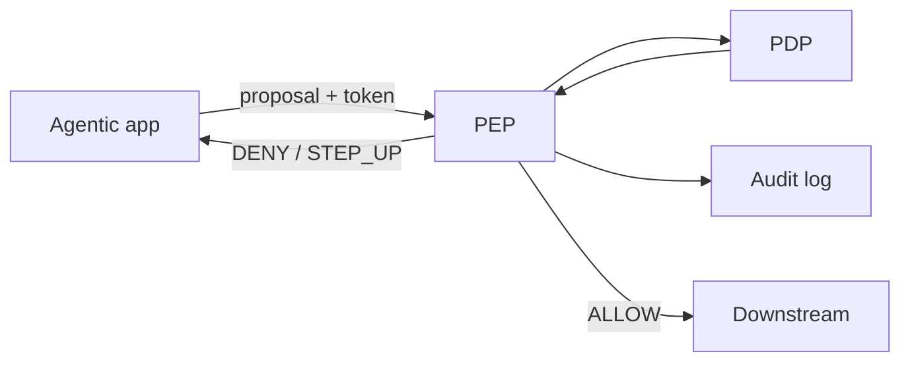

# PEP Enforcement

[Blueprint](/blueprints/pgar-blueprint) · [← Token & session](/playbooks/pgar-runtime/foundation/token-and-session-boundary) · **PEP enforcement** · [PDP surfaces →](/playbooks/pgar-runtime/foundation/pdp-policy-surfaces)

The PEP sits between **proposal** and **execution**. The agentic app cannot call downstream services directly. Every path goes through the PEP.

:::tip[THE CLAIM]
**Decision first, execution second. The audit record is written before any side effect, every time.**
:::

<!-- truncate -->

## Four steps on every proposal

1. **Receive:** tool proposal, bearer token, subject claims
2. **Ask PDP:** map to [SARAC contract](/playbooks/pgar-runtime/foundation/policy-contracts); call PDP
3. **Audit:** log subject, action, resource, redacted context, policy version, verdict (immutable)
4. **Act:** ALLOW → forward to downstream; DENY → refuse; STEP_UP → return to agentic app

## Structural enforcement (non-negotiable)

| Anti-pattern | Fix |
| --- | --- |
| Agentic app has downstream API keys | Downstream trusts PEP network path only |
| "Fast path" bypass for read tools | Every tool class crosses PEP |
| PEP logs after downstream returns | Log verdict before forward |
| Multiple PEP implementations | One enforcement library / sidecar |

:::important[STRUCTURAL ENFORCEMENT]
If the agentic app can reach downstream **without** the PEP, you have a suggestion, not governance.
:::

## Failure classes

- **Bypass path:** direct HTTP from app to payment hub
- **Late audit:** side effect before log commit
- **Verdict ignored:** ALLOW assumed without PDP response
- **Partial PEP:** only "write" tools gated, reads open

## Release gate

- Adversarial bypass suite: **0** unauthorized downstream calls
- Audit ordering: **100%** verdict logged before side effect on trace replay
- PEP coverage: **100%** tools in manifest route through PEP in integration tests

## Trace fields

`pep_receive_ts`, `pdp_latency_ms`, `verdict`, `audit_id`, `downstream_called`, `downstream_call_ts`

See: [Boundary: PEP + PDP](/playbooks/pgar-runtime/boundary/pep-pdp) · [Audit & replay](/playbooks/pgar-runtime/foundation/audit-and-replay)
