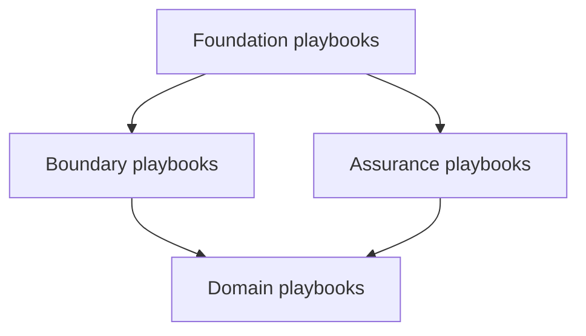

# PGAR Runtime Playbooks

[Playbooks](/playbooks) · **PGAR overview** · [Foundation →](/playbooks/pgar-runtime/foundation)

Implementation guides for [Policy-Governed Agent Runtime](/insights/policy-governed-agent-runtime). The insight explains *why* proposal is not permission. The [PGAR Blueprint](/blueprints/pgar-blueprint) is the reference design. These playbooks are the **how**: contracts, enforcement, boundaries, side effects, and tests.

:::tip[THE CLAIM]
**The LLM proposes. The PEP enforces. The PDP decides. Every side effect gates at the PEP before downstream runs. These playbooks show you how to build that path.**
:::

<!-- truncate -->

## Four playbook groups

| Group | Overview | What you build |
| --- | --- | --- |
| **[Foundation](/playbooks/pgar-runtime/foundation)** | [Open →](/playbooks/pgar-runtime/foundation) | SARAC contracts, token custody, PEP/PDP loop, step-up, audit replay |
| **[Assurance](/playbooks/pgar-runtime/assurance/policy-test-scenarios)** | Policy test scenarios | Golden authorization cases in CI, adversarial bypass tests |
| **[Boundary](/playbooks/pgar-runtime/boundary)** | [Open →](/playbooks/pgar-runtime/boundary) | Five trust boundaries from ingress through downstream |
| **[Domain](/playbooks/pgar-runtime/domain/tool-registry)** | Tool registry | Tool manifests, lifecycle, RAG retrieval as governed actions |

Plus [Further reading (external)](/playbooks/pgar-runtime/further-reading) for third-party PDP/PEP and OAuth patterns mapped to this series.

## Recommended path

1. **[Foundation](/playbooks/pgar-runtime/foundation)** (6 playbooks): policy contracts → token & session → PEP → PDP → step-up → audit
2. **[Assurance](/playbooks/pgar-runtime/assurance/policy-test-scenarios)** (2 playbooks): scenario library and adversarial bypass set (start in parallel once PEP exists)
3. **[Boundary](/playbooks/pgar-runtime/boundary)** (5 playbooks + overview): ingress, agentic app, LLM proposal, PEP + PDP, downstream
4. **[Domain](/playbooks/pgar-runtime/domain/tool-registry)** (3 playbooks): pick tools, manifests, and/or RAG for your agent surface

Bridge reading: [PGAR with RAG](/insights/retrieval-is-a-governed-action). Eval overlap: [Action plane](/playbooks/eval-engineering/plane-action) · [Tool plane](/playbooks/eval-engineering/plane-tool).

## All playbooks at a glance

### Foundation playbooks

| Playbook | One-line purpose |
| --- | --- |
| [Policy contracts](/playbooks/pgar-runtime/foundation/policy-contracts) | SARAC payload shapes the PDP evaluates |
| [Token & session](/playbooks/pgar-runtime/foundation/token-and-session-boundary) | Credentials stay out of the LLM boundary |
| [PEP enforcement](/playbooks/pgar-runtime/foundation/pep-enforcement) | Receive, ask PDP, audit, act on every proposal |
| [PDP surfaces](/playbooks/pgar-runtime/foundation/pdp-policy-surfaces) | ALLOW, DENY, STEP_UP rule authoring |
| [Step-up & attestation](/playbooks/pgar-runtime/foundation/step-up-and-attestation) | Re-eval after human approval |
| [Audit & replay](/playbooks/pgar-runtime/foundation/audit-and-replay) | Immutable verdict chain for examiners |

### Assurance playbooks

| Playbook | One-line purpose |
| --- | --- |
| [Policy test scenarios](/playbooks/pgar-runtime/assurance/policy-test-scenarios) | Representative, edge, and incident replay cases in CI |
| [Adversarial testing](/playbooks/pgar-runtime/assurance/adversarial-testing) | Direct downstream bypass, injection, shadow tools |

### Boundary playbooks

| # | Playbook | One-line purpose |
| --- | --- | --- |
| ① | [Ingress](/playbooks/pgar-runtime/boundary/ingress) | Token validation and claims at the edge |
| ② | [Agentic app](/playbooks/pgar-runtime/boundary/agentic-app) | Orchestration, token custody, validation gates |
| ③ | [LLM proposal](/playbooks/pgar-runtime/boundary/llm-proposal) | Tool schemas only; proposal not permission |
| ④ | [PEP + PDP](/playbooks/pgar-runtime/boundary/pep-pdp) | Verdict before any side effect |
| ⑤ | [Downstream](/playbooks/pgar-runtime/boundary/downstream) | Re-auth, execute, return to app |

See [Boundary overview](/playbooks/pgar-runtime/boundary) for request flow and multi-agent patterns.

### Domain playbooks

| Playbook | One-line purpose |
| --- | --- |
| [Tool registry](/playbooks/pgar-runtime/domain/tool-registry) | Manifest contract, PEP gating per tool |
| [Manifest lifecycle](/playbooks/pgar-runtime/domain/manifest-lifecycle) | Where manifests live, version, and roll back |
| [RAG retrieval](/playbooks/pgar-runtime/domain/rag-retrieval) | Retrieval as a governed tool and context pack |

## Who should read what

| Role | Start with | Then |
| --- | --- | --- |
| **Security / IAM** | [Token & session](/playbooks/pgar-runtime/foundation/token-and-session-boundary), [Ingress](/playbooks/pgar-runtime/boundary/ingress) | [PDP surfaces](/playbooks/pgar-runtime/foundation/pdp-policy-surfaces), [Audit & replay](/playbooks/pgar-runtime/foundation/audit-and-replay) |
| **AI platform** | [PEP enforcement](/playbooks/pgar-runtime/foundation/pep-enforcement), [Agentic app](/playbooks/pgar-runtime/boundary/agentic-app) | [Tool registry](/playbooks/pgar-runtime/domain/tool-registry), [Manifest lifecycle](/playbooks/pgar-runtime/domain/manifest-lifecycle) |
| **Governance / compliance** | [Policy contracts](/playbooks/pgar-runtime/foundation/policy-contracts), [Audit & replay](/playbooks/pgar-runtime/foundation/audit-and-replay) | [Policy test scenarios](/playbooks/pgar-runtime/assurance/policy-test-scenarios) |
| **RAG / knowledge teams** | [RAG retrieval](/playbooks/pgar-runtime/domain/rag-retrieval) | [PGAR with RAG](/insights/retrieval-is-a-governed-action), [Boundary overview](/playbooks/pgar-runtime/boundary) |

## Read next

**[Foundation playbooks →](/playbooks/pgar-runtime/foundation)**
