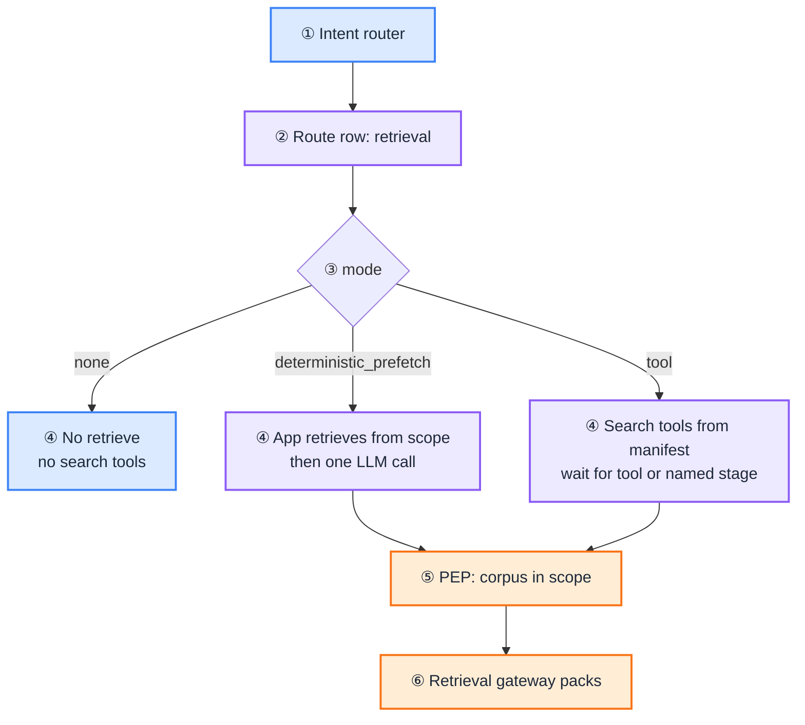
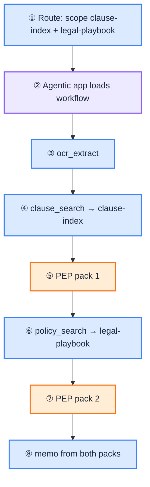

import Details from '@theme/Details';

# RAG Retrieval

[Blueprint](/blueprints/rag-blueprint) · [← RAG overview](/playbooks/rag) · **RAG retrieval**

Retrieval is not a database query. It is a **governed action** that assembles a context pack for one inference call.

Two ways the route declares that action ([route contract](/playbooks/agents/intent-router/route-contract-reference)):

| `retrieval.mode` | Who starts retrieve | Pattern |
| --- | --- | --- |
| omit / `none` | Nobody | Chat or handoff with no knowledge path |
| `deterministic_prefetch` | Agentic app, before the LLM. No retrieve tool schemas. | [Pattern 0](/blueprints/agents-blueprint). Pattern 2 if `retrieve → generate` is a named two-stage workflow. |
| `tool` | A search tool runs inside `scope`. PEP still gates it. | Pattern 1: LLM proposes. Pattern 2: workflow names the stage; LLM may only formulate the query. Pattern 3: LLM proposes inside the current stage allowlist. |

Same PEP and validation gates either way. Prefetch is not an agent loop. The retrieve tool can be `retrieve_documents` or a domain search tool (`policy_search`) as long as it is on the manifest and the corpus is in `scope`.

:::tip[THE CLAIM]
**Retrieval is not permission. The agentic app initiates validation after the context pack returns. RAG executes search; the app orchestrates what reaches the model.**
:::

<!-- truncate -->

## How the route controls retrieve mode

The intent router selects a `route_id`. That row's `retrieval` object is the **only control** for RAG on the request. The LLM cannot switch prefetch to tool. The workflow cannot widen `scope`. After route decision, the agentic app **pins** `retrieval` for the session.

| Control | On the route | What it does |
| --- | --- | --- |
| `mode` | omit / `none` / `deterministic_prefetch` / `tool` | Whether retrieve happens, and who may start it |
| `scope` | Corpus / index ids | Hard allowlist. PEP denies any other corpus |
| Pin | Session pins the row | Mid-run, mode and scope cannot change |

The app **reads** this object at session start and branches. It does not infer mode from the prompt or from which tools the model asks for. Changing `retrieval` on the row is a route-table bump, same as `policy_profile`.



<br/>

### How each mode is used

#### `none` (or omit)

No knowledge path. The app never calls the retrieval gateway. Do not put retrieve tools on the LLM payload.

**Use:** summarize, classify, extract, rewrite over caller-supplied text only.

<Details summary="Route: no retrieval (JSON)">

```json
{
  "route_id": "email_summarize",
  "tool_manifest": "none",
  "retrieval": { "mode": "none" }
}
```

</Details>

#### `deterministic_prefetch`

The **app** retrieves before the LLM. The model never sees retrieve tools and cannot skip, repeat, or retarget search.

1. App takes the user question (or the workflow's retrieve-stage query).
2. Target corpus comes from `retrieval.scope` (one corpus per call).
3. PEP: action is retrieve, resource is that corpus, must be in `scope`.
4. On ALLOW: retrieval gateway (ACL, rerank, pack).
5. App validates the pack, injects `context_chunks` into the prompt.
6. One LLM call. Synthesis only.

**Use:** Pattern 0 grounded Q&A. Pattern 2 if you model `retrieve → generate` as a fixed two-stage workflow with no tool choice.

<Details summary="Route: prefetch (JSON)">

```json
{
  "route_id": "policy_qa",
  "tool_manifest": "none",
  "retrieval": { "mode": "deterministic_prefetch", "scope": ["policy-engine"] },
  "prompt_id": "policy_qa_grounded_v1"
}
```

</Details>

**Bug if:** prefetch mode but retrieve tool schemas are sent to the LLM. The app must strip them.

#### `tool`

The app does **not** retrieve at start. Retrieve runs only when a search tool runs. `scope` still caps which corpus that tool may hit.

Who starts the tool depends on the pattern, not on a second route field:

| Pattern | Who starts the search tool | What the LLM may do |
| --- | --- | --- |
| **1** | LLM proposes, any time in the loop | Pick tool and query; cannot pick a corpus outside `scope` |
| **2** | Workflow names the stage | Formulate the query only (`llm_role: query_formulation`) |
| **3** | LLM proposes, current stage allowlist only | Same as Pattern 1, but only inside that stage |

When the tool runs:

1. Bind corpus from the tool args or the tool's bound corpus.
2. Intersect with `retrieval.scope`. Outside `scope` → DENY, no search.
3. PEP → gateway pack → validate.
4. Return the pack as a tool result (Pattern 1 / 3) or a stage output (Pattern 2).

**Use:** investigation, staged contract review, MSA `policy_search`. Worked Pattern 2 path: [named search stage](#pattern-2-named-search-stage).

<Details summary="Route: tool mode (JSON)">

```json
{
  "route_id": "msa_risk_review",
  "tool_manifest": "msa_risk_review_v1",
  "retrieval": { "mode": "tool", "scope": ["clause-index", "legal-playbook"] },
  "workflow_id": "msa_risk_review_v1"
}
```

</Details>

**Bug if:** tool mode and the app also prefetches at start (double-fetch unless the workflow names a retrieve stage). Empty `scope` with `mode: "tool"` means every retrieve DENY.

### More than one retrieve on the same route

Yes. Keep **one** `retrieval` object. Put every allowed corpus in `scope`. Do not add a second `retrieval` key, and do not use an array of retrieval configs. One mode per route. Each PEP call still targets **one corpus**.

| What you want | Represent it as |
| --- | --- |
| Two corpora this route may touch | `"scope": ["legal-playbook", "clause-index"]` |
| Two fetches in one run (tool mode) | Two tool calls or two workflow stages, each with its own corpus in `scope` |
| Two packs before one LLM call (prefetch) | Same `scope` list. App runs PEP → pack **once per corpus**, then merges `context_chunks` |
| Bind a stage or tool to one corpus | Stage or tool `corpus` field. Must be a member of `scope` |

<Details summary="Route: two corpora, one retrieval object (JSON)">

```json
{
  "route_id": "msa_risk_review",
  "tool_manifest": "msa_risk_review_v1",
  "retrieval": {
    "mode": "tool",
    "scope": ["clause-index", "legal-playbook"]
  },
  "workflow_id": "msa_risk_review_v1"
}
```

</Details>

<Details summary="Workflow: two retrieve stages, one corpus each (JSON)">

```json
{
  "workflow_id": "msa_risk_review_v1",
  "stages": [
    { "id": "ocr", "tool": "ocr_extract", "llm_role": "none" },
    {
      "id": "clause_search",
      "tool": "clause_search",
      "corpus": "clause-index",
      "llm_role": "query_formulation"
    },
    {
      "id": "policy_search",
      "tool": "policy_search",
      "corpus": "legal-playbook",
      "llm_role": "query_formulation"
    },
    { "id": "memo", "tool": "draft_memo", "llm_role": "synthesis" }
  ]
}
```

</Details>

<Details summary="Prefetch: two corpora, still one LLM call (JSON)">

```json
{
  "route_id": "policy_qa",
  "tool_manifest": "none",
  "retrieval": {
    "mode": "deterministic_prefetch",
    "scope": ["policy-engine", "product-faq"]
  }
}
```

App: PEP + pack for `policy-engine`, then PEP + pack for `product-faq`. Merge validated packs into `context_chunks`. Still Pattern 0.

</Details>

Pattern 1 / 3: the LLM may call `retrieve_documents` (or a domain search tool) more than once. Each proposal names one `corpus`. If that id is not in `scope`, DENY. Two successful calls → two packs → two observations.

:::note[Do not mix prefetch and tool on one row]

One `retrieval` object. One `mode`. An array of configs leaves the app unable to decide whether to strip retrieve tools. Prefetch forbids them; tool requires them.

```json
"retrieval": [
  { "mode": "deterministic_prefetch", "scope": ["clause-index"] },
  { "mode": "tool", "scope": ["legal-playbook"] }
]
```

If you need a first pack and a later search, keep `mode: "tool"` and make the first retrieve a named workflow stage (or two tool calls). Do not declare two modes.

:::

**Also do not:**

- One gateway call that unions two corpora. Split into two PEP-gated calls.
- Widen `scope` mid-session. Pin holds.

### What the route does not control

Mode and scope do not set ranker, chunk size, embeddings, or index URLs. Those live in the retrieval gateway behind the corpus id. The route also does not grant permission by itself: PEP still evaluates entitlements on the corpus as resource.

## The route row does not fetch

`retrieval` on the route is a **permit**, not a search. It says which corpora this capability may touch, and whether retrieve is prefetch or a tool. The agentic app fetches when the pattern says so. Embeddings, index URLs, and chunk text live in the retrieval gateway behind those corpus ids. They do not belong on the route row.

| Field | Role at retrieve time |
| --- | --- |
| `retrieval.mode: "tool"` | Do not prefetch. Retrieve only when a search tool runs. |
| `retrieval.mode: "deterministic_prefetch"` | App retrieves from `scope` before the LLM call. No retrieve tool schemas. |
| `retrieval.scope` | Allowed corpus / index ids. A proposal (or stage) for any other corpus is denied. |
| `workflow_id` | **When** retrieve runs on Patterns 2-3 (named stage or stage allowlist). |
| `tool_manifest` | **How** retrieve is called: tool name, schema, `pdp_action`, risk tier. |
| `policy_profile` | PEP/PDP rules around that action (tenant, entitlements). |
| `prompt_id` | Query formulation or synthesis. The model does not pick the corpus. |

### Pattern 2: named search stage

The workflow owns order. The LLM does not choose "search now" or a different index.

<Details summary="Route row: MSA risk review (JSON)">

```json
{
  "route_id": "msa_risk_review",
  "intent": "msa_risk_review",
  "model_profile": "reasoning-standard",
  "tool_manifest": "msa_risk_review_v1",
  "policy_profile": "read_only_standard",
  "retrieval": { "mode": "tool", "scope": ["clause-index", "legal-playbook"] },
  "workflow_id": "msa_risk_review_v1",
  "prompt_id": "msa_risk_review_v1",
  "output_schema_id": "msa_memo_v1",
  "eval_suite_id": "msa_risk_review_golden"
}
```

</Details>

<Details summary="Workflow stages that fetch (JSON)">

Two retrieve stages. Each `corpus` must be in `retrieval.scope`. One `retrieval` object, not two.

```json
{
  "workflow_id": "msa_risk_review_v1",
  "stages": [
    { "id": "ocr", "tool": "ocr_extract", "llm_role": "none" },
    {
      "id": "clause_search",
      "tool": "clause_search",
      "corpus": "clause-index",
      "llm_role": "query_formulation"
    },
    {
      "id": "policy_search",
      "tool": "policy_search",
      "corpus": "legal-playbook",
      "llm_role": "query_formulation"
    },
    { "id": "risk_engine", "tool": "risk_engine", "llm_role": "none" },
    { "id": "memo", "tool": "draft_memo", "llm_role": "synthesis" }
  ]
}
```

</Details>



<br/>

1. Ingress hits `msa_risk_review`. App loads this route, the workflow, and the manifest. `retrieval.scope` is `["clause-index", "legal-playbook"]`.
2. Stage `ocr`: extract the MSA. No RAG.
3. Stage `clause_search`: LLM formulates topics. App retrieves from `clause-index` (must be in `scope`). PEP → pack → store as stage output.
4. Stage `policy_search`: LLM formulates a playbook query. App retrieves from `legal-playbook`. Same PEP → pack path. Second pack, still this route.
5. `risk_engine` scores from those outputs.
6. `memo`: LLM synthesizes only from stage outputs (both packs) and cites sources.

### Pattern 0: prefetch (no search tool)

`retrieval: { "mode": "deterministic_prefetch", "scope": ["policy-engine"] }` means the app retrieves from that corpus **before** the one LLM call. Same PEP → gateway → pack → validate path. No retrieve tool on the manifest. The model only sees `context_chunks`.

### Pattern 1 and 3: LLM proposes inside scope

Pattern 1: the LLM may call the search tool zero, one, or many times, in any order. Pattern 3: only from the current stage allowlist. In both cases PEP still intersects the proposal with `retrieval.scope`. The hop sequence below uses this shape with `retrieve_documents`.

## PGAR + RAG path

Tool mode where the LLM proposes retrieve (Patterns 1 and 3). Pattern 2 uses the same PEP → gateway → pack path; the **workflow** starts the tool instead of the LLM.

1. LLM proposes `retrieve_documents(corpus, query)` (or the app runs the named search stage)
2. Agentic app → PEP → PDP (SARAC with corpus as resource; corpus must be in `retrieval.scope`)
3. On ALLOW → retrieval gateway runs (ACL, rerank, pack)
4. Context pack → **agentic app** (logged with policy version)
5. App initiates **validation** (grounding, scope, abstention)
6. On pass → app forwards validated pack to LLM for synthesis (or stores it as a stage output)

**Implementation detail:** [Worked example below](#worked-example-one-request-step-by-step).

## SARAC for retrieval

| Field | RAG mapping |
| --- | --- |
| **subject** | doc_entitlements, tenant, roles |
| **action** | `retrieve_documents`, or the search tool's `pdp_action` (for example `policy_search`) |
| **resource** | corpus or collection id (must be in `retrieval.scope`) |
| **context** | query, classification ceiling |

## Two gates (do not merge)

| Gate | When | Owner |
| --- | --- | --- |
| **Policy (PGAR)** | Before search | PEP + PDP |
| **Validation** | Before synthesis | App-initiated service |

## Worked example: one request, step by step {#worked-example-one-request-step-by-step}

This section is the **implementation walkthrough**: payloads, SARAC, audit fields, and branches.

**User question:** *"What's our wire limit for corporate clients in the EU?"*

Click each block to expand. Collapsed by default.

### Setup (before the question)

**Claims** (from IdP, held in agentic app session):

<Details summary="Session claims (JSON)">

```json
{
  "sub": "officer-123",
  "roles": ["corporate_banking_officer"],
  "doc_entitlements": ["policy-engine:read"],
  "tenant": "bank-eu"
}
```

</Details>

`policy-engine:read` means this principal may search the **`policy-engine` corpus** only. It does not merge corpora; each retrieval proposal targets one corpus and PDP checks the matching entitlement.

**Tool manifest:** version `2026.07.1`, held by agentic app. This walkthrough uses the **RAG tool subset**; manifest shape and enforcement hops are defined in [Manifest registry § full manifest](/playbooks/agents/manifests/manifest-registry#full-manifest-example) and [§ one proposal](/playbooks/agents/manifests/manifest-registry#worked-example-one-proposal).

| Tool | Used in this walkthrough |
| --- | --- |
| `retrieve_documents` | Yes (proposed by LLM) |
| `list_corpora` | In manifest; optional follow-up |
| `get_document_metadata` | In manifest; optional follow-up |

For this walkthrough the LLM proposes **`retrieve_documents`** only. Other tools remain available for later turns; each proposal gets its own PEP/PDP check.

**Corpora (logical scopes):**

| Corpus id | Contents | This officer |
| --- | --- | --- |
| `policy-engine` | Regulatory / policy docs | `policy-engine:read` |
| `hr-policies` | HR handbook | No entitlement |

Corpus ids may map to separate collections in one vector store, metadata partitions in one index, or separate indexes. PGAR scopes by **corpus + entitlement**, not by physical DB layout.

### ① Ingress

**Components:** API Gateway → IdP → Agentic app

1. User sends message + bearer token.
2. Gateway validates token; IdP returns claims.
3. Gateway forwards request + token + claims to agentic app.
4. App opens session (`session_id`), stores token and claims, assigns `request_id`.

**Crosses LLM boundary:** Nothing yet.

**Trace:** `request_id`, `sub`, `token_exp`

Boundary playbook: [Ingress](/playbooks/governance/runtime/boundary/ingress)

### ② Agentic app (first LLM call)

**Components:** Agentic app → LLM

1. App builds LLM request: messages + tool schemas **only**.
2. No token, roles, `doc_entitlements`, or policy text.

<Details summary="LLM request payload (JSON)">

```json
{
  "messages": [
    { "role": "user", "content": "What's our wire limit for corporate clients in the EU?" }
  ],
  "tools": [
    {
      "name": "retrieve_documents",
      "parameters": { "corpus": "string", "query": "string" }
    },
    {
      "name": "list_corpora",
      "parameters": {}
    },
    {
      "name": "get_document_metadata",
      "parameters": { "doc_id": "string" }
    }
  ]
}
```

</Details>

The app derives the `tools` array from the manifest (see [Manifest registry § manifest → LLM](/playbooks/agents/manifests/manifest-registry#manifest--llm--pep)). Same three names; no `pdp_action`, `risk_tier`, or entitlements in the LLM payload.

**Trace:** `session_id`, `llm_payload_hash`

Boundary playbook: [Agentic app](/playbooks/governance/runtime/boundary/agentic-app)

### ③ LLM proposes

**Components:** LLM → Agentic app

1. LLM returns a **proposal**, not an executed search:

<Details summary="Retrieval tool proposal (JSON)">

```json
{
  "tool": "retrieve_documents",
  "arguments": {
    "corpus": "policy-engine",
    "query": "wire limits corporate clients EU"
  }
}
```

</Details>

2. App verifies tool is in manifest and args match JSON schema.

**Important:** `corpus` here is a **search scope hint**, not evidence. The model does not receive document chunks yet.

Boundary playbook: [LLM proposal](/playbooks/governance/runtime/boundary/llm-proposal)

### ④ PEP → PDP (policy gate)

**Components:** Agentic app → PEP → PDP → PEP

1. App calls PEP with `proposal + token + claims`.
2. PEP maps to SARAC and calls PDP:

| Field | Value |
| --- | --- |
| **subject** | `officer-123`, roles, `doc_entitlements: ["policy-engine:read"]` |
| **action** | `retrieve_documents` |
| **resource** | `{ "type": "corpus", "id": "policy-engine" }` |
| **context** | `{ "query": "wire limits corporate clients EU", "classification_ceiling": "internal" }` |

3. PDP checks: entitlement for `policy-engine`, tenant, classification rules.
4. PDP returns **`ALLOW`**, policy version `pgar.retrieval.corpus/v2`.
5. PEP writes audit **before** any search:

<Details summary="PEP audit record (JSON)">

```json
{
  "audit_id": "aud-7c1a",
  "verdict": "ALLOW",
  "policy_version": "pgar.retrieval.corpus/v2",
  "resource": "policy-engine",
  "downstream_called": false
}
```

</Details>

**DENY branch:** If `doc_entitlements` lacked `policy-engine:read`, PDP returns **DENY**, PEP logs, app refuses. No retrieval, no context pack, no synthesis from search.

Boundary playbook: [PEP + PDP](/playbooks/governance/runtime/boundary/pep-pdp)

### ⑤ Retrieval executes (ALLOW only)

**Components:** PEP → Retrieval gateway → Agentic app

1. PEP forwards authorized request to retrieval gateway (scoped identity, not LLM).
2. Gateway searches **`policy-engine` corpus only**:
   - Hybrid search
   - ACL filter (drop chunks/documents officer cannot see)
   - Rerank
   - Pack to token budget with source ids and scores
3. Example context pack returned to **agentic app**:

<Details summary="Context pack (JSON)">

```json
{
  "context_pack_id": "pack-9f2e",
  "corpus": "policy-engine",
  "chunks": [
    {
      "doc_id": "policy-wire-limits-v3",
      "text": "EU corporate wire limit: EUR 50,000 per day...",
      "score": 0.91
    },
    {
      "doc_id": "policy-wire-limits-v3",
      "text": "Tier-2 clients require additional approval above EUR 25,000...",
      "score": 0.87
    }
  ],
  "policy_version": "pgar.retrieval.corpus/v2"
}
```

</Details>

4. App logs pack: sources, scores, `ranker_version`, `policy_version`, `pack_token_count`.

If a candidate were `CONFIDENTIAL` and the officer lacked clearance, **ACL at gateway drops it** before packing. Reranker never sees disallowed chunks.

Boundary playbook: [Downstream](/playbooks/governance/runtime/boundary/downstream) (return path to app)

### ⑥ Validation (app-initiated)

**Components:** Agentic app → Validation service → Agentic app

RAG executes search; the **agentic app initiates** validation. Retrieval does not auto-validate.

1. App sends context pack + original question to validation.
2. Checks: sufficiency, scope violations (expect 0), abstention if evidence thin, attribution mapping.
3. Result: `validation_passed: true`.

If validation fails: abstain or escalate. Do not forward raw pack to LLM for a confident answer.

### ⑦ Synthesis (second LLM call)

**Components:** Agentic app → LLM → Agentic app → User

1. App sends **validated context pack** + user question to LLM (still no token or entitlements).
2. LLM synthesizes from pack with citations.
3. Optional post-synthesis check: claims match cited chunks.
4. App delivers grounded response to user.

**Trace:** `validation_passed`, `cited_doc_ids`, `response_id`

### End-to-end hops

<Details summary="End-to-end hop sequence (text)">

```text
User → ① Gateway/IdP → ② App → ③ LLM (propose)
  → ② App → ④ PEP/PDP (ALLOW + audit)
  → ⑤ Retrieval gateway (pack) → ② App (log)
  → ⑥ Validation (pass) → ③ LLM (synthesize) → ② App → User
```

</Details>

### Examiner replay (without chat transcript)

| Question | Artifact |
| --- | --- |
| Who? | `sub: officer-123` in audit + session |
| What was proposed? | `retrieve_documents` on `policy-engine` |
| Which policy decided? | `pgar.retrieval.corpus/v2` |
| Verdict before search? | `ALLOW` in `aud-7c1a` |
| What did the model see? | `pack-9f2e` chunk list + scores |
| What was delivered? | Answer citing `policy-wire-limits-v3` |

See [Audit & replay](/playbooks/governance/runtime/foundation/audit-and-replay).

### Multi-corpus note

If claims were `["policy-engine:read", "hr-policies:read"]`, the officer may search **either** corpus when proposed, but each call still targets **one corpus**. Wire limits → `policy-engine`. Leave policy → `hr-policies`. Proposing `legal-contracts` without entitlement → **DENY at step ④**. Route `scope` must also include that corpus; entitlements do not widen the route. How to declare two corpora on one row: [More than one retrieve on the same route](#more-than-one-retrieve-on-the-same-route).

## Failure classes

- **ACL in prompt:** "don't retrieve HR docs" instead of PDP
- **Post-search filter:** top-k returned then filtered (leak in logs)
- **Skip validation:** raw pack to LLM
- **Direct index access:** app bypasses PEP for "read-only" search

## Context pack audit record

Log: `sources`, `scores`, `ranker_version`, `policy_version`, `pep_verdict`, `pack_token_count`.

## Eval overlap

[Eval plane Context](/playbooks/evaluation/plane-context): recall@k, scope violations, abstention.

## Trace fields

`retrieve_proposal`, `corpus`, `pep_verdict`, `context_pack_id`, `scope_violations`, `validation_passed`

See: [G.A.I.N RAG](/frameworks/gain-rag) · [RAG Blueprint](/blueprints/rag-blueprint) · [Governance Blueprint](/blueprints/governance/runtime)
