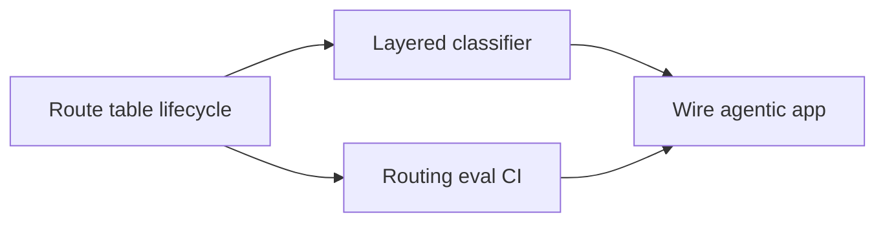

# Intent Router Playbooks

[Router overview](/playbooks/router) · **Intent router overview** · [Route table lifecycle →](/playbooks/router/intent-router/route-table-lifecycle)

Implementation guides for [What Is an Intent Router](/insights/what-is-intent-router). **Plane ①** of the [Router Blueprint](/blueprints/router-blueprint).

:::tip[THE CLAIM]
**Route before the loop.** The router owns dispatch and trace; the agentic app owns manifest pin and orchestration. The LLM never sees tools from routes that were not selected for this turn.
:::

<!-- truncate -->

## Four playbooks

| Playbook | One-line purpose |
| --- | --- |
| [Route table lifecycle](/playbooks/router/intent-router/route-table-lifecycle) | Versioned route contracts, storage patterns, promote and rollback |
| [Layered classifier](/playbooks/router/intent-router/layered-classifier) | Eligible routes, rules, classifier, LLM fallback, safety |
| [Wire agentic app](/playbooks/router/intent-router/wire-agentic-app) | Manifest load, outcomes UX, PGAR handoff |
| [Routing eval CI](/playbooks/router/intent-router/routing-eval-ci) | Golden set, release gates, incident replay |

## Recommended path

1. **[Route table lifecycle](/playbooks/router/intent-router/route-table-lifecycle):** define rows and storage before writing classifier code
2. **[Routing eval CI](/playbooks/router/intent-router/routing-eval-ci):** golden set in parallel with Layer ①–②
3. **[Layered classifier](/playbooks/router/intent-router/layered-classifier):** implement the pipeline
4. **[Wire agentic app](/playbooks/router/intent-router/wire-agentic-app):** manifest pin and loop entry

Bridge reading: [PGAR Agentic app](/playbooks/pgar-runtime/boundary/agentic-app) · [Eval Plane ①: Input](/playbooks/eval-engineering/plane-input).

## Who should read what

| Role | Start with | Then |
| --- | --- | --- |
| **AI platform** | [Route table lifecycle](/playbooks/router/intent-router/route-table-lifecycle), [Layered classifier](/playbooks/router/intent-router/layered-classifier) | [Wire agentic app](/playbooks/router/intent-router/wire-agentic-app) |
| **Domain squad** | [Route table lifecycle](/playbooks/router/intent-router/route-table-lifecycle) | [Routing eval CI](/playbooks/router/intent-router/routing-eval-ci) |
| **Governance** | [Routing eval CI](/playbooks/router/intent-router/routing-eval-ci) | [Eval Input plane](/playbooks/eval-engineering/plane-input) |

## Read next

**[Route table lifecycle →](/playbooks/router/intent-router/route-table-lifecycle)**
