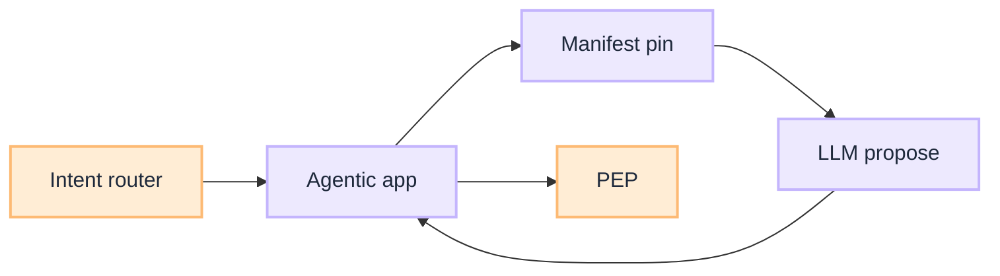

# Wire Agentic App

[Blueprint](/blueprints/router-blueprint) · [← Layered classifier](/playbooks/router/intent-router/layered-classifier) · **Wire app**

The router sits **outside** plan → act → observe. The [agentic app](/playbooks/pgar-runtime/boundary/agentic-app) consumes the route contract and enters **Plane ② Orchestration** ([PGAR](/playbooks/pgar-runtime)).

:::tip[THE CLAIM]
**On clarify or abstain, do not call the LLM with tools.** On route, load manifest for `route_id` only, then enter the loop.
:::

<!-- truncate -->

## Request sequence

1. Receive user message + session from ingress
2. **Call intent router** → route decision record
3. On `clarify` / `abstain` → UX response; no tool schemas
4. On `route` → load [tool manifest](/playbooks/pgar-runtime/domain/manifest-lifecycle) for `route_id`; pin `manifest_version` on session
5. Call LLM with messages + **scoped schemas only**
6. On tool proposal → validate against manifest → [PEP](/playbooks/pgar-runtime/boundary/pep-pdp)

## Session pin

Pin both **`route_table_version`** and **`manifest_version`** at session open (or at route decision). Mid-session promote of either artifact must not change an in-flight session without explicit policy.

## Failure classes

| Failure | Symptom |
| --- | --- |
| Tools from unselected routes in LLM payload | Intent bypass; manifest not scoped |
| Clarify path still loads payment manifest | High-risk leak |
| No route decision in trace | Cannot debug misroutes |

## Plane handoff

| From | To |
| --- | --- |
| Plane ① Intent (this series) | Plane ② [PGAR orchestration](/playbooks/pgar-runtime/boundary/agentic-app) |
| `model_profile` on route row | Plane ③ [G.A.I.N LLM](/frameworks/gain-llm) gateway per call |

## Read next

**[PGAR Agentic app →](/playbooks/pgar-runtime/boundary/agentic-app)**
