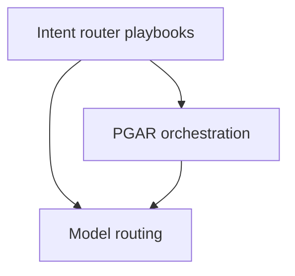

# Router Playbooks

[Playbooks](/playbooks) · **Router overview** · [Intent router (Plane ①) →](/playbooks/router/intent-router)

Implementation guides for the [Router Blueprint](/blueprints/router-blueprint). The insight and design guides explain *why* routing belongs at ingress and *how* to design it. These playbooks are the **how** for each plane.

:::tip[THE CLAIM]
**Route before the loop.** Plane ① picks the governed path; Plane ② runs the agent loop; Plane ③ selects the model at the gateway. Each plane has its own contracts, eval gates, and ownership.
:::

<!-- truncate -->

## Three planes

| Plane | Overview | What you build |
| --- | --- | --- |
| **[Intent router (Plane ①)](/playbooks/router/intent-router)** | [Open →](/playbooks/router/intent-router) | Route table, layered classifier, agentic app wiring, routing eval CI |
| **Orchestration (Plane ②)** | [PGAR Runtime](/playbooks/pgar-runtime) | Agent loop, PEP/PDP, manifests — see PGAR playbooks |
| **Model routing (Plane ③)** | [G.A.I.N LLM](/frameworks/gain-llm) | Gateway profiles, failover, cost caps (dedicated playbooks planned) |

## Recommended path

 

1. **[Intent router (Plane ①)](/playbooks/router/intent-router):** route table → eval CI in parallel → classifier → wire app
2. **[PGAR Runtime (Plane ②)](/playbooks/pgar-runtime):** when manifests differ per turn, wire the agentic app into the governed loop
3. **Model routing (Plane ③):** apply `model_profile` from the route row at the LLM gateway

Bridge reading: [What Is an Intent Router](/insights/what-is-intent-router) · [How to Design an Intent Router](/insights/design-intent-router) · [PGAR Agentic app](/playbooks/pgar-runtime/boundary/agentic-app) · [Eval Plane ①: Input](/playbooks/eval-engineering/plane-input).

## Intent router playbooks at a glance

| Playbook | One-line purpose |
| --- | --- |
| [Route table lifecycle](/playbooks/router/intent-router/route-table-lifecycle) | Versioned route contracts, storage patterns, promote and rollback |
| [Layered classifier](/playbooks/router/intent-router/layered-classifier) | Eligible routes, rules, classifier, LLM fallback, safety |
| [Wire agentic app](/playbooks/router/intent-router/wire-agentic-app) | Manifest load, outcomes UX, PGAR handoff |
| [Routing eval CI](/playbooks/router/intent-router/routing-eval-ci) | Golden set, release gates, incident replay |

## Who should read what

| Role | Start with | Then |
| --- | --- | --- |
| **AI platform** | [Intent router overview](/playbooks/router/intent-router), [Route table lifecycle](/playbooks/router/intent-router/route-table-lifecycle) | [Wire agentic app](/playbooks/router/intent-router/wire-agentic-app), [PGAR Agentic app](/playbooks/pgar-runtime/boundary/agentic-app) |
| **Domain squad** | [Route table lifecycle](/playbooks/router/intent-router/route-table-lifecycle) | [Routing eval CI](/playbooks/router/intent-router/routing-eval-ci) |
| **Governance** | [Routing eval CI](/playbooks/router/intent-router/routing-eval-ci) | [Eval Input plane](/playbooks/eval-engineering/plane-input) |

## Read next

**[Intent router playbooks (Plane ①) →](/playbooks/router/intent-router)**
